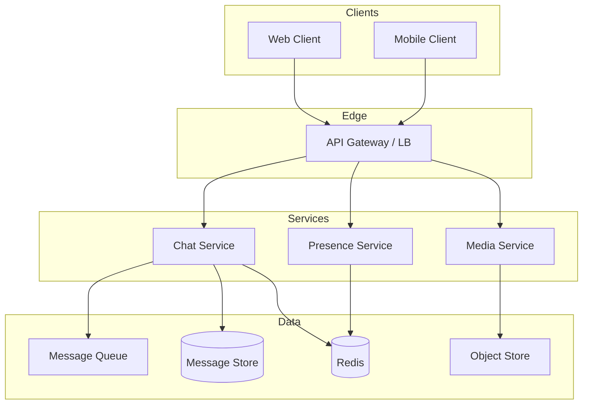
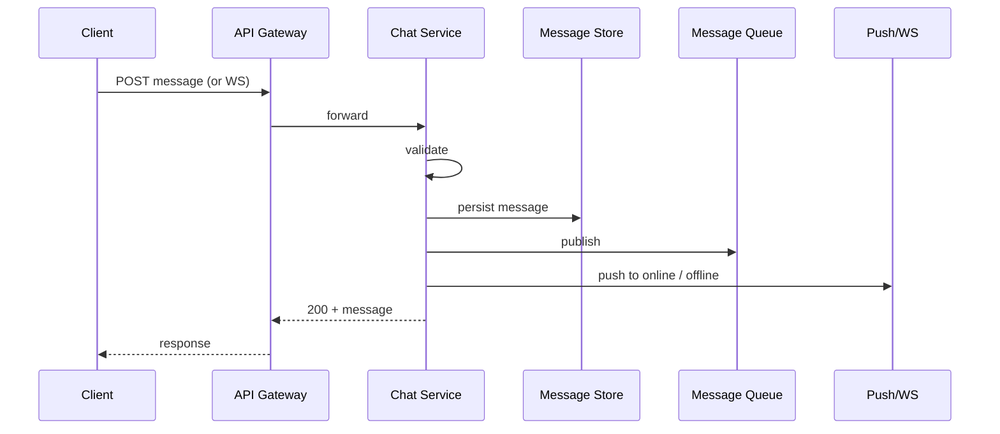

# High-Level Design: Scalable Chat Application (WhatsApp/Slack)

## System Design Process

---

### Step 1: Clarify Requirements

**Functional requirements**
- Send/receive messages (text, media) in 1:1 and group chats
- Message history and search
- Online/offline presence and typing indicators
- Read receipts and delivery status
- Push notifications when offline
- Create/list conversations; add/remove members (groups)

**Non-functional requirements**
- Low latency (< 200 ms for message delivery)
- High availability (99.99%)
- Ordering and exactly-once delivery where required
- Scale to millions of concurrent connections

**Constraints & assumptions**
- Clients: Web, iOS, Android; WebSocket preferred, long-poll fallback
- Message size: text up to 64 KB; media via separate upload
- Retention: configurable (e.g. 5 years); compliance for delete
- Assume authenticated users (identity from Auth Service)

---

### Step 2: High-Level Design — Components, Interfaces, Data Flow

**Components**
- **Clients** (Web/Mobile) — send/receive via HTTPS + WebSocket
- **API Gateway / Load Balancer** — TLS, routing, WebSocket sticky sessions
- **Chat Service** — validate, persist, fan-out messages; push to online users
- **Presence Service** — online/offline, last seen, typing; heartbeats
- **Media Service** — upload, store (object store), return CDN URLs
- **Message Queue** (Kafka/SQS) — async fan-out to online and push workers
- **Message Store** (Cassandra/DynamoDB) — persistent history, partitioned by conversation
- **Cache** (Redis) — presence, recent messages per chat
- **Push Service** — FCM/APNs for offline delivery

**Interfaces (summary)**
- REST: create/list conversations, get messages, mark read
- WebSocket: real-time message delivery, typing, presence
- Internal: Chat ↔ Store, Queue, Push; Presence ↔ Redis

**Data flow (send message)**
1. Client → API GW → Chat Service
2. Chat Service: validate → write to Message Store → publish to Queue
3. Online: Chat Service pushes to subscriber connections (same or via internal channel)
4. Offline: Push workers consume queue → Push Service → FCM/APNs

---

#### High-Level Architecture

Component view: clients, gateway, services, and data stores.

**Mermaid:**

**Eraser (paste at [Eraser.io](https://app.eraser.io)):** `Clients > LB > Chat, Presence, Media; Chat > MQ, DB, Redis; Presence > Redis; Media > S3`

---

#### Flow Diagram — Send Message

Sequence of steps for sending a message.

**Mermaid:**

---

### Step 3: Detailed Design — Database & API

**Database choice**
- **Message store:** NoSQL wide-column (Cassandra/DynamoDB) — high write throughput, partition by `conversation_id`, sort by `message_id`; optional secondary index for user_conversations.
- **Users/conversations:** SQL or NoSQL; relational fine for membership and metadata.

**API endpoints (required)**

| Method | Endpoint | Description |
|--------|----------|-------------|
| POST | `/v1/conversations` | Create conversation (1:1 or group) |
| GET | `/v1/conversations` | List user's conversations (paginated) |
| GET | `/v1/conversations/:id` | Get conversation metadata and members |
| GET | `/v1/conversations/:id/messages` | Get messages (cursor, limit, before/after) |
| POST | `/v1/conversations/:id/messages` | Send message |
| POST | `/v1/conversations/:id/read` | Mark as read up to message_id |
| POST | `/v1/conversations/:id/members` | Add members (group) |
| DELETE | `/v1/conversations/:id/members/:userId` | Remove member (group) |
| GET | `/v1/users/:id/presence` | Get presence for user(s) |
| POST | `/v1/presence/heartbeat` | Heartbeat (or via WebSocket) |
| POST | `/v1/media/upload` | Upload media; returns URL |
| WS | `/v1/ws?token=<jwt>` | WebSocket: message, typing, presence, ping/pong |

**Data model (conceptual)**
- **Users:** user_id, profile, settings
- **Conversations:** conversation_id, type (1:1/group), participants, created_at
- **Messages:** message_id, conversation_id, sender_id, content, type, timestamp, status
- **Presence:** user_id → { status, last_seen } (Redis, TTL)

---

### Step 4: Scale & Optimize

**Load balancing**
- Stateless Chat, Presence, Media behind LB
- WebSocket: sticky sessions (consistent hashing on user_id) so same server handles same user’s connection

**Sharding**
- Message store: partition by `conversation_id` (or (user_id, conversation_id)) for even distribution and locality
- Message queue: partition by conversation_id for per-chat ordering

**Caching**
- Redis: presence (user_id → status, last_seen); recent messages per conversation (reduce read load)
- Cache invalidation: on new message, update or invalidate conversation cache as needed

**Other**
- Horizontal scaling of all services; queue consumers scale with partition count
- Push: retries, backoff, idempotency for at-least-once delivery

---

## Capacity Estimation

- **Users:** 500M MAU, 50M DAU
- **Concurrent connections:** ~10M
- **Messages/day:** ~1B → ~100 GB/day; 5-year retention → ~200 TB

---

## Trade-offs

| Decision | Choice | Rationale |
|----------|--------|-----------|
| Real-time | WebSocket | Low latency, bidirectional; long-poll fallback |
| Ordering | Per-conversation queue + sequence in DB | Strong ordering without global lock |
| Message DB | Wide-column (Cassandra/DynamoDB) | High write throughput, partition by conversation |
| Caching | Recent messages + presence in Redis | Lower read latency and load |
