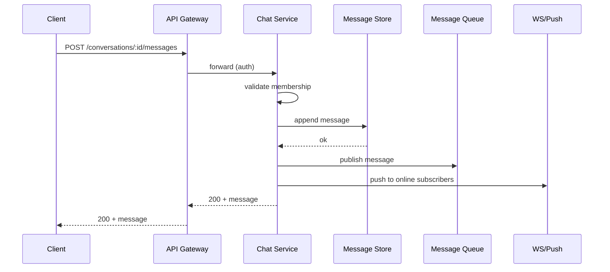

# Low-Level Design: Scalable Chat Application

This LLD elaborates **Step 3: Detailed Design** (APIs, DB, algorithms) and supports Step 2 (data flow).

---

## 1. API Endpoints (Complete)

### REST — Conversations & Messages

| Method | Endpoint | Request / Response |
|--------|----------|-------------------|
| POST | `/v1/conversations` | Body: `{ "type": "direct\|group", "member_ids": [], "name": "optional" }` → `{ "conversation_id", "created_at" }` |
| GET | `/v1/conversations` | Query: `limit`, `cursor` → `{ "conversations": [], "next_cursor" }` |
| GET | `/v1/conversations/:id` | → `{ "conversation_id", "type", "members", "name", "last_message" }` |
| GET | `/v1/conversations/:id/messages` | Query: `limit`, `before`, `after` (message_id) → `{ "messages": [], "next_cursor" }` |
| POST | `/v1/conversations/:id/messages` | Body: `{ "content": "...", "content_type": "text\|image", "client_msg_id": "idempotency" }` → `{ "message_id", "created_at" }` |
| POST | `/v1/conversations/:id/read` | Body: `{ "message_id": "last_read" }` → 204 |
| POST | `/v1/conversations/:id/members` | Body: `{ "user_ids": [] }` → 204 |
| DELETE | `/v1/conversations/:id/members/:userId` | → 204 |

### REST — Presence & Media

| Method | Endpoint | Request / Response |
|--------|----------|-------------------|
| GET | `/v1/users/:id/presence` | Query: `user_ids` (list) → `{ "users": [{ "user_id", "status", "last_seen" }] }` |
| POST | `/v1/presence/heartbeat` | Body: `{}` or empty → 204 |
| POST | `/v1/media/upload` | Multipart: file → `{ "url": "https://cdn.../..." }` |

### WebSocket — Single connection

**Connect:** `WS /v1/ws?token=<jwt>`

**Client → Server:**

| type | payload | description |
|------|---------|-------------|
| message | `conversation_id`, `content`, `client_id` | Send message |
| typing | `conversation_id`, `is_typing` | Typing start/stop |
| ping | — | Keepalive |

**Server → Client:**

| type | payload | description |
|------|---------|-------------|
| message | `message` object | New message |
| presence | `user_id`, `status` | Presence update |
| typing | `user_id`, `conversation_id`, `is_typing` | Typing from another user |
| pong | — | Response to ping |

---

## 2. Flow Diagram — Send Message

**Mermaid sequence:**



**Eraser.io sequence (paste into Eraser):**

```eraser
Client > API GW: POST /conversations/:id/messages
API GW > Chat Service: forward (auth)
Chat Service > Chat Service: validate membership
Chat Service > Message Store: append message
Message Store > Chat Service: ok
Chat Service > Message Queue: publish message
Chat Service > WS/Push: push to online subscribers
Chat Service > API GW: 200 + message
API GW > Client: 200 + message
```

---

## 3. Database Schemas

### Users
```sql
users (user_id PK, email, name, avatar_url, created_at, updated_at)
```

### Conversations
```sql
conversations (conversation_id PK, type ENUM(direct, group), name, created_by, created_at)
conversation_members (conversation_id FK, user_id FK, role, joined_at, last_read_message_id)
  PK (conversation_id, user_id)
```

### Messages (partitioned store)
```sql
-- Partition key: conversation_id; Sort key: message_id
messages (
  conversation_id,
  message_id,
  sender_id,
  content_type,
  content_ref,
  metadata JSON,
  created_at,
  PRIMARY KEY (conversation_id, message_id)
)
```

### Index
- `user_conversations (user_id, conversation_id, last_message_at)` for listing inbox.

---

## 4. Key Classes / Modules

```text
ChatService
  - sendMessage(conversationId, senderId, content, clientId) → messageId
  - getMessages(conversationId, cursor, limit)
  - markRead(conversationId, userId, messageId)

MessageRepository
  - append(conversationId, message)
  - getRange(conversationId, fromMessageId, limit)

MessageQueue (interface)
  - publish(conversationId, message)
  - subscribe(conversationId, handler)

PresenceManager
  - setOnline(userId, deviceId, connId)
  - setOffline(userId, deviceId)
  - getPresence(userIds[])
  - setTyping(userId, conversationId, isTyping)

WebSocketManager
  - register(userId, connection)
  - sendToUser(userId, payload)
```

---

## 5. Algorithms / Logic

### Send message
1. Resolve conversation; check membership.
2. Generate `message_id` (e.g. ULID); persist with `(conversation_id, message_id)`.
3. Publish to queue (partition = conversation_id).
4. Return message_id; idempotency via `client_msg_id`.

### Idempotency
- Store (conversation_id, client_id, client_msg_id) → message_id; on retry return existing.

### Typing
- Client sends typing start/stop; Presence writes Redis (conversation_id, user_id, TTL); subscribers get events.

---

## 6. Error Handling

- **Duplicate:** Idempotency key → return existing message_id.
- **Not in conversation:** 403.
- **Message too large:** 413; max 64 KB text.
- **Offline recipient:** Store + queue; push worker sends FCM/APNs with retries.

---

## Interview-Readiness Enhancements

### API and consistency
- Mark idempotency requirements for mutation APIs.
- Specify pagination/cursor strategy for list endpoints.
- Clarify consistency guarantees per endpoint/workflow.

### Data model and concurrency
- Explicitly list partition key/index choices and why.
- State optimistic vs pessimistic locking policy and conflict handling.
- Define deduplication/idempotent-consumer strategy for async paths.

### Reliability and operations
- Add explicit failure scenarios with mitigations and degradation behavior.
- Add monitoring/alert thresholds for critical flows and queue lag.
- Document rollout and rollback steps for schema/API changes.

### Validation checklist
- Include unit + integration + load + failure-injection test cases for critical paths.

