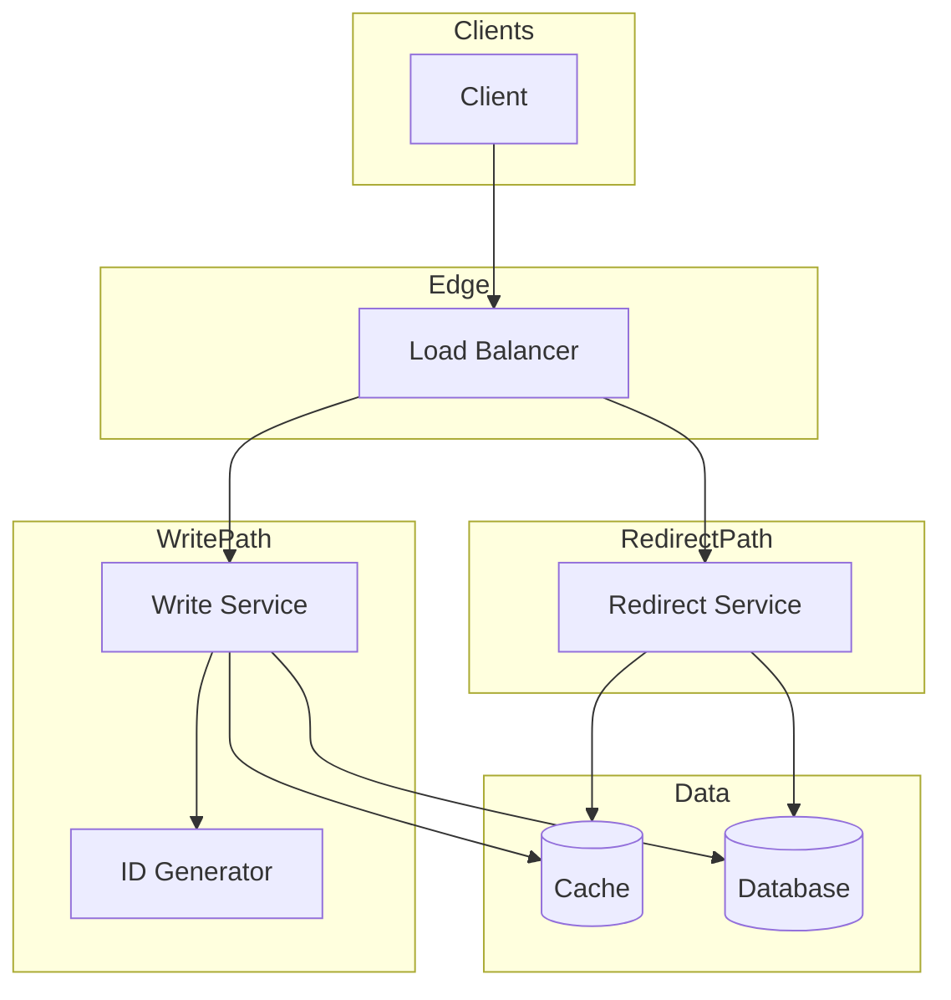
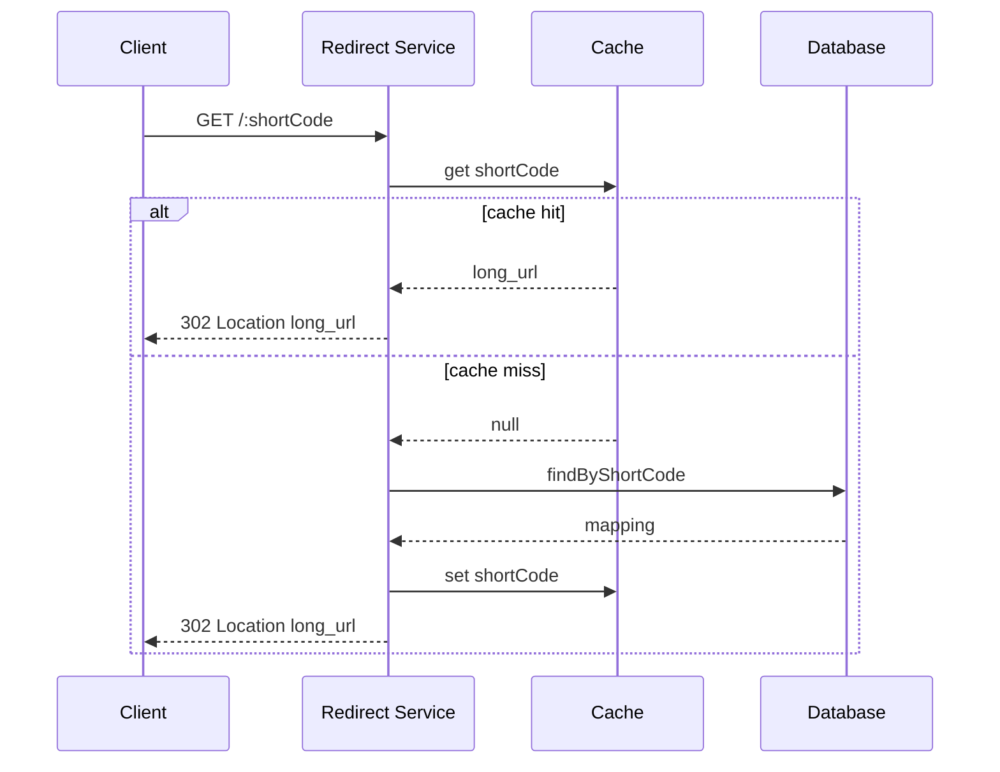

# High-Level Design: URL Shortener (Bitly/TinyURL)

## System Design Process

---

### Step 1: Clarify Requirements

**Functional**
- Generate short URL from long URL (custom alias optional)
- Redirect short URL → original URL (301/302)
- Optional: expiry, analytics (click count, referrer, geo), user’s link list

**Non-functional**
- High availability and low latency for redirects
- Short code: 6–8 characters, URL-safe
- Scale: billions of redirects, millions of new URLs per day

**Constraints & assumptions**
- Read:write ratio ~100:1; redirect path is latency-critical
- Short codes globally unique; no PII in code

---

### Step 2: High-Level Design — Components, Interfaces, Data Flow

**Components**
- **Load Balancer** — route traffic to write and redirect services
- **Write Service** — create short URL: validate URL, get code, store mapping
- **Redirect Service** — resolve short → long, cache-first, return 302
- **ID Generator** — unique 6–8 char codes (counter + base62 or hash)
- **Cache (Redis)** — short_code → long_url; TTL for expiry
- **Database** — persistent url_mappings

**Data flow**
- **Create:** Client POST → Write Service → validate → ID Gen → DB write → (cache pre-warm) → return short URL
- **Redirect:** GET short → Redirect Service → cache lookup → on miss: DB → cache set → 302 to long_url

---

#### High-Level Architecture

Component view: clients, LB, write/redirect services, ID generator, cache, DB.

**Mermaid:**

---

#### Flow Diagram — Redirect (main path)

**Mermaid:**

---

### Step 3: Detailed Design — Database & API

**Database**
- **SQL:** Single table `url_mappings`; short_code PK; indexes on user_id, expires_at. Good for moderate scale.
- **NoSQL:** Key-value or wide-column with short_code as key; optional TTL for expiry. Good for very high read/write.

**API endpoints (required)**

| Method | Endpoint | Description |
|--------|----------|-------------|
| POST | `/api/v1/shorten` | Create short URL; body: long_url, optional custom_alias, expires_in_days |
| GET | `/:shortCode` | Redirect to long URL (302); 404 if not found/expired |
| GET | `/api/v1/analytics/:shortCode` | Click count, created_at, last_click (optional referrer/geo) |
| GET | `/api/v1/links` | List current user’s short links (paginated) |
| DELETE | `/api/v1/links/:shortCode` | Invalidate/delete link (optional) |

**Data model**
- url_mappings: short_code (PK), long_url, user_id, created_at, expires_at, click_count

---

### Step 4: Scale & Optimize

**Load balancing**
- Stateless Write and Redirect services behind LB; round-robin or least connections

**Sharding**
- DB: shard by short_code hash if single DB becomes bottleneck; cache remains keyed by short_code

**Caching**
- Redis: short_code → long_url (and TTL if expiry); cache-aside on redirect; high hit rate for popular links

---

## Capacity Estimation

- Read:write ~100:1; 100M new URLs/month → ~40/s; 10B redirects/month → ~4K/s
- Storage: 500 B/record × 1B URLs → ~500 GB

---

## Trade-offs

| Decision | Choice | Rationale |
|----------|--------|-----------|
| Redirect | 302 | Per-click tracking; 301 for permanent SEO |
| Cache | Redis | Sub-ms redirect latency |
| Short code | Counter + Base62 | No collision; hash+retry if no counter |
