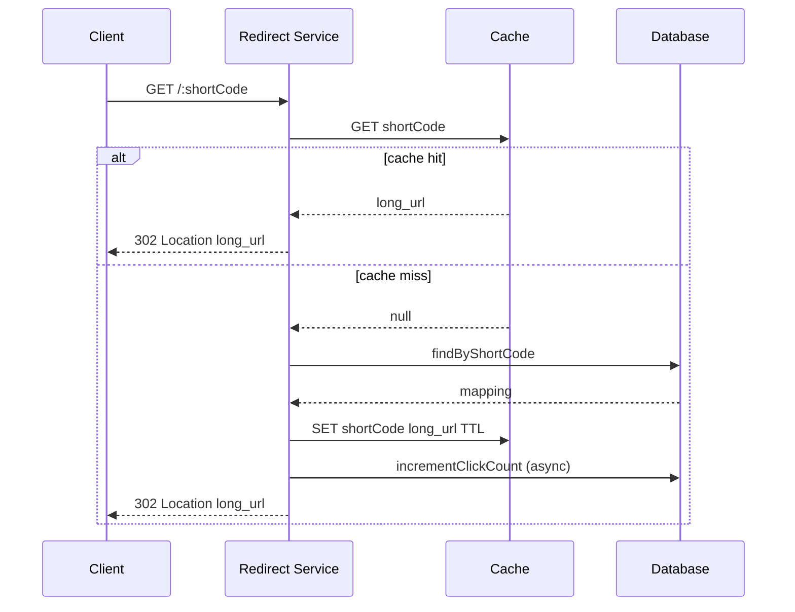

# Low-Level Design: URL Shortener

This LLD details **Step 3: Detailed Design** (APIs, DB, algorithms) for the URL shortener.

---

## 1. API Endpoints (Complete)

| Method | Endpoint | Request | Response |
|--------|----------|---------|----------|
| POST | `/api/v1/shorten` | `{ "long_url": "https://...", "custom_alias": "optional", "expires_in_days": 365 }` | `{ "short_url", "short_code" }` |
| GET | `/:shortCode` | — | 302 Location: long_url (or 404) |
| GET | `/api/v1/analytics/:shortCode` | — | `{ "clicks", "created_at", "last_click" }` |
| GET | `/api/v1/links` | Query: `limit`, `cursor` | `{ "links": [], "next_cursor" }` (user’s links) |
| DELETE | `/api/v1/links/:shortCode` | — | 204 (optional) |

---

## 2. Flow Diagram — Redirect



---

## 3. Database Schema

```sql
url_mappings (
  short_code   VARCHAR(10) PRIMARY KEY,
  long_url     VARCHAR(2048) NOT NULL,
  user_id      VARCHAR(36),
  created_at   TIMESTAMP DEFAULT CURRENT_TIMESTAMP,
  expires_at   TIMESTAMP NULL,
  click_count  BIGINT DEFAULT 0
);

CREATE INDEX idx_user_id ON url_mappings(user_id);
CREATE INDEX idx_expires_at ON url_mappings(expires_at) WHERE expires_at IS NOT NULL;
```

---

## 4. Key Classes / Modules

```text
ShortenService
  - createShortUrl(longUrl, userId?, customAlias?, expiresInDays?) → ShortUrlResult
  - resolveShortCode(shortCode) → longUrl | null

IdGenerator (interface)
  - generate() → shortCode

CounterIdGenerator implements IdGenerator
  - nextId() via Redis INCR or DB sequence
  - encodeBase62(id) → 6–8 char string

HashIdGenerator implements IdGenerator  // alternative
  - generate(longUrl) → hash; handle collision with retry + salt

UrlRepository
  - save(shortCode, longUrl, userId?, expiresAt?)
  - findByShortCode(shortCode) → mapping | null
  - existsShortCode(shortCode) → boolean
  - incrementClickCount(shortCode)

RedirectHandler
  - handle(shortCode) → 302 with long_url or 404
  - lookup: Cache → DB → Cache set
```

---

## 5. Algorithms

### Base62 encoding (0-9, a-z, A-Z = 62 chars)
```text
chars = "0-9a-zA-Z"
encode(n):
  if n == 0 return "0"
  result = ""
  while n > 0:
    result = chars[n % 62] + result
    n = n / 62
  return result  // pad to 6 chars with leading zeros if needed
```

### Short code generation (counter-based)
1. Get next ID from distributed counter (e.g. Redis INCR by key "url:id" or DB sequence).
2. Encode ID to base62; pad to fixed length (e.g. 6).
3. Ensure uniqueness: insert into DB; on duplicate key (e.g. custom alias clash), retry or return error.

### Redirect with cache
1. key = shortCode, value = long_url (or full mapping JSON).
2. GET key from Redis; if hit, return 302.
3. If miss: SELECT from DB; if not found or expired, return 404.
4. SET Redis with TTL (e.g. 24h or match expires_at); return 302.

---

## 6. Error Handling

- **Invalid long_url:** 400 (malformed URL or disallowed scheme).
- **Custom alias taken:** 409 Conflict.
- **Short code not found / expired:** 404.
- **Rate limit:** 429 (per user/IP for create and redirect).

---

## 7. Optional: Analytics

- On redirect: increment click_count in DB (async or batched) and/or publish event to queue (click stream) for referrer, user-agent, geo.
- Analytics API reads from DB or from aggregated tables populated by stream processing.
