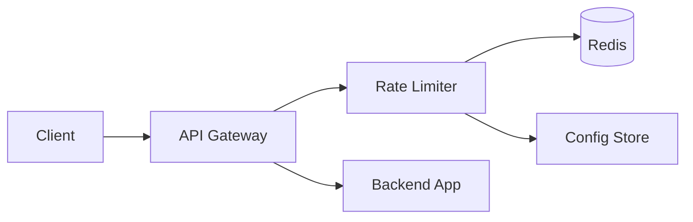
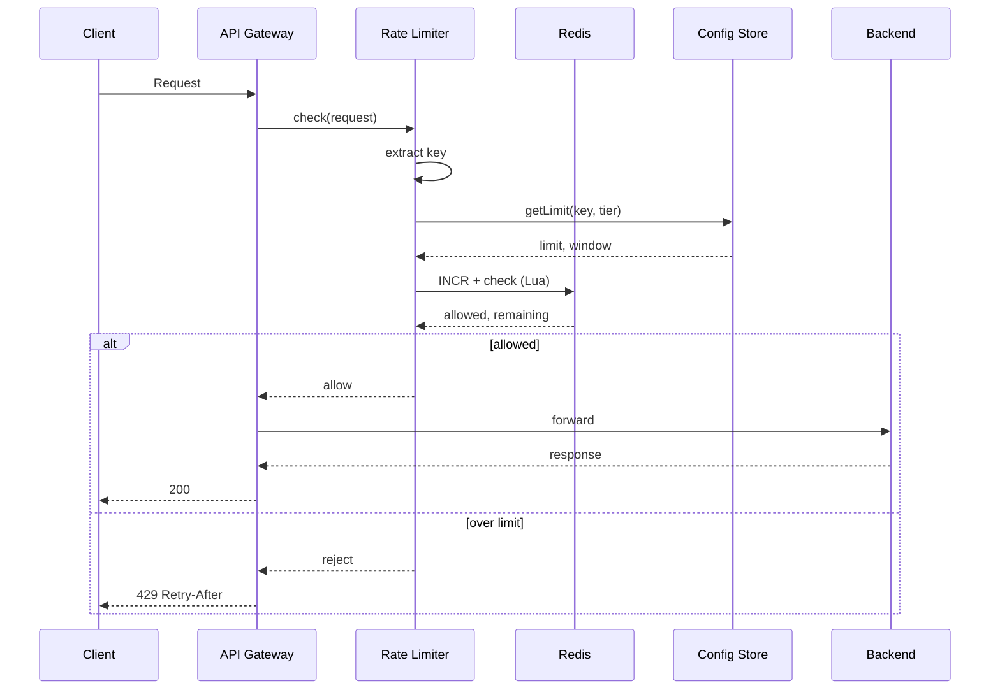

# High-Level Design: API Rate Limiter

## System Design Process

---

### Step 1: Clarify Requirements

**Functional**
- Limit by identifier: user_id, API key, IP, or combination
- Multiple limits: e.g. 100 req/min per user, 10 req/s per IP
- Return 429 + Retry-After when limited
- Optional: different limits per endpoint or tier

**Non-functional**
- Low latency (minimal added latency per request)
- Accurate under concurrency; distributed: same limit across all app servers

**Constraints & assumptions**
- Runs as middleware in front of APIs; not a standalone user-facing API
- Config (limits, tiers) can be stored in DB or config service

---

### Step 2: High-Level Design — Components, Interfaces, Data Flow

**Components**
- **API Gateway / Application** — receives request; invokes rate limiter before backend
- **Rate Limiter Middleware** — extract key, call engine, allow or 429
- **Rate Limit Engine** — apply algorithm (fixed/sliding window or token bucket); check and update counters
- **Counter Store (Redis)** — key = limit_key, value = count, TTL
- **Config Store** — limits per tier/endpoint

**Data flow**
1. Request → Gateway → Middleware extracts key (user/IP/key)
2. Engine gets limit from Config; computes limit_key (e.g. user_123:60)
3. Engine runs algorithm in Redis (INCR + TTL or Lua for atomicity)
4. If over limit → 429 Retry-After; else allow request

---

#### High-Level Architecture

Component view: client, gateway, rate limiter, Redis, config, backend.

**Mermaid:**



---

#### Flow Diagram — Request with rate limit check

**Mermaid:**



**Eraser:**

```eraser
Client > API Gateway: Request
API Gateway > Rate Limiter: check(request)
Rate Limiter > Config Store: getLimit
Config Store > Rate Limiter: limit, window
Rate Limiter > Redis: INCR + check
Redis > Rate Limiter: allowed, remaining
Rate Limiter > API Gateway: allow or 429
API Gateway > Backend: forward (if allowed)
API Gateway > Client: 200 or 429
```

---

### Step 3: Detailed Design — Database & API

**Database / store**
- **Redis:** Counters (key = limit_key, value = count, TTL). No SQL/NoSQL for counters; optional SQL for config (limit rules per tier).
- **Config:** SQL table `rate_limit_rules (tier, scope, limit, window_seconds)` or NoSQL; or file/config service.

**API endpoints (required)**

Rate limiter is **middleware**; it does not expose its own REST API. Required “interfaces”:

| Interface | Description |
|-----------|-------------|
| Middleware.check(request) | Returns Allow or Reject(429, Retry-After). Called by gateway on every request. |
| Config: getLimit(identifierType, tier, endpoint?) | Returns { limit, window_seconds } for the key. |
| Optional admin API | GET/PUT `/admin/rate-limits` — list/update limit rules (internal). |
| Optional metrics | GET `/metrics` — expose rate limit usage (allowed/rejected counts). |

---

### Step 4: Scale & Optimize

**Load balancing**
- Stateless app servers; rate limit state only in Redis. LB distributes requests; each server talks to same Redis.

**Sharding**
- Redis Cluster: shard by rate limit key (e.g. hash of key) for high throughput. No DB sharding for counters.

**Caching**
- Config: cache limit rules in memory with short TTL to avoid DB/config service on every request.
- Optional: local “allow” cache (e.g. key allowed for next N seconds) to reduce Redis calls for cold keys.

---

## Capacity Estimation

- 1M RPS globally; 10M unique keys → 1M reads + 1M writes/s to Redis. Redis Cluster handles with partitioning.

---

## Trade-offs

| Decision | Choice | Rationale |
|----------|--------|-----------|
| Store | Redis | Fast, atomic ops, TTL |
| Algorithm | Sliding window counter | O(1), good accuracy |
| Key granularity | Per user + optional per endpoint | Fairness vs memory |
