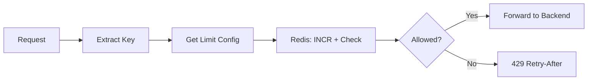

# Low-Level Design: API Rate Limiter

This LLD details **Step 3: Detailed Design** for the rate limiter (middleware, Redis, algorithms).

---

## 1. API Endpoints / Interfaces (Complete)

Rate limiter is **middleware**; no user-facing REST API. Required interfaces:

| Interface | Description |
|-----------|-------------|
| `Middleware.check(request)` | Returns Allow or Reject(429, Retry-After). Invoked by gateway per request. |
| `Config.getLimit(identifierType, tier, endpoint?)` | Returns `{ limit, window_seconds }`. |
| Optional | `GET/PUT /admin/rate-limits` — manage rules; `GET /metrics` — rate limit stats. |

---

## 2. Flow Diagram — Request with Rate Limit Check



---

## 3. Key Classes / Modules

```text
RateLimiter (interface)
  - allow(key string, limit int, windowSeconds int) → (allowed bool, remaining int, resetAt int64)

FixedWindowRateLimiter implements RateLimiter
  - uses Redis INCR + EXPIRE
  - key: "rl:fw:{key}:{windowStart}"

SlidingWindowCounterRateLimiter implements RateLimiter
  - key: "rl:sw:{key}:{windowId}"  (e.g. windowId = nowSeconds / windowSeconds)
  - Lua script: INCR, EXPIRE, GET prev window, compute weighted count, return allow + remaining

KeyExtractor
  - extract(request) → key string  // from API key, user id, IP, or composite

RateLimitConfig
  - getLimit(keyType, tier, path) → LimitRule { limit, windowSeconds }
```

---

## 4. Redis Key Design

```text
Key:   rl:{identifier}:{scope}:{window_id}
       e.g. rl:user_123:global:1707890120   (window_id = unix_time / 60 for 1-min window)
Value: count (integer)
TTL:   window_seconds * 2   (keep previous window for sliding counter)
```

---

## 5. Lua Script (Sliding Window Counter – Atomic)

```lua
-- KEYS[1] = current window key
-- KEYS[2] = previous window key
-- ARGV[1] = limit
-- ARGV[2] = window_seconds
-- ARGV[3] = now_ts

local current = redis.call('INCR', KEYS[1])
redis.call('EXPIRE', KEYS[1], ARGV[2] * 2)

local prev = redis.call('GET', KEYS[2]) or 0
local elapsed = (tonumber(ARGV[3]) % ARGV[2]) / ARGV[2]
local estimated = tonumber(prev) * (1 - elapsed) + current
local limit = tonumber(ARGV[1])

if estimated <= limit then
  return {1, limit - math.ceil(estimated)}  -- allowed, remaining
else
  return {0, 0}  -- rejected
end
```

---

## 6. Middleware Flow (Pseudocode)

```text
onRequest(req):
  key = KeyExtractor.extract(req)           // e.g. user_123
  rule = Config.getLimit("user", req.tier, req.path)  // e.g. 100 per 60s
  allowed, remaining, resetAt = RateLimiter.allow(key, rule.limit, rule.window)
  setHeader("X-RateLimit-Remaining", remaining)
  setHeader("X-RateLimit-Reset", resetAt)
  if not allowed:
    setHeader("Retry-After", resetAt - now())
    return 429
  next(req)
```

---

## 7. Configuration Schema

```text
LimitRule: { limit: int, window_seconds: int }
TierLimit: tier_id → LimitRule or endpoint → LimitRule
Default: e.g. 100/min for free, 10000/min for premium
```

---

## 8. Error Handling

- **Redis down:** Fail open (allow) or fail closed (reject) based on policy; circuit breaker and fallback.
- **Invalid key:** Use IP or anonymous id as fallback to avoid bypass.
- **Clock skew:** Use Redis time or NTP-synced time for window boundaries.

---

## Interview-Readiness Enhancements

### API and consistency
- Mark idempotency requirements for mutation APIs.
- Specify pagination/cursor strategy for list endpoints.
- Clarify consistency guarantees per endpoint/workflow.

### Data model and concurrency
- Explicitly list partition key/index choices and why.
- State optimistic vs pessimistic locking policy and conflict handling.
- Define deduplication/idempotent-consumer strategy for async paths.

### Reliability and operations
- Add explicit failure scenarios with mitigations and degradation behavior.
- Add monitoring/alert thresholds for critical flows and queue lag.
- Document rollout and rollback steps for schema/API changes.

### Validation checklist
- Include unit + integration + load + failure-injection test cases for critical paths.

