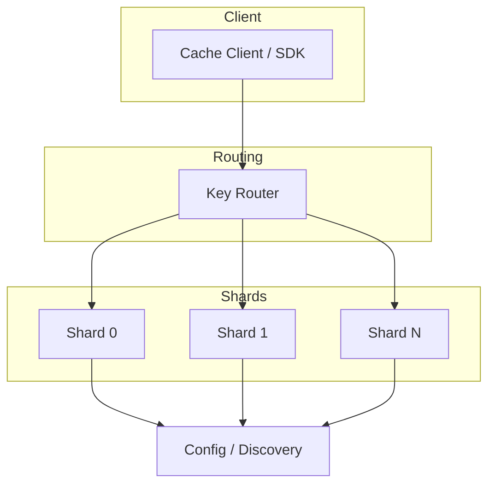
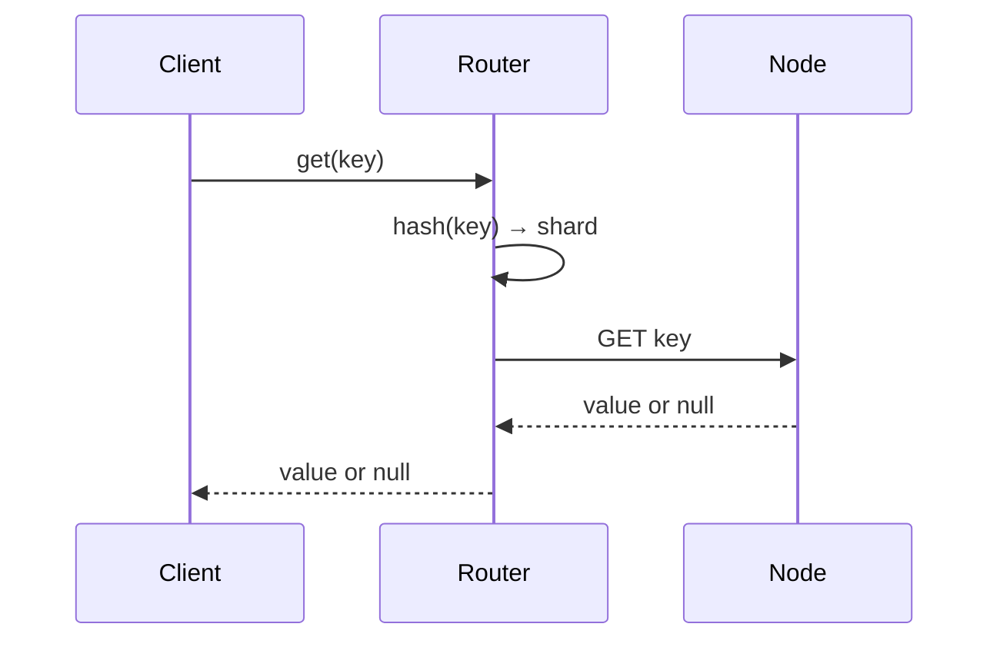

# High-Level Design: Distributed Cache System

## 1. Overview

A distributed in-memory cache that provides high-throughput, low-latency key-value access across many nodes, with replication and partitioning for scalability and availability (e.g. Redis Cluster, Memcached cluster).

---

## System Design Process

### Step 1: Clarify Requirements
- **Functional:** get(key), set(key, value, TTL?), delete(key); optional structures (hash, list, set), pub/sub.
- **Non-functional:** Sub-ms latency, HA (tolerate node failures), horizontal scaling, consistency (eventual or strong).
- **Constraints:** In-memory; key-value or extended structures.

### Step 2: High-Level Design — Components, Data Flow
- **Components:** Client/SDK (routing, pool), Shards (primary + replicas), Config/Discovery (shard map). Data flow: GET/SET → hash key → shard → node; see §4–§8 below.

#### High-Level Architecture

Component view: client, router, shards, config.

**Mermaid:**



#### Flow Diagram — GET request

**Mermaid:**



### Step 3: Detailed Design — Database & API
- **Database:** No persistent DB for cache; in-memory store per node. Optional: config store (SQL/NoSQL) for shard map.
- **API / Interface (required):**

| Operation | Description |
|----------|-------------|
| get(key) | Return value or null; key hashed to shard. |
| set(key, value, ttl?) | Write to primary of shard; replicate; optional TTL. |
| delete(key) | Remove key from primary; replicate. |
| mget(keys), mset(entries) | Batch get/set (optional). |

### Step 4: Scale & Optimize
- **Load balancing:** Client routes by key to one shard; no generic LB; replica for read scaling.
- **Sharding:** Consistent hashing or hash slots (e.g. 16384); virtual nodes for balance.
- **Caching:** N/A (this is the cache); optional local client cache for hot keys.

---

## 2. Requirements (Detail)

### Functional
- get(key), set(key, value, TTL?), delete(key)
- Optional: multiple data structures (hash, list, set, sorted set)
- Optional: pub/sub or cache invalidation events

### Non-Functional
- Sub-millisecond latency for cache hits
- High availability: tolerate node/shard failures
- Horizontal scaling: add nodes and rebalance
- Consistency: eventual or strong depending on use case

---

## 3. Capacity Estimation

- **Keys:** 1B
- **Avg value size:** 1 KB → ~1 PB total; assume 100 GB per node → ~10K nodes (or fewer with replication)
- **QPS:** 10M reads, 1M writes
- **Latency:** p99 < 5 ms

---

## 4. High-Level Architecture

```
                    ┌─────────────────────────────────────┐
                    │         Cache Client / SDK           │
                    │  (routing, connection pool, retry)   │
                    └────────────────┬────────────────────┘
                                     │
        ┌────────────────────────────┼────────────────────────────┐
        │                            │                            │
        ▼                            ▼                            ▼
┌───────────────┐            ┌───────────────┐            ┌───────────────┐
│  Shard 0      │            │  Shard 1      │            │  Shard N      │
│  M1 M2 M3     │            │  M1 M2 M3     │            │  M1 M2 M3     │
│  (replicas)   │            │  (replicas)   │            │  (replicas)   │
└───────────────┘            └───────────────┘            └───────────────┘
        │                            │                            │
        └────────────────────────────┼────────────────────────────┘
                                     │
                    ┌────────────────▼────────────────┐
                    │  Config / Discovery Service     │
                    │  (shard map, node list)         │
                    └────────────────────────────────┘
```

---

## 5. Core Components

| Component | Responsibility |
|-----------|----------------|
| **Client / SDK** | Hash key to shard, connect to correct node(s), connection pool, retry, circuit breaker |
| **Shard** | Subset of key space; each shard = primary + replicas |
| **Node** | Single cache instance (e.g. Redis); stores keys in memory, eviction (LRU/LFU), TTL |
| **Config / Discovery** | Maintain shard-to-nodes mapping; clients fetch or subscribe to updates |
| **Replication** | Primary-replica async/sync replication per shard |

---

## 6. Partitioning (Sharding)

- **Consistent hashing:** Key → hash → ring; assign key to next node clockwise. Reduces rebalance to K/N keys when adding/removing nodes.
- **Hash slot (Redis Cluster):** 16384 slots; slot = CRC16(key) mod 16384. Each node owns a range of slots. Rebalance by moving slots.
- **Virtual nodes:** Multiple points per physical node on ring for even distribution.

---

## 7. Replication & Availability

- **Primary-Replica:** Each shard has one primary and one or more replicas. Writes go to primary; reads can go to replica (read-your-writes consideration).
- **Failover:** If primary down, promote replica (manual or automatic); client or proxy redirects to new primary.
- **Quorum:** For strong consistency, optional read/write quorum (e.g. W=2, R=2 in multi-node store).

---

## 8. Data Flow

### GET
1. Client hashes key → shard (or slot).
2. Client sends request to node(s) for that shard (primary or replica for read).
3. Node returns value or null; on miss, application may load from DB and SET.

### SET
1. Client hashes key → shard.
2. Client sends SET to primary; primary applies and replicates to replicas.
3. Return OK; optional wait for replication ack.

### Rebalance (add node)
1. New node joins; config assigns some slots/shards to it.
2. Source nodes migrate keys for those slots to new node (background).
3. Client config updated; new requests for moved keys go to new node.

---

## 9. Eviction & TTL

- **Memory limit:** Per-node maxmemory; when full, evict by policy: noeviction, allkeys-lru, volatile-lru, etc.
- **TTL:** Key-level expiry; background or lazy deletion.

---

## 10. Trade-offs

| Decision | Choice | Rationale |
|----------|--------|-----------|
| Partitioning | Consistent hashing or hash slots | Minimal key movement on scale |
| Replication | Async primary-replica | Throughput; accept brief inconsistency |
| Client vs proxy | Client-side routing | Fewer hops, lower latency; proxy for multi-language simplicity |

---

## 11. Interview Steps

1. Clarify: key-value only or structures, TTL, consistency needs.
2. Estimate: keys, size, QPS, latency.
3. Draw: clients, shards, nodes, config/discovery.
4. Detail: hashing (consistent hash or slots), replication, failover.
5. Discuss: eviction, rebalance, and single points of failure (config service).
