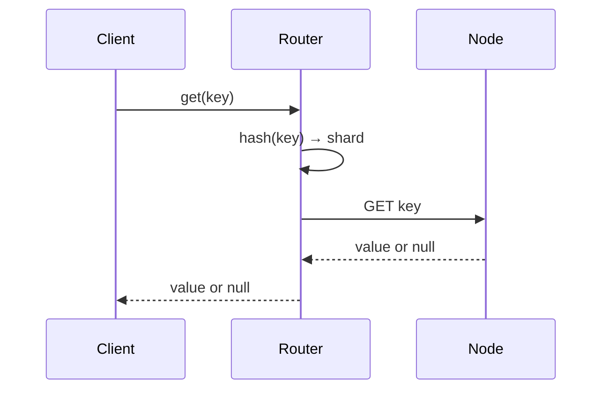

# Low-Level Design: Distributed Cache System

This LLD details **Step 3: Detailed Design** (APIs, routing, algorithms).

---

## 1. API Endpoints / Interface (Complete)

| Operation | Signature | Description |
|-----------|------------|-------------|
| get | get(key: string) → value \| null | Hash key to shard; read from primary or replica. |
| set | set(key, value, ttlSeconds?) → void | Hash key; write to primary; replicate; optional TTL. |
| delete | delete(key) → void | Remove from primary; replicate. |
| mget | mget(keys[]) → map | Batch get (optional). |
| mset | mset(entries, ttl?) → void | Batch set (optional). |

---

## 2. Flow Diagram — GET



---

## 3. Public API (Cache Interface)

```text
CacheClient
  - get(key: string) → value | null
  - set(key: string, value: bytes, ttlSeconds?: int) → void
  - delete(key: string) → void
  - mget(keys: string[]) → map[key]value
  - mset(entries: map[key]value, ttlSeconds?: int) → void
```

---

## 4. Key Classes / Modules

```text
CacheClient
  - router: KeyRouter
  - connectionPool: ConnectionPool
  - get/set/delete → router.getNode(key) → pool.send(node, command)

KeyRouter (interface)
  - getNode(key) → Node  // primary for write
  - getNodeForRead(key) → Node  // primary or replica

ConsistentHashRouter implements KeyRouter
  - ring: SortedMap<hash, Node>
  - virtualNodesPerNode: int
  - getNode(key): hash(key) → find next node on ring

HashSlotRouter implements KeyRouter  // Redis Cluster style
  - slotCount: 16384
  - slotToNode: map[slot]Node
  - getNode(key): slot = CRC16(key) % slotCount; return slotToNode[slot]

ConnectionPool
  - getConnection(node) → Connection
  - release(connection)

Node
  - address: string
  - role: primary | replica
  - slots: [start, end]  // for slot-based
```

---

## 5. Consistent Hashing (Algorithm)

```text
hash_fn: key → uint64
ring: sorted list of (hash, node_id)
virtual nodes: each physical node has V entries (hash(node_id + i) for i in 0..V-1)

getNode(key):
  h = hash_fn(key)
  find smallest ring_entry such that ring_entry.hash >= h (wrap around)
  return ring_entry.node_id
```

---

## 6. Protocol (Simplified Wire Format)

```text
Request:  GET <key>\r\n   or   SET <key> <length>\r\n<value>\r\n
Response: VALUE <key> <length>\r\n<value>\r\n   or   END\r\n   or   STORED\r\n
```

(Actual implementation would follow Redis protocol or Memcached protocol.)

---

## 7. Client Flow (GET)

```text
1. key → KeyRouter.getNode(key) → node
2. ConnectionPool.getConnection(node) → conn
3. send(conn, "GET", key)
4. response = read(conn)
5. if response miss and readThrough: load from DB, SET, return value
6. return response
```

---

## 8. Rebalance (Slot Migration)

```text
When adding node N:
1. Config assigns slots S to N (taken from existing nodes).
2. For each slot s in S:
   - Source node sends keys in slot s to N (MIGRATE).
   - N accepts and stores; source deletes.
3. Config updates slotToNode; clients refresh config.
4. Clients now route slot s to N.
```

---

## 9. Failure Handling

- **Node unreachable:** Retry with backoff; mark node down; use replica for read if available; fail fast for write to that shard.
- **Config refresh:** On redirect (moved) or periodically fetch slot map from config service.
- **Connection pool:** Timeout, max retries, circuit breaker per node.

---

## 10. Optional: Cache-Aside (Application Pattern)

```text
get(key):
  val = cache.get(key)
  if val != null return val
  val = db.load(key)
  if val != null cache.set(key, val, ttl)
  return val

set(key, value):
  db.save(key, value)
  cache.set(key, value, ttl)

Invalidation: on update/delete, cache.delete(key) after db write.
```

---

## Interview-Readiness Enhancements

### API and consistency
- Mark idempotency requirements for mutation APIs.
- Specify pagination/cursor strategy for list endpoints.
- Clarify consistency guarantees per endpoint/workflow.

### Data model and concurrency
- Explicitly list partition key/index choices and why.
- State optimistic vs pessimistic locking policy and conflict handling.
- Define deduplication/idempotent-consumer strategy for async paths.

### Reliability and operations
- Add explicit failure scenarios with mitigations and degradation behavior.
- Add monitoring/alert thresholds for critical flows and queue lag.
- Document rollout and rollback steps for schema/API changes.

### Validation checklist
- Include unit + integration + load + failure-injection test cases for critical paths.

