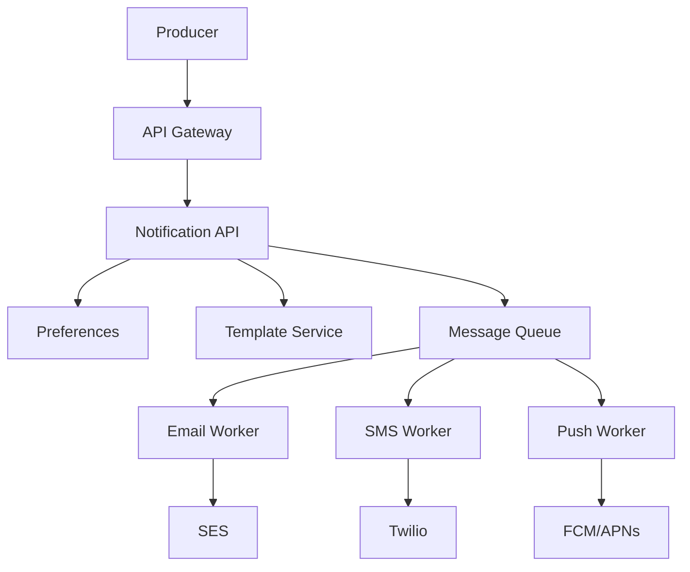
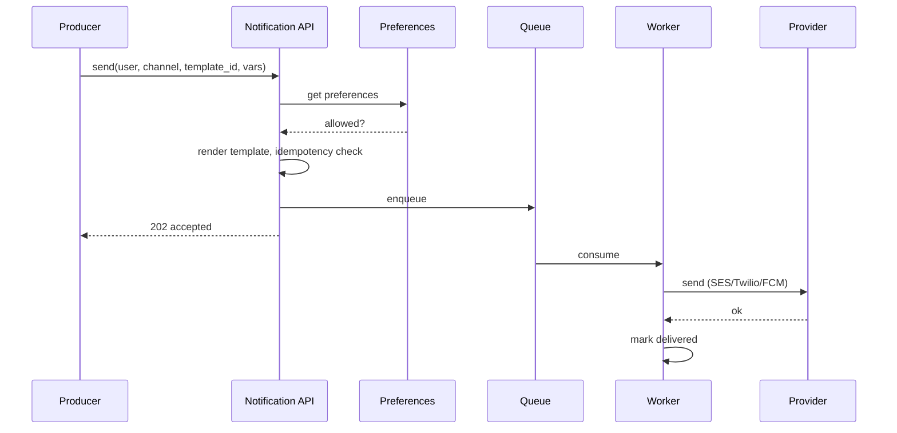

# High-Level Design: Notification System (Email/SMS/Push)

## 1. Overview

A system that delivers notifications to users through multiple channels (Email, SMS, Push) in a reliable, scalable, and channel-agnostic way, with preferences and templating.

---

## System Design Process

### Step 1: Clarify Requirements
- **Functional:** Send via Email, SMS, Push; user preferences (opt-in/out per channel/category); templates with variables; delivery status and retries; optional inbox.
- **Non-functional:** High throughput, low latency enqueue; at-least-once delivery; idempotency.
- **Constraints:** External providers (SES, Twilio, FCM/APNs); prefer queue-based decoupling.

### Step 2: High-Level Design — Components, Data Flow
- **Components:** Notification API, Preferences, Template Service, Message Queue (per channel), Workers (Email/SMS/Push), Notification Log. Data flow: send request → preferences check → template render → idempotency check → enqueue → worker → provider (see §6 below).

#### High-Level Architecture

Component view: producer, gateway, notification API, queue, workers, providers.

**Mermaid:**



#### Flow Diagram — Send notification

**Mermaid:**



### Step 3: Detailed Design — Database & API
- **Database:** SQL or NoSQL for preferences, templates, notification_log; queues (SQS/Kafka) for channel queues.
- **API endpoints (required):**

| Method | Endpoint | Description |
|--------|----------|-------------|
| POST | `/v1/notifications/send` | Send notification; body: user_id, channel, template_id, variables, idempotency_key |
| GET | `/v1/notifications/:id` | Get delivery status |
| GET | `/v1/users/:id/preferences` | Get user notification preferences |
| PUT | `/v1/users/:id/preferences` | Update preferences (channels, categories) |
| GET | `/v1/users/:id/notifications` | Inbox / history (optional, paginated) |

### Step 4: Scale & Optimize
- **Load balancing:** Stateless Notification API behind LB; workers scale with queue partitions.
- **Sharding:** Queue partition by user_id or channel; preferences and log by user_id.
- **Caching:** Preferences in Redis to reduce DB load; template cache in memory.

---

## 2. Requirements (Detail)

### Functional
- Send notifications via Email, SMS, Push (FCM/APNs)
- User preferences: opt-in/opt-out per channel and category
- Templates with variables (e.g. user name, order id)
- Delivery status and retries
- Optional: in-app notification center (inbox)

### Non-Functional
- High throughput and low latency for enqueue
- At-least-once delivery with retries and backoff
- Idempotency to avoid duplicate sends

---

## 3. Capacity Estimation

- **Volume:** 100M notifications/day → ~1.2K/s average; peak 10K/s
- **Channels:** Email 60%, Push 30%, SMS 10%
- **Storage:** Notifications log for 90 days → ~1B records, ~100 GB

---

## 4. High-Level Architecture

```
┌─────────────┐                    ┌──────────────────┐
│  Services   │─── Publish ───────►│  API Gateway     │
│ (Order, etc)│                    └────────┬─────────┘
└─────────────┘                             │
                                            ▼
                                  ┌──────────────────┐
                                  │ Notification     │
                                  │ Service (API)    │
                                  └────────┬─────────┘
                                            │
                    ┌───────────────────────┼───────────────────────┐
                    │                       │                       │
                    ▼                       ▼                       ▼
           ┌────────────────┐      ┌────────────────┐      ┌────────────────┐
           │  Message Queue │      │  Preferences   │      │  Template      │
           │  (per channel  │      │  Service       │      │  Service       │
           │   or unified)  │      │  (DB/Redis)    │      │  (DB)          │
           └───────┬────────┘      └────────────────┘      └────────────────┘
                   │
     ┌─────────────┼─────────────┐
     │             │             │
     ▼             ▼             ▼
┌─────────┐  ┌─────────┐  ┌─────────┐
│ Email   │  │ SMS     │  │ Push    │
│ Worker  │  │ Worker  │  │ Worker  │
└────┬────┘  └────┬────┘  └────┬────┘
     │            │            │
     ▼            ▼            ▼
┌─────────┐  ┌─────────┐  ┌─────────┐
│ SMTP /  │  │ Twilio  │  │ FCM /   │
│ SES     │  │ etc     │  │ APNs    │
└─────────┘  └─────────┘  └─────────┘
```

---

## 5. Core Components

| Component | Responsibility |
|-----------|----------------|
| **Notification API** | Accept send request, resolve template, check preferences, enqueue to channel-specific queue |
| **Preferences Service** | Store and return user preferences (channel on/off, category, quiet hours) |
| **Template Service** | Store templates (subject, body, SMS body) and render with variables |
| **Message Queue** | Per-channel queues (email, sms, push) for decoupling and backpressure |
| **Workers** | Consume queue, call external provider (SES, Twilio, FCM/APNs), record status, retry on failure |
| **Notification Log** | Persist sent notifications for inbox and idempotency |

---

## 6. Data Flow (Send Notification)

1. Producer calls Notification API: `send(user_id, channel, template_id, variables, idempotency_key)`.
2. API loads user preferences → skip if channel/category disabled.
3. API loads template, renders with variables.
4. API checks idempotency (e.g. key in Redis/DB); if already sent, return existing status.
5. API enqueues payload to channel queue (email/sms/push).
6. Worker picks up; calls provider (SES/Twilio/FCM); on success marks delivered; on failure requeues with backoff.
7. Optional: write to notification_log for inbox and analytics.

---

## 7. Data Model (Conceptual)

- **user_preferences:** user_id, channel, category, enabled, quiet_hours
- **templates:** template_id, channel, name, subject (email), body, variables_schema
- **notifications:** id, user_id, channel, template_id, payload, status, created_at, delivered_at
- **idempotency:** idempotency_key → notification_id (TTL 24h)

---

## 8. Scaling & Reliability

- **Workers:** Scale horizontally per queue; each channel can scale independently.
- **Retries:** Exponential backoff; dead-letter queue after N failures.
- **Rate limits:** Respect provider limits (SES, Twilio); throttle per queue or use token bucket.
- **Idempotency:** Prevent duplicate sends for same event (e.g. order shipped once per order_id).

---

## 9. Trade-offs

| Decision | Choice | Rationale |
|----------|--------|-----------|
| Queue | Per-channel | Isolate channel failures and scale independently |
| Preferences | Check before enqueue | Avoid sending then rejecting; reduce cost |
| Template storage | DB with cache | Versioning and admin UI; cache hot templates |

---

## 10. Interview Steps

1. Clarify: channels, preferences, templates, idempotency, inbox.
2. Estimate: volume, peak QPS, storage.
3. Draw: API → preferences/template → queue → workers → providers.
4. Detail: send flow, preference check, template render, retry/DLQ.
5. Scale: multiple workers, per-channel queues, rate limiting.

---

## Interview-Readiness Enhancements

### Capacity & SLO framing
- Define read/write QPS separately and estimate peak vs average traffic.
- Add latency budgets (p95/p99) per critical hop and target availability.
- State durability target and expected data growth/day.

### Critical path clarity
- Document write path (authoritative commit first, async side-effects second).
- Document read path (cache/read model first, fallback to source of truth).
- Identify likely hotspots (hot keys, hot partitions, fanout spikes).

### Failure handling
- Define retry strategy (bounded retries, backoff, jitter).
- Add circuit breakers and bulkheads for unstable dependencies.
- Cover queue failures (DLQ, replay) and datastore failover behavior.

### Security, operations, and cost
- Baseline security: AuthN/AuthZ, encryption in transit/at rest, secrets rotation.
- Observability: golden signals, SLO alerts, tracing, runbooks, canary/rollback.
- DR/cost: explicit RTO/RPO and top cost drivers with optimization levers.

### Trade-off table (mandatory)
- Include at least two realistic alternatives with decision rationale for this system.

