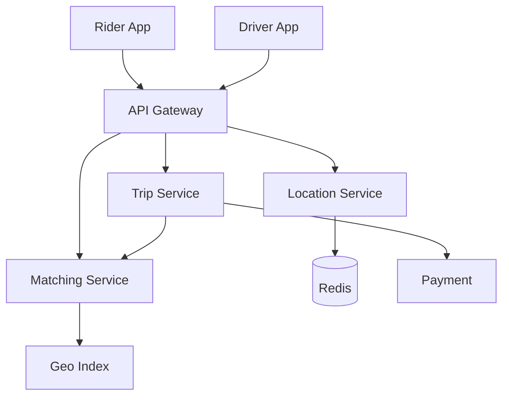
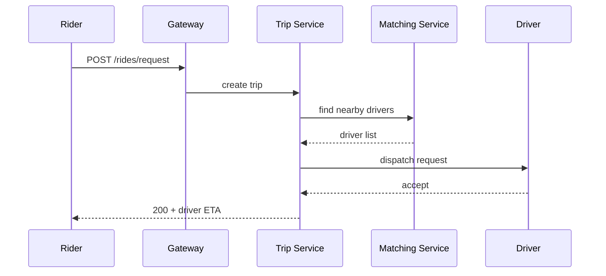

# High-Level Design: Ride-Hailing System (Uber/Ola)

## 1. Overview

A system that matches riders with drivers in real time, handles booking, tracking, and payments, with support for multiple trip types and pricing.

---

## System Design Process

### Step 1: Clarify Requirements
- **Functional:** Rider: request ride, track ETA, cancel, pay, rate. Driver: go online/offline, accept/decline, navigate, complete trip. Real-time location, ETA, dynamic pricing, trip history.
- **Non-functional:** Low latency matching and ETA; high availability; scale to millions of riders/drivers.
- **Constraints:** Real-time location updates (e.g. every 4–5 s per driver).

### Step 2: High-Level Design — Components, Data Flow
- **Components:** Trip Service, Matching Service, Location Service, Pricing Service, Payment Service; Geo Index, Message Queue, Redis/Geohash; see §4–§6 below.

#### High-Level Architecture

**Mermaid:**



#### Flow Diagram — Request ride

**Mermaid:**



### Step 3: Detailed Design — Database & API
- **Database:** SQL for trips, users, payments; Redis/Geohash for driver location; optional NoSQL for trip history.
- **API endpoints (required):**

| Method | Endpoint | Description |
|--------|----------|-------------|
| POST | `/v1/rides/request` | Request ride (pickup, drop, type) |
| GET | `/v1/rides/:id` | Trip status, ETA |
| POST | `/v1/rides/:id/cancel` | Cancel ride |
| POST | `/v1/rides/:id/complete` | Driver completes trip |
| POST | `/v1/drivers/location` | Update driver location (or WebSocket) |
| POST | `/v1/drivers/availability` | Go online/offline |
| POST | `/v1/rides/:id/accept`, `/decline` | Driver accept/decline |
| GET | `/v1/rides/:id/estimate` | Fare estimate |
| POST | `/v1/rides/:id/pay` | Trigger payment |

### Step 4: Scale & Optimize
- **Load balancing:** Stateless services behind LB; WebSocket sticky for location.
- **Sharding:** Trips by trip_id or user_id; location by geohash grid.
- **Caching:** Geo index in memory/Redis; driver availability and location in Redis.

---

## 2. Requirements

### Functional
- Rider: request ride (pickup, drop, type), track driver ETA, cancel, pay, rate
- Driver: go online/offline, accept/decline request, navigate, complete trip, earn
- Real-time location updates and ETA
- Dynamic pricing (surge)
- Trip history and receipts

### Non-Functional
- Low latency for matching and ETA
- High availability for dispatch and payments
- Scale: millions of riders and drivers, thousands of concurrent trips

---

## 3. Capacity Estimation

- **Users:** 50M riders, 2M drivers
- **Trips/day:** 10M
- **Concurrent trips:** ~100K
- **Location updates:** Every 4–5 s per driver → ~500K updates/s at peak

---

## 4. High-Level Architecture

```
┌─────────────┐     ┌─────────────┐                    ┌──────────────────┐
│ Rider App   │     │ Driver App  │                    │  API Gateway     │
└──────┬──────┘     └──────┬──────┘                    └────────┬─────────┘
       │                   │                                    │
       │    Location       │    Location                        │
       │    (WebSocket/    │    (WebSocket/                     │
       │     polling)      │     polling)                       │
       └───────────────────┴────────────────────┬───────────────┘
                                                │
                    ┌───────────────────────────┼───────────────────────────┐
                    │                           │                           │
                    ▼                           ▼                           ▼
           ┌────────────────┐          ┌────────────────┐          ┌────────────────┐
           │  Trip Service   │          │  Matching      │          │  Location      │
           │  (book, cancel, │          │  Service       │          │  Service       │
           │   state machine)│          │  (find drivers)│          │  (store/query  │
           └────────┬────────┘          └───────┬────────┘          │   nearby)      │
                    │                           │                    └───────┬────────┘
                    │                           │                            │
                    │                  ┌────────┴────────┐                   │
                    │                  ▼                 ▼                   ▼
                    │           ┌────────────┐    ┌────────────┐    ┌────────────┐
                    │           │  Geo Index │    │  Message   │    │  Redis /   │
                    │           │  (Grid/    │    │  Queue     │    │  Geohash   │
                    │           │   Geohash) │    │  (match)   │    │  (driver   │
                    │           └────────────┘    └────────────┘    │   location)│
                    │                                               └────────────┘
                    ▼
           ┌────────────────┐    ┌────────────────┐
           │  Pricing       │    │  Payment       │
           │  Service       │    │  Service       │
           └────────────────┘    └────────────────┘
                    │                     │
                    └──────────┬──────────┘
                               ▼
                      ┌────────────────┐
                      │  Database      │
                      │  (trips, users)│
                      └────────────────┘
```

---

## 5. Core Components

| Component | Responsibility |
|-----------|----------------|
| **Trip Service** | Create trip, state transitions (requested → accepted → in_progress → completed), cancel, ETA |
| **Matching Service** | Find nearby available drivers (geo index), dispatch request, accept/decline flow, timeout and re-dispatch |
| **Location Service** | Ingest driver locations (WebSocket/polling), store in Redis/Geohash or grid; query nearby drivers |
| **Pricing Service** | Compute fare (base + distance + time + surge multiplier); surge based on demand/supply ratio |
| **Payment Service** | Charge rider (card/wallet), pay driver (settlement); idempotent and auditable |
| **Geo Index** | Grid or Geohash to quickly find drivers in a radius around pickup |

---

## 6. Data Flow (Request Ride)

1. Rider sends pickup + drop + trip type to Trip Service.
2. Trip Service creates trip in state "searching"; calls Matching Service with pickup location.
3. Matching Service queries Location Service for nearby available drivers (e.g. within 5 km).
4. Matching Service selects top N drivers (by distance/rating), sends dispatch request (push to driver app).
5. First driver to accept → Matching Service notifies Trip Service; trip state → "accepted"; rider and driver get update.
6. If no accept within T seconds, expand radius or re-dispatch; after K timeouts, mark "no drivers" and notify rider.
7. Driver reaches pickup → state "in_progress"; at drop → state "completed"; Pricing and Payment run.

---

## 7. Location Updates

- Driver app sends (lat, lng) every 4–5 s via WebSocket or batched HTTP.
- Location Service writes to Redis: key = driver_id, value = geohash + lat/lng, TTL = 60 s (driver considered offline if no update).
- Geo query: rider's pickup geohash → get same and adjacent cells from Redis/Geospatial index → return driver_ids.

---

## 8. Data Model (Conceptual)

- **users:** rider/driver profile, payment methods
- **trips:** trip_id, rider_id, driver_id, pickup, drop, status, fare, created_at, completed_at
- **driver_locations:** driver_id, lat, lng, updated_at (ephemeral)
- **surge_zones:** zone_id, multiplier, updated_at

---

## 9. Scaling

- **Location:** High write throughput; Redis Cluster or dedicated geo store; partition by region.
- **Matching:** Stateless; scale workers; use message queue for async dispatch and accept.
- **Trip DB:** Shard by trip_id or rider_id; read replicas for history.

---

## 10. Trade-offs

| Decision | Choice | Rationale |
|----------|--------|-----------|
| Geo index | Geohash or grid in Redis | Fast "drivers in area" query |
| Dispatch | Push to driver + first-accept wins | Low latency; avoid over-assignment with timeout and lock |
| Surge | Demand/supply ratio per zone, periodic refresh | Balance supply and revenue |

---

## 11. Interview Steps

1. Clarify: trip types, payment flow, surge, pooling.
2. Estimate: trips/s, location updates/s, storage.
3. Draw: Trip, Matching, Location, Pricing, Payment; geo index.
4. Detail: request flow, matching (nearby + dispatch + accept), location ingest and query.
5. Scale: Redis for location, sharding, async dispatch.
