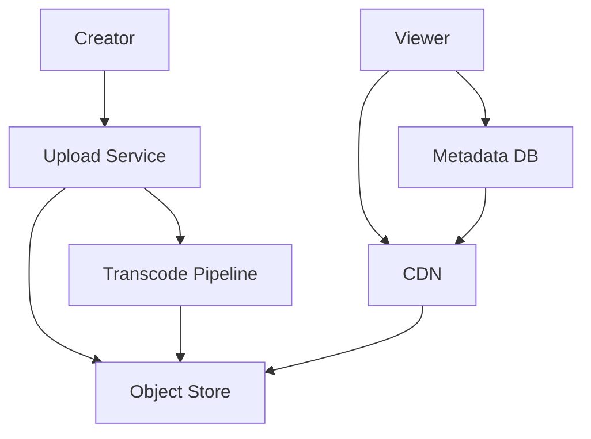
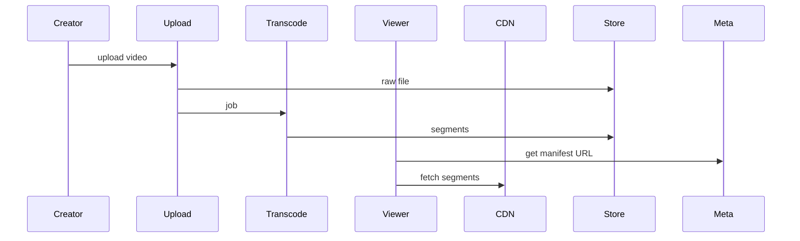

# High-Level Design: Video Streaming Platform (YouTube/Netflix)

## 1. Overview

A platform for uploading, storing, transcoding, and streaming video to viewers with adaptive bitrate streaming (ABR), search, and recommendations.

---

## System Design Process

### Step 1: Clarify Requirements
- **Functional:** Upload and process video; stream (adaptive, seek, resume); search and discovery; metadata, comments, likes; optional live.
- **Non-functional:** Low startup and buffering; scale to millions of videos, billions of views; cost-effective storage and CDN.
- **Constraints:** Multiple qualities/bitrates; HLS/DASH for ABR.

### Step 2: High-Level Design — Components, Data Flow
- **Components:** Upload Service, Transcoding Pipeline, Metadata DB, CDN, Streaming Service, Search/Recs; see §4–§6 below.

#### High-Level Architecture

**Mermaid:**



#### Flow Diagram — Upload and stream

**Mermaid:**



### Step 3: Detailed Design — Database & API
- **Database:** SQL/NoSQL for metadata (video, creator, manifest URLs); object store for segments; Elasticsearch for search.
- **API endpoints (required):**

| Method | Endpoint | Description |
|--------|----------|-------------|
| POST | `/v1/videos/upload` | Initiate upload (multipart or resumable) |
| GET | `/v1/videos/:id` | Video metadata, manifest URL |
| GET | `/v1/videos/:id/stream` | Stream manifest (HLS/DASH) or redirect to CDN |
| GET | `/v1/videos/:id/progress` | Watch progress (save/read) |
| GET | `/v1/search?q=...` | Search videos |
| GET | `/v1/recommendations` | Recommended videos |
| POST | `/v1/videos/:id/like`, `/comments` | Like, comment (optional) |

### Step 4: Scale & Optimize
- **Load balancing:** Stateless upload and API; CDN for all segment traffic.
- **Sharding:** Metadata by video_id; segments in object store (key by video_id + quality + segment).
- **Caching:** CDN for segments and manifest; metadata cache (Redis) for hot videos.

---

## 2. Requirements

### Functional
- Upload video (creator); process and store
- Stream video to viewer (adaptive quality, seek, resume)
- Search and discovery; recommendations
- Thumbnails, metadata, comments, likes
- Optional: live streaming

### Non-Functional
- Low startup time and minimal buffering
- Scale: millions of videos, billions of views
- Cost-effective storage and egress (CDN)

---

## 3. Capacity Estimation

- **Videos:** 500M; avg 10 min, multiple qualities → ~50 PB storage
- **Views:** 1B/day; avg 5 min watch → ~350K concurrent streams
- **Uploads:** 1M/day; ingest and transcode pipeline

---

## 4. High-Level Architecture

```
┌─────────────┐                    ┌──────────────────┐
│  Creator    │── Upload ─────────►│  API / Upload    │
└─────────────┘                    │  Service         │
                                   └────────┬─────────┘
                                            │
                                   ┌────────▼─────────┐
                                   │  Object Store    │
                                   │  (raw upload)    │
                                   └────────┬─────────┘
                                            │
┌─────────────┐                    ┌────────▼─────────┐
│  Viewer     │◄── Stream ────────►│  CDN            │
└─────────────┘   (HLS/DASH)       │  (segments)     │
       │                           └────────▲─────────┘
       │                                    │
       │                           ┌────────┴─────────┐
       │                           │  Transcoding     │
       │                           │  Pipeline        │
       │                           │  (workers)       │
       │                           └────────┬─────────┘
       │                                    │
       │                           ┌────────▼─────────┐
       │                           │  Metadata DB     │
       │                           │  (video info,    │
       │                           │   manifest URLs) │
       │                           └──────────────────┘
       │
       └── Search / Recommendations ──► Search Index (Elasticsearch) / Rec Service
```

---

## 5. Core Components

| Component | Responsibility |
|-----------|----------------|
| **Upload Service** | Accept multipart upload, write to object store, create job for transcoding |
| **Transcoding Pipeline** | Decode source, encode to multiple resolutions/bitrates (e.g. 360p, 720p, 1080p), segment (e.g. 4–6 s), upload segments to object store, generate HLS/DASH manifest |
| **Metadata DB** | Video id, title, creator, duration, manifest URLs per quality, thumbnail, status (processing/ready) |
| **CDN** | Cache and serve segments and manifest; origin = object store |
| **Streaming Service** | Return manifest URL (or redirect to CDN); track watch progress |
| **Search / Recommendations** | Index metadata; recommend by watch history and engagement |

---

## 6. Data Flow

### Upload
1. Creator uploads file (chunked) to Upload Service → object store (raw bucket).
2. Upload Service creates record in Metadata DB (status=processing) and enqueues transcode job (video_id, source_uri).
3. Transcoding workers pull job; download source; transcode to 360p/720p/1080p; segment; upload segments to CDN origin bucket; write manifest URLs to Metadata DB; set status=ready.

### Playback
1. Viewer requests play(video_id). Backend returns manifest URL (or page with player that loads manifest from CDN).
2. Player fetches manifest from CDN (e.g. master.m3u8); selects quality based on bandwidth; fetches segment files (.ts or .m4s) from CDN.
3. Optional: backend records watch progress (user_id, video_id, position) for resume and analytics.

---

## 7. Adaptive Bitrate (ABR)

- Manifest lists multiple renditions (e.g. 360p, 720p, 1080p) with segment URLs.
- Player measures throughput; chooses next segment from appropriate rendition to minimize buffering while maximizing quality.
- No server-side logic per request; all in manifest + client.

---

## 8. Data Model (Conceptual)

- **videos:** video_id, creator_id, title, description, duration, status, created_at, thumbnail_url
- **video_renditions:** video_id, quality (360p/720p/1080p), manifest_url, segment_base_url
- **watch_progress:** user_id, video_id, position_seconds, updated_at

---

## 9. Scaling

- **Storage:** Object store (S3/GCS) with lifecycle (archive old/low-views); cold storage for long tail.
- **Transcode:** Queue (SQS/Kafka) + worker pool; scale workers; use GPU instances for faster encode.
- **Delivery:** CDN for all segments and manifest; reduce origin load and latency globally.
- **Metadata:** DB sharded by video_id; read replicas for catalog and search.

---

## 10. Trade-offs

| Decision | Choice | Rationale |
|----------|--------|-----------|
| Format | HLS / DASH | Standard ABR; wide player support |
| Transcode | Async pipeline | Decouple upload latency from processing time |
| Origin | Object store + CDN | Cost and scale; CDN absorbs view load |

---

## 11. Interview Steps

1. Clarify: upload vs live, quality levels, search/recs.
2. Estimate: storage, egress, concurrent streams.
3. Draw: Upload → object store → transcode → segments → CDN; metadata DB; playback = manifest + CDN.
4. Detail: transcode pipeline (resolutions, segment length), manifest structure, ABR on client.
5. Scale: CDN, queue-based transcode, object store + lifecycle.

---

## Interview-Readiness Enhancements

### Capacity & SLO framing
- Define read/write QPS separately and estimate peak vs average traffic.
- Add latency budgets (p95/p99) per critical hop and target availability.
- State durability target and expected data growth/day.

### Critical path clarity
- Document write path (authoritative commit first, async side-effects second).
- Document read path (cache/read model first, fallback to source of truth).
- Identify likely hotspots (hot keys, hot partitions, fanout spikes).

### Failure handling
- Define retry strategy (bounded retries, backoff, jitter).
- Add circuit breakers and bulkheads for unstable dependencies.
- Cover queue failures (DLQ, replay) and datastore failover behavior.

### Security, operations, and cost
- Baseline security: AuthN/AuthZ, encryption in transit/at rest, secrets rotation.
- Observability: golden signals, SLO alerts, tracing, runbooks, canary/rollback.
- DR/cost: explicit RTO/RPO and top cost drivers with optimization levers.

### Trade-off table (mandatory)
- Include at least two realistic alternatives with decision rationale for this system.

