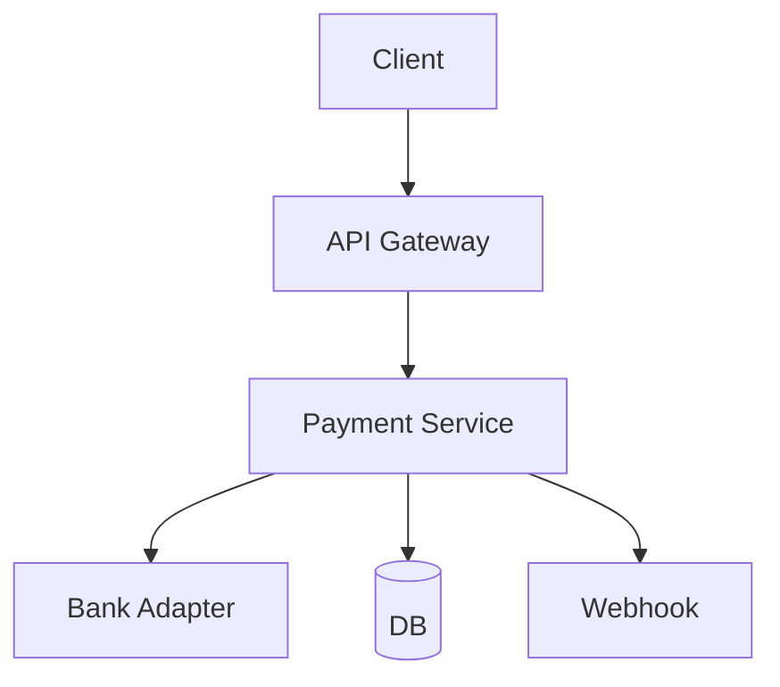
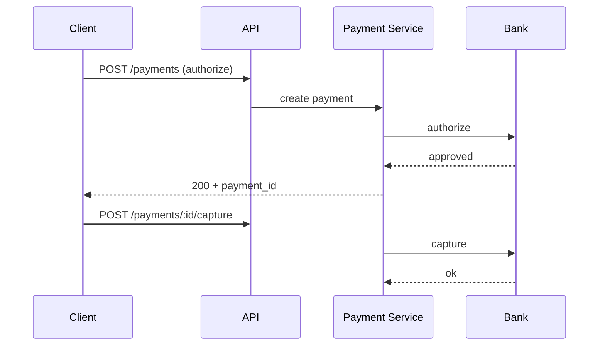

# High-Level Design: Payment Gateway (Stripe/Razorpay)

## 1. Overview

A system that lets merchants accept payments (cards, UPI, wallets) from customers, with authorization, capture, refunds, and reconciliation with banks and card networks.

---

## System Design Process

### Step 1: Clarify Requirements
- **Functional:** Authorize/capture payments; refunds; webhooks; merchant dashboard; idempotency. See §2 below.
- **Non-functional:** PCI-DSS; high availability; audit trail. **Constraints:** No raw card storage; use tokenization.

### Step 2: High-Level Design — Components, Data Flow
- **Components:** API Gateway, Payment Service, Bank Adapter, Webhook Service, DB; see §4–§6 below.
- #### High-Level Architecture

**Mermaid:**



#### Flow Diagram — Authorize and capture

**Mermaid:**



### Step 3: Detailed Design — Database & API
- **Database:** SQL for transactions, idempotency keys, settlements; audit log.
- **API endpoints (required):** POST `/v1/payments` (create/intent), POST `/v1/payments/:id/capture`, POST `/v1/refunds`, GET `/v1/payments/:id`, POST `/v1/webhooks` (receive from bank). See LLD for full list.

### Step 4: Scale & Optimize
- **Load balancing:** Stateless API and payment service behind LB.
- **Sharding:** Transactions by merchant_id or payment_id.
- **Caching:** Idempotency key cache (Redis); avoid duplicate charges.

---

## 2. Requirements

### Functional
- Process payment (card/UPI/wallet): authorize and optionally capture
- Capture previously authorized payment
- Refund (full or partial)
- Webhooks for payment status (succeeded, failed, refunded)
- Merchant dashboard: transactions, settlements, API keys
- Idempotency for all mutating operations

### Non-Functional
- Security: PCI-DSS; no raw card data stored (use tokenization or provider)
- High availability and consistency for money movement
- Audit trail and reconciliation

---

## 3. Capacity Estimation

- **TPS:** 10K payment requests/s peak
- **Storage:** 1B transactions; ~500 bytes each → ~500 GB
- **Settlement:** Daily batch to bank; reconciliation reports

---

## 4. High-Level Architecture

```
┌─────────────┐                    ┌──────────────────┐
│  Merchant   │── API (idempotent)─►│  API Gateway     │
│  / Customer │                    └────────┬─────────┘
└─────────────┘                             │
                                            ▼
                                  ┌──────────────────┐
                                  │  Payment Service │
                                  │  (orchestration) │
                                  └────────┬─────────┘
                                            │
        ┌───────────────────────────────────┼───────────────────────────────────┐
        │                                   │                                   │
        ▼                                   ▼                                   ▼
┌────────────────┐                 ┌────────────────┐                 ┌────────────────┐
│  Acquirer /    │                 │  Idempotency    │                 │  Transaction   │
│  Card Network  │                 │  Store (Redis) │                 │  DB (ledger)   │
│  (or PSP)      │                 └────────────────┘                 └────────────────┘
└────────────────┘                           │                                   │
        │                                     │                                   │
        │                                     └───────────────────────────────────┘
        │
        ▼
┌────────────────┐                 ┌────────────────┐
│  Webhook       │                 │  Settlement     │
│  Dispatcher    │                 │  Service        │
└────────────────┘                 └────────────────┘
```

---

## 5. Core Components

| Component | Responsibility |
|-----------|----------------|
| **Payment Service** | Validate request, idempotency check, create transaction record, call acquirer/PSP, update state, emit webhook |
| **Acquirer / PSP Integration** | Forward auth/capture/refund to bank or card network (or Stripe/Razorpay as aggregator); receive response |
| **Transaction Store (Ledger)** | Append-only or stateful record per payment: id, merchant, amount, currency, status, idempotency_key, created_at |
| **Idempotency Store** | Key = idempotency_key (merchant-provided); value = payment_id + response; TTL 24h |
| **Webhook Dispatcher** | On status change, POST to merchant URL with retries and signature |
| **Settlement Service** | Batch daily payouts to merchant bank; reconciliation with acquirer reports |

---

## 6. Data Flow (Create Payment)

1. Merchant POST /v1/payments with idempotency_key, amount, currency, payment_method (token/card_id), etc.
2. Payment Service: lookup idempotency_key; if found return cached response.
3. Create transaction row (status=pending); call acquirer authorize (and capture if auto_capture).
4. On success: update transaction status=success/captured; store idempotency_key → payment_id + response; dispatch webhook; return 200 + payment details.
5. On failure: update status=failed; store idempotency response; dispatch webhook; return 4xx with error.

---

## 7. Payment States

- **pending:** Created, auth in progress
- **authorized:** Auth success, not captured (if two-phase)
- **captured:** Charge completed
- **failed:** Auth or capture failed
- **refunded:** Full or partial refund
- **disputed:** Chargeback (later phase)

---

## 8. Data Model (Conceptual)

- **transactions:** id, merchant_id, amount, currency, status, payment_method_type, idempotency_key, external_id (acquirer ref), created_at, metadata
- **refunds:** id, payment_id, amount, status, created_at
- **webhook_deliveries:** id, payment_id, url, payload, status, attempts, next_retry_at

---

## 9. Security and Compliance

- Never log or store full card number; use tokenization (Stripe Token, Razorpay token) or PCI-compliant vault.
- Idempotency keys mandatory for create payment, capture, refund.
- Webhook signature (HMAC) so merchant can verify origin.

---

## 10. Trade-offs

| Decision | Choice | Rationale |
|----------|--------|-----------|
| Idempotency | Server-side with merchant key | Prevents duplicate charges on retry |
| Acquirer | Integrate via single PSP (e.g. Stripe) first | Faster to market; multi-PSP later |
| Ledger | Append-only or immutable updates | Audit and reconciliation |

---

## 11. Interview Steps

1. Clarify: auth-only vs auto-capture, refunds, webhooks, multi-currency.
2. Estimate: TPS, storage, settlement frequency.
3. Draw: API → Payment Service → Idempotency + Ledger + Acquirer; Webhook + Settlement.
4. Detail: create payment flow with idempotency; state transitions; webhook retry.
5. Security: tokenization, idempotency, webhook signing.

---

## Interview-Readiness Enhancements

### Capacity & SLO framing
- Define read/write QPS separately and estimate peak vs average traffic.
- Add latency budgets (p95/p99) per critical hop and target availability.
- State durability target and expected data growth/day.

### Critical path clarity
- Document write path (authoritative commit first, async side-effects second).
- Document read path (cache/read model first, fallback to source of truth).
- Identify likely hotspots (hot keys, hot partitions, fanout spikes).

### Failure handling
- Define retry strategy (bounded retries, backoff, jitter).
- Add circuit breakers and bulkheads for unstable dependencies.
- Cover queue failures (DLQ, replay) and datastore failover behavior.

### Security, operations, and cost
- Baseline security: AuthN/AuthZ, encryption in transit/at rest, secrets rotation.
- Observability: golden signals, SLO alerts, tracing, runbooks, canary/rollback.
- DR/cost: explicit RTO/RPO and top cost drivers with optimization levers.

### Trade-off table (mandatory)
- Include at least two realistic alternatives with decision rationale for this system.

