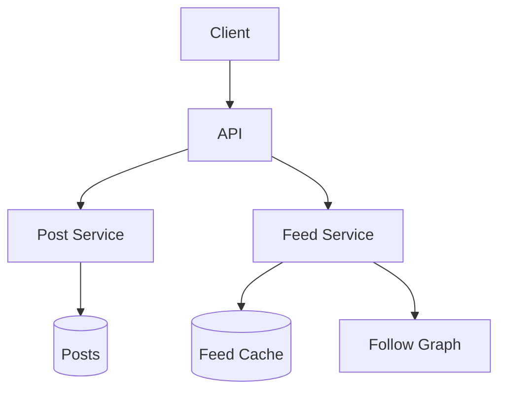
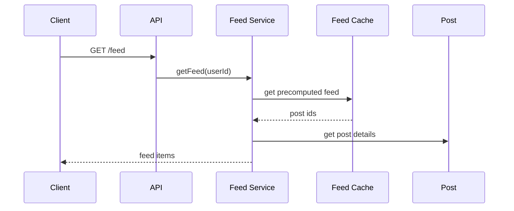

# High-Level Design: News Feed System

## 1. Overview

A system that generates a personalized, time-ordered feed of posts (from people/groups a user follows) with low latency and high freshness, similar to Facebook/LinkedIn feed.

---

## System Design Process

### Step 1: Clarify Requirements
- **Functional:** Post creation; feed (sorted/ranked); follow/unfollow; like, comment, share; pagination. See §2 below.
- **Non-functional:** Feed latency < 200 ms; scale to millions of users; balance fan-out write vs read. **Constraints:** Fan-out choice (push vs pull vs hybrid).

### Step 2: High-Level Design — Components, Data Flow
- **Components:** Post Service, Feed Service, Graph (follow) Service, Feed Store (per-user or activity store); see §4–§6 below.
- #### High-Level Architecture

**Mermaid:**



#### Flow Diagram — Get feed

**Mermaid:**



### Step 3: Detailed Design — Database & API
- **Database:** SQL/NoSQL for posts; feed store (NoSQL or cache) per user if push; graph DB or table for follow.
- **API endpoints (required):** POST `/v1/posts`, GET `/v1/feed` (cursor, limit), GET `/v1/posts/:id`, POST `/v1/follow`, POST `/v1/posts/:id/like`, POST `/v1/posts/:id/comments`. See LLD for full list.

### Step 4: Scale & Optimize
- **Load balancing:** Stateless services; read replicas for feed.
- **Sharding:** Posts by user_id or post_id; feed by user_id.
- **Caching:** Per-user feed cache (Redis); precomputed for push model.

---

## 2. Requirements

### Functional
- Post creation (text, media, link)
- Feed: list of posts from followed entities, sorted by time (or ranking)
- Follow/unfollow users/pages
- Like, comment, share
- Real-time or near-real-time feed updates
- Pagination (infinite scroll)

### Non-Functional
- Feed read latency < 200 ms p99
- Handle millions of users and billions of posts
- Fan-out: balance write amplification vs read complexity

---

## 3. Capacity Estimation

- **Users:** 300M; 50M DAU
- **Posts/day:** 100M
- **Feed reads/day:** 500M (10 per DAU)
- **Avg followees:** 200 → fan-out write 100M × 200 = 20B feed writes/day → ~230K/s write if push model

---

## 4. High-Level Architecture

```
┌─────────────┐                    ┌──────────────────┐
│   Client    │                    │  API Gateway     │
└──────┬──────┘                    └────────┬─────────┘
       │                                     │
       │     ┌───────────────────────────────┼───────────────────────────────┐
       │     │                               │                               │
       │     ▼                               ▼                               ▼
       │  ┌────────────┐            ┌────────────┐            ┌────────────┐
       │  │ Post       │            │ Feed       │            │ Social     │
       │  │ Service    │            │ Service    │            │ Graph      │
       │  └─────┬──────┘            └─────┬──────┘            │ (follows)  │
       │        │                          │                   └─────┬──────┘
       │        │                          │                         │
       │        ▼                          │                         │
       │  ┌────────────┐                   │                         │
       │  │ Posts DB   │                   │                         │
       │  └────────────┘                   │                         │
       │        │                          │                         │
       │        │     ┌────────────────────┼────────────────────┐    │
       │        │     │                    │                    │    │
       │        │     ▼                    ▼                    ▼    │
       │        │  ┌────────────┐   ┌────────────┐   ┌────────────┐│
       │        │  │ Feed Cache │   │ Feed       │   │ Graph DB   ││
       │        │  │ (Redis)    │   │ Store      │   │ or Cache   ││
       │        │  │ user→posts │   │ (push)     │   │ user→followees
       │        │  └────────────┘   └────────────┘   └────────────┘│
       │        │         │                │                        │
       │        │         │                │   Fan-out on write    │
       │        └─────────┴────────────────┴────────────────────────┘
       │                          │
       │                    ┌─────▼─────┐
       │                    │ Message   │
       │                    │ Queue     │
       │                    └───────────┘
```

---

## 5. Core Components

| Component | Responsibility |
|-----------|----------------|
| **Post Service** | Create post, store in Posts DB, publish event (post_id, user_id, timestamp) to queue |
| **Feed Service** | Read feed: from cache (push) or build from followees’ posts (pull/hybrid); merge and sort; paginate |
| **Social Graph** | Follow/unfollow; return list of followees for a user (cached) |
| **Fan-out Worker** | Consume post events; for each new post, get author’s followers; write post_id to each follower’s feed in cache/feed store |
| **Feed Cache/Store** | Per-user feed: sorted list/set of (post_id, timestamp); Redis sorted set or dedicated feed table |
| **Message Queue** | Decouple post creation from fan-out |

---

## 6. Fan-out Strategies

### Push (write-time fan-out)
- On new post: fan-out to all followers’ feed cache/store.
- **Pro:** Read feed = read one list → very fast. **Con:** Heavy write (e.g. celebrity with 10M followers); need limit (e.g. cap fan-out, rest via pull).

### Pull (read-time)
- On feed read: get followees, fetch their latest posts, merge-sort in memory.
- **Pro:** No write amplification. **Con:** Read cost scales with followees and posts; latency higher.

### Hybrid
- Push for normal users (bounded followers); pull for celebrities or “infinite” scroll beyond cached window.
- Or: push only recent N posts per user into feed cache; older posts pulled on demand.

---

## 7. Data Flow

### Publish post
1. Post Service stores post in DB; publishes event to queue.
2. Fan-out worker: get post author’s followers (from graph service/cache).
3. For each follower (or batch): append (post_id, timestamp) to follower’s feed in Redis sorted set (or feed table). If follower count > threshold (e.g. 10K), skip push for that user or fan-out async in chunks.
4. Optionally pre-warm cache for online users.

### Read feed
1. Feed Service: get user_id from request.
2. Read feed from Redis (e.g. ZREVRANGE feed:user_id 0 29) for first page.
3. If cache miss (new user or cold): pull from feed store or run pull merge from followees’ posts; backfill cache.
4. Resolve post_id → post content (batch from Posts DB or cache); return ordered list.

---

## 8. Data Model (Conceptual)

- **posts:** post_id, user_id, content, created_at, like_count, comment_count
- **follows:** follower_id, followee_id (social graph)
- **feed_store:** user_id, post_id, created_at (for push model; can be Redis sorted set)
- **feed_cache:** user_id → list of (post_id, ts) in Redis

---

## 9. Ranking (Optional)

- Instead of pure time: score = f(recency, likes, comments, affinity). Precompute score at fan-out or at read time; store (post_id, score) in feed; sort by score.
- Machine learning ranking model can run offline to score and reorder feed.

---

## 10. Scaling

- **Fan-out:** Async workers; batch inserts; skip or limit fan-out for very high follower counts.
- **Feed cache:** Redis Cluster; key = user_id; value = sorted set; set size limit (e.g. 1000) and trim by score (time).
- **Social graph:** Cache followees list; DB sharded by follower_id.
- **Posts:** Sharded by user_id or post_id; read replicas for feed resolution.

---

## 11. Interview Steps

1. Clarify: ranking vs chronological, real-time vs batch, celebrity handling.
2. Estimate: posts/s, feed reads/s, fan-out writes/s.
3. Draw: Post Service, Feed Service, Social Graph, Fan-out Worker, Feed Cache/Store, Queue.
4. Detail: push vs pull vs hybrid; fan-out on write; read path from cache.
5. Scale: batching, celebrity limit, Redis sorted set, and caching post content.
