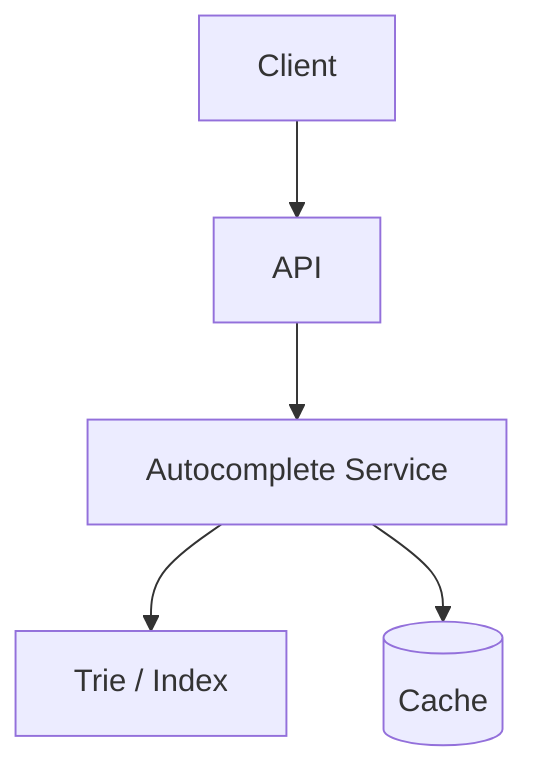
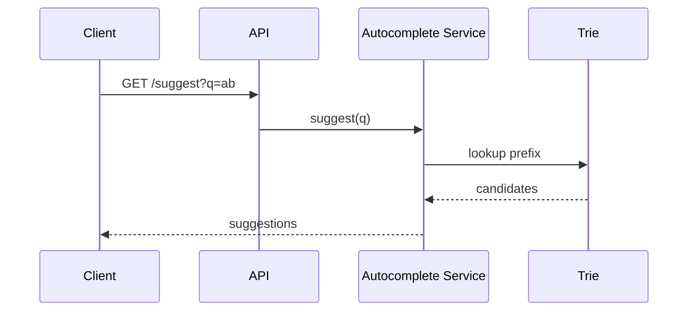

# High-Level Design: Search Autocomplete System

## 1. Overview

A system that suggests completions or trending queries as the user types (e.g. search box autocomplete), with low latency and support for popularity and personalization.

---

## System Design Process
- **Step 1: Clarify Requirements** — Functional/non-functional and constraints: see §2 below.
- **Step 2: High-Level Design** — Components, interfaces, data flow: see §4–§6 below.
- **Step 3: Detailed Design** — Database (SQL/NoSQL) and API design: see Data Model and LLD for full API list.
- **Step 4: Scale & Optimize** — Load balancing, sharding, caching: see Scaling below.

#### High-Level Architecture

**Mermaid:**



#### Flow Diagram — Get suggestions

**Mermaid:**



**API endpoints (required):** GET `/v1/suggest?q=...&limit=10` (suggestions). See LLD for full list.

---

## 2. Requirements

### Functional
- Return top-K suggestions (queries or product names) given a prefix
- Suggestions ordered by frequency/popularity or relevance
- Optional: personalization (user history), trending, spelling correction
- Update suggestion index as search behavior changes (periodic or real-time)

### Non-Functional
- Latency < 100 ms for each keystroke
- Scale: millions of unique queries, thousands of QPS
- Handle typos (fuzzy) optionally

---

## 3. Capacity Estimation

- **Unique queries:** 10M
- **QPS:** 50K (autocomplete requests)
- **Avg prefix length:** 5 characters
- **Storage:** Trie or n-gram index; estimate 1–2 GB in memory per node tier

---

## 4. High-Level Architecture

```
┌─────────────┐                    ┌──────────────────┐
│   Client    │── prefix ──────────►│  API Gateway     │
└─────────────┘                    └────────┬─────────┘
                                            │
                                            ▼
                                  ┌──────────────────┐
                                  │ Autocomplete     │
                                  │ Service          │
                                  └────────┬─────────┘
                                            │
                    ┌───────────────────────┼───────────────────────┐
                    │                       │                       │
                    ▼                       ▼                       ▼
           ┌────────────────┐      ┌────────────────┐      ┌────────────────┐
           │  Trie / Prefix  │      │  Query Log      │      │  Aggregation    │
           │  Store (Redis  │      │  (searches)     │      │  Pipeline       │
           │  or in-memory) │      │  Kafka/DB      │      │  (count by      │
           └────────────────┘      └───────┬────────┘      │   query)        │
                                            │               └────────┬────────┘
                                            │                        │
                                            └────────────────────────┘
                                                    (build/update index)
```

---

## 5. Core Components

| Component | Responsibility |
|-----------|----------------|
| **Autocomplete Service** | Accept prefix, query trie or prefix store, return top-K suggestions with scores |
| **Prefix Store** | Trie (in-memory or Redis) or sorted set per prefix: prefix → sorted set (query, count) |
| **Query Log** | Record every search (query, user_id, timestamp) for aggregation |
| **Aggregation Pipeline** | Batch or stream: count queries by full query string (and optionally by prefix); update trie or prefix-store periodically |
| **Index Builder** | Rebuild or incrementally update trie from aggregated counts; deploy to Autocomplete Service |

---

## 6. Data Structures

### Trie (Prefix Tree)
- Each node = character; path from root = prefix. Store at each node (or at leaf): list of (query, count) for queries that start with this prefix.
- Query: traverse prefix; at node, return top-K by count from that node’s list. Limitation: store only top M queries per node to bound memory (e.g. top 100 per prefix).

### Alternative: Per-prefix Sorted Set (Redis)
- Key = "ac:" + prefix (e.g. "ac:app"); value = query string; score = count or recency score.
- ZREVRANGE ac:app 0 9 → top 10. For each keystroke, lookup prefix; Redis supports range query. Need to maintain keys for all prefixes (e.g. all 1-, 2-, 3- character prefixes that exist in query set) or use a trie in application over Redis keys.

### Hybrid
- Trie in application memory (one box or sharded by first letter); each node holds top 100 (query, count). Rebuild daily from aggregated logs.

---

## 7. Data Flow

### Query (read path)
1. Client sends prefix (e.g. "app").
2. Autocomplete Service looks up prefix in trie (or Redis).
3. Return top K suggestions (e.g. "apple store", "apple music", "app download") with optional metadata.
4. Latency target: single in-memory lookup or single Redis round-trip.

### Index update (write path)
1. Every search is logged (query, timestamp) to Kafka or append-only store.
2. Aggregation job (batch or stream): count queries per full query string over last 7 days (or 24h for trending).
3. Build trie: for each query, insert into trie at every prefix (a, ap, app, appl, ...); at each node keep only top M queries by count.
4. Deploy new trie to service (swap) or update Redis keys; repeat every hour or daily.

---

## 8. Data Model (Conceptual)

- **Query log:** query, user_id, timestamp (stream or batch table)
- **Aggregated counts:** query, count, period (e.g. last_7d)
- **Trie:** in-memory; node → children; node → [(query, count)] top M

---

## 9. Scaling

- **Read:** In-memory trie → sub-ms; replicate trie to multiple instances; or Redis Cluster with prefix keys.
- **Trie size:** Limit suggestions per prefix (e.g. 100); prune low-count queries.
- **Update:** Rebuild trie offline; blue-green deploy or lazy load new trie.

---

## 10. Optional: Personalization and Trending

- **Personalization:** Per-user trie or per-user top queries; merge with global trie with boost for user’s history.
- **Trending:** Use counts from last 1h or 24h; blend with 7d counts.
- **Fuzzy:** Use edit-distance or n-gram index for typo tolerance; more complex and higher latency.

---

## 11. Interview Steps

1. Clarify: global vs personalized, trending, typo tolerance, update frequency.
2. Estimate: QPS, unique queries, memory for trie.
3. Draw: Client → Autocomplete Service → Trie/Prefix Store; Query Log → Aggregation → Index Builder.
4. Detail: trie structure (prefix → top-K), read path; how index is built from logs.
5. Scale: in-memory trie replica, Redis, and periodic rebuild.

---

## Interview-Readiness Enhancements

### Capacity & SLO framing
- Define read/write QPS separately and estimate peak vs average traffic.
- Add latency budgets (p95/p99) per critical hop and target availability.
- State durability target and expected data growth/day.

### Critical path clarity
- Document write path (authoritative commit first, async side-effects second).
- Document read path (cache/read model first, fallback to source of truth).
- Identify likely hotspots (hot keys, hot partitions, fanout spikes).

### Failure handling
- Define retry strategy (bounded retries, backoff, jitter).
- Add circuit breakers and bulkheads for unstable dependencies.
- Cover queue failures (DLQ, replay) and datastore failover behavior.

### Security, operations, and cost
- Baseline security: AuthN/AuthZ, encryption in transit/at rest, secrets rotation.
- Observability: golden signals, SLO alerts, tracing, runbooks, canary/rollback.
- DR/cost: explicit RTO/RPO and top cost drivers with optimization levers.

### Trade-off table (mandatory)
- Include at least two realistic alternatives with decision rationale for this system.

