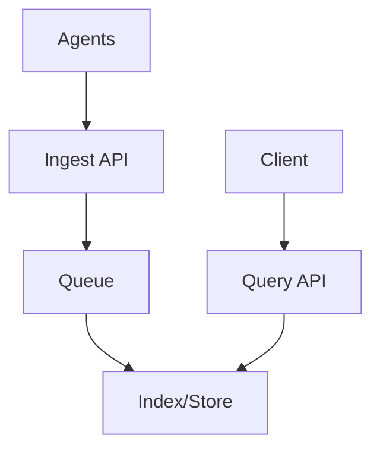
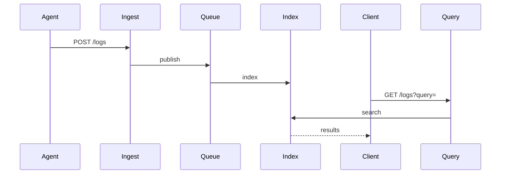

# High-Level Design: Logging & Monitoring System

## 1. Overview

A centralized system to collect, store, search, and visualize logs and metrics from many services, with alerting and dashboards (e.g. ELK, Datadog, Prometheus+Grafana style).

---

## System Design Process
- **Step 1: Clarify Requirements** — See §2 below (ingest, query, retention, alerts).
- **Step 2: High-Level Design** — Components and data flow: see §4–§6 below.
- **Step 3: Detailed Design** — Storage (e.g. Elasticsearch, S3 + index) and API: see LLD for full API list.
- **Step 4: Scale & Optimize** — Sharding, retention, caching: see Scaling below.

#### High-Level Architecture

**Mermaid:**



#### Flow Diagram — Ingest and query

**Mermaid:**



**API endpoints (required):** POST `/v1/logs` (ingest), GET `/v1/logs?query=...` (search). See LLD for full list.

---

## 2. Requirements

### Functional
- Ingest logs (text, JSON) and metrics (counters, gauges, histograms) from applications and infra
- Store logs with retention (e.g. 30 days hot, 1 year cold)
- Full-text and structured search on logs
- Dashboards and charts for metrics
- Alerts based on thresholds or patterns (e.g. error rate, latency p99)
- Optional: distributed tracing (trace_id across services)

### Non-Functional
- High ingest throughput (millions of events/s)
- Low query latency for recent data
- Reliable delivery (at-least-once) and no silent drops under load

---

## 3. Capacity Estimation

- **Log volume:** 100 GB/day from 10K hosts
- **Metrics:** 1M time series, 10s scrape interval → ~10K samples/s write
- **Query:** 1K concurrent dashboard + ad-hoc search
- **Retention:** 30 days hot (3 TB), 1 year cold (100 TB compressed)

---

## 4. High-Level Architecture

```
┌─────────────┐     ┌─────────────┐                    ┌──────────────────┐
│  App / Host │────►│  Agent /    │────► Logs/Metrics ─►│  Message Queue   │
│  (log emit) │     │  Collector  │     (batch)         │  (Kafka)         │
└─────────────┘     └─────────────┘                    └────────┬─────────┘
                                                               │
                    ┌──────────────────────────────────────────┼──────────────────────────┐
                    │                                          │                          │
                    ▼                                          ▼                          ▼
           ┌────────────────┐                         ┌────────────────┐         ┌────────────────┐
           │  Log Ingest    │                         │  Metrics       │         │  Index /       │
           │  & Storage     │                         │  Store         │         │  Search        │
           │  (Elasticsearch │                         │  (Prometheus/  │         │  (Elasticsearch│
           │   or similar)   │                         │   M3/Influx)   │         │   for logs)    │
           └───────┬────────┘                         └───────┬────────┘         └───────┬────────┘
                   │                                          │                          │
                   └──────────────────────────────────────────┼──────────────────────────┘
                                                              │
                                                              ▼
                                                    ┌────────────────┐
                                                    │  Alerting      │
                                                    │  & Dashboards  │
                                                    │  (Grafana,     │
                                                    │   Alertmanager)│
                                                    └────────────────┘
```

---

## 5. Core Components

| Component | Responsibility |
|-----------|----------------|
| **Agent / Collector** | On each host or sidecar: collect logs (files, stdout) and metrics (scrape or push); batch and send to Kafka or direct to ingest |
| **Message Queue** | Buffer logs and metrics; decouple producers from consumers; partition by service/host for order |
| **Log Ingest** | Consume from queue; parse (JSON); write to log store (e.g. Elasticsearch); build index for search |
| **Log Store** | Durable storage + inverted index; time-based indices (e.g. logs-2024-01-15); full-text and field search |
| **Metrics Store** | Time-series DB: (metric_name, labels) → [(timestamp, value)]; downsampling for long retention |
| **Alerting** | Evaluate rules (e.g. error_rate > 5%); send notifications (PagerDuty, Slack, email) |
| **Dashboards** | Query metrics and logs; render charts and tables |

---

## 6. Data Flow

### Logs
1. App writes log line (stdout or file) or sends to local agent.
2. Agent batches lines; sends to Kafka topic (e.g. logs, partition by service).
3. Log consumer parses (JSON or regex); enriches (host, env); indexes into Elasticsearch (daily index).
4. User searches via API or UI → query Elasticsearch → return hits.
5. Old indices: move to cold storage (S3); delete from hot after retention.

### Metrics
1. Scraper pulls /metrics from targets (Prometheus style) or app pushes to gateway.
2. Metrics written to time-series DB (or via Kafka for scale).
3. Dashboard/alerting queries time-series DB (PromQL or similar).
4. Long retention: downsampled (e.g. 1m → 1h → 1d) and stored in object store.

---

## 7. Data Model (Conceptual)

- **Log document:** timestamp, level, message, service, host, trace_id, fields (key-value from JSON).
- **Metric:** name, labels (env, service, host), timestamp, value (float); or histogram buckets.
- **Alert rule:** name, expression (e.g. rate(errors[5m]) > 0.05), for duration, severity, notify channel.

---

## 8. Scaling

- **Ingest:** Kafka partitions for parallelism; multiple log consumers; Elasticsearch index per day and shard by size.
- **Search:** Elasticsearch cluster; replica for read; cache frequent queries.
- **Metrics:** Time-series DB with horizontal sharding (e.g. by metric name or tenant); downsampling to reduce storage and query cost.
- **Alerting:** Dedicated evaluator workers; rate-limit notifications.

---

## 9. Trade-offs

| Decision | Choice | Rationale |
|----------|--------|-----------|
| Log storage | Elasticsearch | Full-text and structured search; time-based indices |
| Metrics | Dedicated TSDB | Efficient range queries and aggregation |
| Buffer | Kafka | Decouple and absorb burst; replay for reprocessing |

---

## 10. Interview Steps

1. Clarify: logs vs metrics, retention, search needs, alerting.
2. Estimate: volume (GB/s or events/s), retention, QPS for search.
3. Draw: Agents → Kafka → Log/Metrics ingest → Store; Alerting and Dashboards on top.
4. Detail: log indexing (time-based index), metrics schema, alert rule evaluation.
5. Scale: partitioning, cold storage, and downsampling.

---

## Interview-Readiness Enhancements

### Capacity & SLO framing
- Define read/write QPS separately and estimate peak vs average traffic.
- Add latency budgets (p95/p99) per critical hop and target availability.
- State durability target and expected data growth/day.

### Critical path clarity
- Document write path (authoritative commit first, async side-effects second).
- Document read path (cache/read model first, fallback to source of truth).
- Identify likely hotspots (hot keys, hot partitions, fanout spikes).

### Failure handling
- Define retry strategy (bounded retries, backoff, jitter).
- Add circuit breakers and bulkheads for unstable dependencies.
- Cover queue failures (DLQ, replay) and datastore failover behavior.

### Security, operations, and cost
- Baseline security: AuthN/AuthZ, encryption in transit/at rest, secrets rotation.
- Observability: golden signals, SLO alerts, tracing, runbooks, canary/rollback.
- DR/cost: explicit RTO/RPO and top cost drivers with optimization levers.

### Trade-off table (mandatory)
- Include at least two realistic alternatives with decision rationale for this system.

