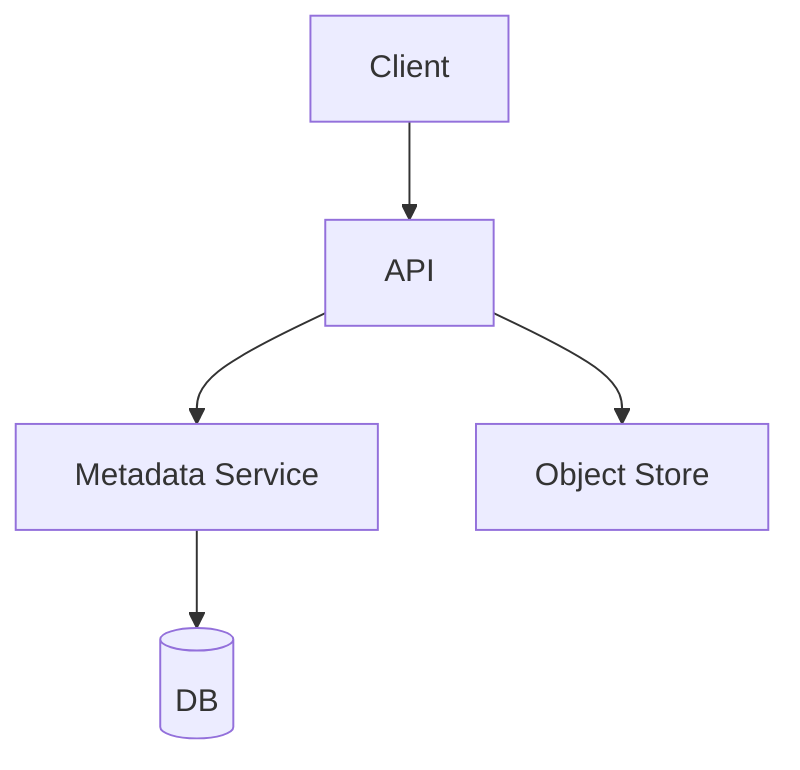
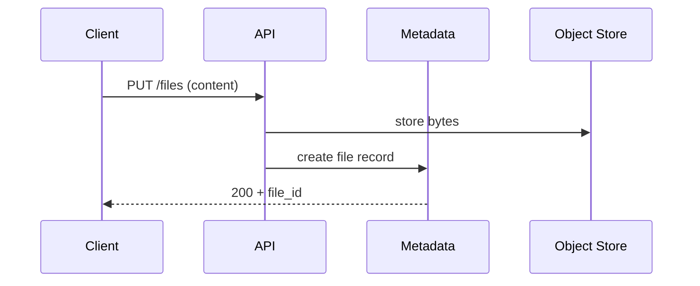

# High-Level Design: File Storage System (Google Drive)

## 1. Overview

A cloud file storage system that allows users to upload, store, organize, sync, and share files and folders with versioning and collaboration features.

---

## System Design Process
- **Step 1: Clarify Requirements** — See §2 below (upload, metadata, sync, share, versioning).
- **Step 2: High-Level Design** — Components and data flow: see §4–§6 below.
- **Step 3: Detailed Design** — DB for metadata; object store for blobs; see LLD for full API list.
- **Step 4: Scale & Optimize** — Sharding, CDN, caching: see Scaling below.

#### High-Level Architecture

**Mermaid:**



#### Flow Diagram — Upload file

**Mermaid:**



**API endpoints (required):** PUT/GET `/v1/files`, GET `/v1/files/:id/content`, POST `/v1/folders`, GET `/v1/shared`. See LLD for full list.

---

## 2. Requirements

### Functional
- Upload and download files (any size; large files chunked)
- Organize in folders (hierarchy); move, rename, delete
- Share files/folders with users or links (public/private)
- Version history (optional): list and restore previous versions
- Sync across devices (optional): delta sync, conflict resolution
- Search by name and metadata

### Non-Functional
- Durable storage (replication, backup)
- Low latency for metadata; scalable bandwidth for content
- Support very large files (e.g. 5 TB) and huge number of small files

---

## 3. Capacity Estimation

- **Users:** 100M; 10M DAU
- **Files:** 50B files; avg 1 MB → 50 PB (with replication 3x → 150 PB)
- **Uploads:** 1M files/day; 10 TB/day
- **Metadata:** 50B × 500 bytes → 25 TB metadata

---

## 4. High-Level Architecture

```
┌─────────────┐                    ┌──────────────────┐
│   Client    │                    │  API Gateway     │
│  (Web/App)  │                    └────────┬─────────┘
└──────┬──────┘                             │
       │                                    │
       │     ┌──────────────────────────────┼──────────────────────────────┐
       │     │                              │                              │
       │     ▼                              ▼                              ▼
       │  ┌────────────┐            ┌────────────┐            ┌────────────┐
       │  │ Metadata   │            │  Upload    │            │  Download  │
       │  │ Service    │            │  Service   │            │  Service   │
       │  │ (CRUD,     │            │  (init,    │            │  (signed   │
       │  │  hierarchy)│            │   part,    │            │   URL or   │
       │  └─────┬──────┘            │   complete)│            │   stream)  │
       │        │                   └─────┬──────┘            └─────┬──────┘
       │        │                         │                         │
       │        ▼                         ▼                         ▼
       │  ┌────────────┐            ┌────────────┐            ┌────────────┐
       │  │ Metadata   │            │  Object    │            │  Object   │
       │  │ DB         │            │  Store     │            │  Store    │
       │  │ (files,    │            │  (S3/GCS)  │            │  (same)   │
       │  │  folders,  │            │  chunks    │            │  CDN      │
       │  │  shares)   │            │            │            │  optional │
       │  └────────────┘            └────────────┘            └────────────┘
```

---

## 5. Core Components

| Component | Responsibility |
|-----------|----------------|
| **Metadata Service** | File/folder CRUD, hierarchy (parent_id), move/rename, list children; permissions and sharing |
| **Upload Service** | Init multipart upload; generate presigned URLs for parts; complete upload (merge parts); write file_id → object_key to metadata |
| **Download Service** | Resolve file_id → object key; check permission; return presigned URL or stream from object store (optional via CDN) |
| **Metadata DB** | Files, folders, versions, shares; hierarchy and permissions |
| **Object Store** | Blob storage for file content (chunked for large files); versioning optional at object level |
| **Sync Service** | (Optional) Delta sync: compare client state with server (cursor/token); return list of changes; conflict resolution |

---

## 6. Data Flow

### Upload (large file, multipart)
1. Client: POST init upload (filename, size, parent_id) → upload_id, part_size.
2. Server creates file row in metadata (status=uploading); reserves file_id and object key.
3. Client uploads parts to presigned URLs (PUT to object store); server records part numbers.
4. Client: POST complete (upload_id, parts[]) → server triggers merge (or object store multipart complete); updates metadata (size, status=ready, object_key).
5. Small files: single PUT with presigned URL; metadata updated on callback or polling.

### Download
1. Client: GET file by id (or path). Metadata Service checks permission; returns object key (or version key).
2. Download Service returns 302 to presigned URL (or streams); optional CDN in front of object store.

### Hierarchy
- Folders: parent_id; root = null. List children: SELECT * FROM files WHERE parent_id = ? AND owner_id IN (user + shared).
- Path resolution: traverse parent_id to root or store materialized path for faster lookup.

---

## 7. Data Model (Conceptual)

- **files:** file_id, name, parent_id (folder), owner_id, type (file/folder), size, object_key (for file content), mime_type, created_at, updated_at, version
- **file_versions:** file_id, version_id, object_key, size, created_at
- **shares:** resource_id (file/folder), shared_with (user_id or link), permission (read/write), created_at
- **permissions:** Resolved per request: user can access if owner or has share permission (inherit from folder).

---

## 8. Scaling

- **Metadata:** DB sharded by user_id or file_id; read replicas; cache hot metadata (recent files, hierarchy).
- **Object store:** Unlimited scale; use multipart for large files; lifecycle to cold storage for old versions.
- **Upload/Download:** Presigned URLs offload traffic to object store; CDN for popular downloads.
- **Sync:** Cursor-based delta (changes since token); merge conflicts: last-write-wins or keep both and flag.

---

## 9. Trade-offs

| Decision | Choice | Rationale |
|----------|--------|-----------|
| Content storage | Object store (S3/GCS) | Durable, scalable, cheap |
| Large file | Multipart upload | Avoid timeouts; resume support |
| Permission | Resolve at read | Flexibility; cache permission bits per user/resource |

---

## 10. Interview Steps

1. Clarify: versioning, sharing, sync, search, max file size.
2. Estimate: files, total storage, upload/download bandwidth.
3. Draw: Metadata Service, Upload/Download, Object Store, Metadata DB.
4. Detail: multipart upload flow; metadata hierarchy; permission check.
5. Scale: sharding metadata, presigned URLs, CDN, and version storage.
