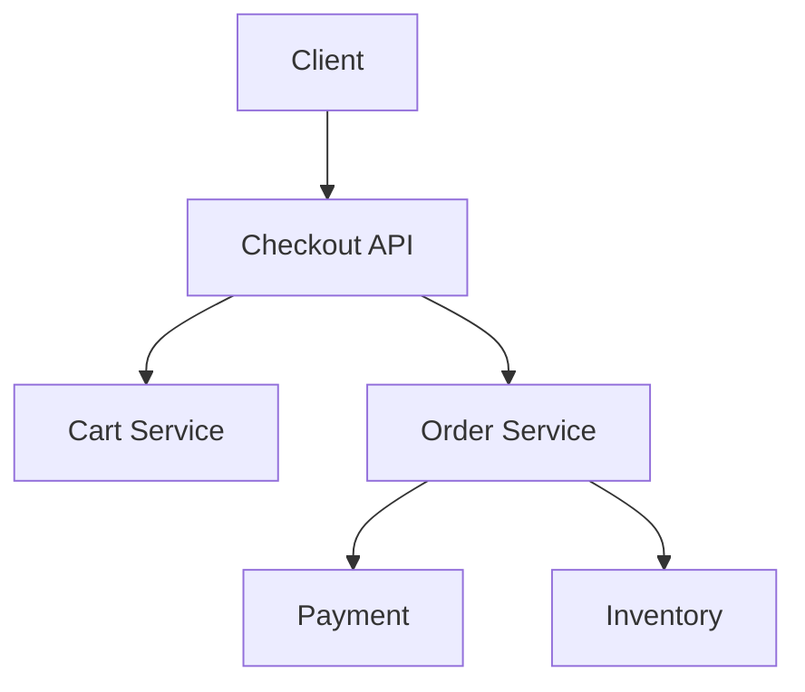
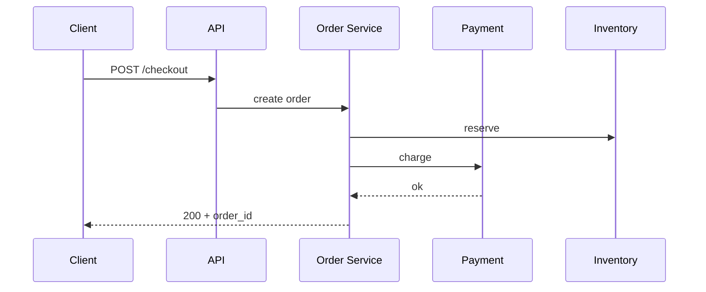

# High-Level Design: E-commerce Checkout System

## 1. Overview

A checkout system that manages cart, inventory reservation, order creation, payment, and fulfillment in a reliable and consistent way, with support for promotions and multiple payment methods.

---

## System Design Process
- **Step 1: Clarify Requirements** — See §2 below (cart, checkout, order, payment).
- **Step 2: High-Level Design** — Components and data flow: see §4–§6 below.
- **Step 3: Detailed Design** — DB (orders, cart, inventory); payment gateway; see LLD for full API list.
- **Step 4: Scale & Optimize** — Sharding, queues, idempotency: see Scaling below.

#### High-Level Architecture

**Mermaid:**



#### Flow Diagram — Place order

**Mermaid:**



**API endpoints (required):** GET/POST `/v1/cart`, POST `/v1/checkout`, POST `/v1/orders`, GET `/v1/orders/:id`. See LLD for full list.

---

## 2. Requirements

### Functional
- Cart: add/update/remove items; persist per user; merge guest and logged-in cart
- Checkout: apply address, shipping method, coupons; validate inventory and pricing
- Place order: reserve inventory, create order, charge payment; send confirmation
- Order management: status (placed, paid, shipped, delivered); cancel, return
- Idempotency for place-order and payment

### Non-Functional
- Consistency: avoid overselling (inventory); avoid double charge (payment)
- High availability during peak (e.g. sale events)
- Audit trail for orders and payments

---

## 3. Capacity Estimation

- **Users:** 10M; 500K DAU
- **Orders/day:** 100K; peak 5K orders/min
- **Cart operations:** 10x order rate
- **Inventory SKUs:** 1M; need atomic decrement on order

---

## 4. High-Level Architecture

```
┌─────────────┐                    ┌──────────────────┐
│   Client    │                    │  API Gateway     │
└──────┬──────┘                    └────────┬─────────┘
       │                                    │
       │     ┌──────────────────────────────┼──────────────────────────────┐
       │     │                              │                              │
       │     ▼                              ▼                              ▼
       │  ┌────────────┐            ┌────────────┐            ┌────────────┐
       │  │ Cart       │            │ Checkout   │            │ Order      │
       │  │ Service    │            │ Service    │            │ Service    │
       │  └─────┬──────┘            └─────┬──────┘            └─────┬──────┘
       │        │                        │                         │
       │        │                        │                         │
       │        ▼                        ▼                         ▼
       │  ┌────────────┐     ┌─────────────────────────────────────────────┐
       │  │ Cart Store │     │  Inventory Service  │  Pricing Service      │
       │  │ (Redis/DB) │     │  (reserve/release)  │  (coupons, tax)       │
       │  └────────────┘     └──────────┬──────────┘  └──────────┬──────────┘
       │                                │                        │
       │                                ▼                        ▼
       │  ┌────────────┐            ┌────────────┐            ┌────────────┐
       │  │ Payment    │            │ Inventory  │            │ Catalog /  │
       │  │ Service    │            │ DB / Cache │            │ Promo DB   │
       │  └─────┬──────┘            └────────────┘            └────────────┘
       │        │
       │        ▼
       │  ┌────────────┐            ┌────────────┐
       │  │ Payment    │            │ Order DB   │
       │  │ Gateway    │            │ (orders,   │
       │  │ (Stripe)   │            │  items)    │
       │  └────────────┘            └────────────┘
```

---

## 5. Core Components

| Component | Responsibility |
|-----------|----------------|
| **Cart Service** | Add/update/remove line items; persist cart (Redis or DB); merge guest cart on login |
| **Checkout Service** | Validate cart; resolve shipping address and method; apply coupons; call pricing; return summary (totals, tax) |
| **Order Service** | Place order: validate → reserve inventory → create order → charge payment → confirm or rollback; idempotency by key |
| **Inventory Service** | Reserve (decrement available); release (on cancel or timeout); atomic operations to avoid oversell |
| **Pricing Service** | Compute item price, discounts, tax, shipping; apply coupon rules |
| **Payment Service** | Authorize/capture via payment gateway; idempotent; webhook for async status |
| **Order Store** | Orders and order_items; immutable after placed; status updates |

---

## 6. Data Flow (Place Order)

1. Client POST place-order with idempotency_key, cart_id, address_id, payment_method_id.
2. Order Service: idempotency check; if key seen, return existing order response.
3. Load cart; validate items (still in catalog, price check); call Pricing for totals.
4. **Reserve inventory** (per SKU): decrement available_quantity where quantity >= requested; if any fail, return 409 (out of stock).
5. Create order row (status=placed) and order_items; reserve has TTL (e.g. 15 min) so unpaid orders can be released.
6. **Charge payment** (authorize + capture); on success → update order status=paid; on failure → release inventory, order status=payment_failed.
7. Store idempotency_key → order_id; send confirmation (email/notification); return order details.
8. Async: fulfillment pipeline picks up paid orders for shipping.

---

## 7. Inventory Consistency

- **Option A:** DB row per SKU with available_quantity; UPDATE ... SET available = available - qty WHERE sku = ? AND available >= qty; check row count (optimistic).
- **Option B:** Redis decrement with Lua (atomic); sync to DB periodically; or DB as source of truth and cache with invalidation.
- **Reservation TTL:** Reserve returns reservation_id; if order not paid in 15 min, background job releases reservation (increment back).

---

## 8. Data Model (Conceptual)

- **carts:** cart_id, user_id (nullable for guest), updated_at
- **cart_items:** cart_id, sku, quantity
- **orders:** order_id, user_id, status, total, idempotency_key, created_at
- **order_items:** order_id, sku, quantity, price_at_order
- **inventory:** sku, available_quantity, reserved_quantity (or reservations table with TTL)
- **reservations:** reservation_id, sku, quantity, order_id, expires_at

---

## 9. Trade-offs

| Decision | Choice | Rationale |
|----------|--------|-----------|
| Cart store | Redis | Fast; optional DB backup for logged-in users |
| Inventory | DB with conditional update | Strong consistency; Redis for read scaling with care |
| Place order | Synchronous reserve + pay | Simpler; saga for multi-step with compensation if needed |
| Idempotency | Required for place-order | Prevents duplicate orders on retry |

---

## 10. Interview Steps

1. Clarify: guest checkout, coupons, multi-currency, returns.
2. Estimate: orders/s, cart ops, inventory SKUs.
3. Draw: Cart, Checkout, Order, Inventory, Pricing, Payment.
4. Detail: place-order flow (validate → reserve → create order → pay → confirm/rollback); idempotency.
5. Discuss: overselling prevention, reservation TTL, and payment failure handling.

---

## Interview-Readiness Enhancements

### Capacity & SLO framing
- Define read/write QPS separately and estimate peak vs average traffic.
- Add latency budgets (p95/p99) per critical hop and target availability.
- State durability target and expected data growth/day.

### Critical path clarity
- Document write path (authoritative commit first, async side-effects second).
- Document read path (cache/read model first, fallback to source of truth).
- Identify likely hotspots (hot keys, hot partitions, fanout spikes).

### Failure handling
- Define retry strategy (bounded retries, backoff, jitter).
- Add circuit breakers and bulkheads for unstable dependencies.
- Cover queue failures (DLQ, replay) and datastore failover behavior.

### Security, operations, and cost
- Baseline security: AuthN/AuthZ, encryption in transit/at rest, secrets rotation.
- Observability: golden signals, SLO alerts, tracing, runbooks, canary/rollback.
- DR/cost: explicit RTO/RPO and top cost drivers with optimization levers.

### Trade-off table (mandatory)
- Include at least two realistic alternatives with decision rationale for this system.

