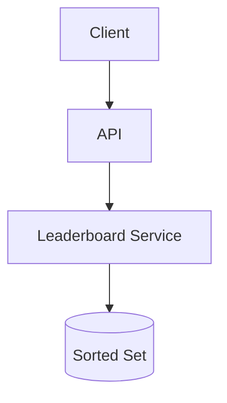
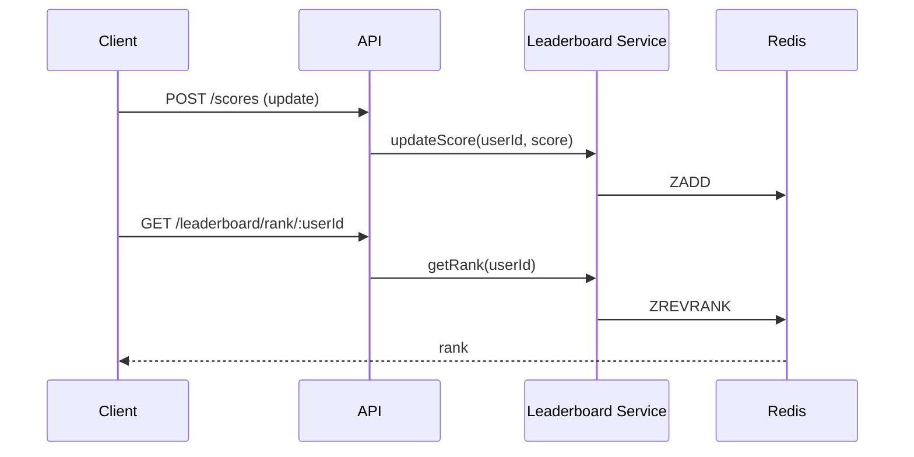

# High-Level Design: Leaderboard System

## 1. Overview

A system that maintains and serves ranked lists of players/users by score (e.g. game leaderboard), with support for global and friend-based leaderboards, real-time updates, and historical snapshots.

---

## System Design Process
- **Step 1: Clarify Requirements** — See §2 below (update score, top N, rank, time windows).
- **Step 2: High-Level Design** — Components and data flow: see §4–§6 below.
- **Step 3: Detailed Design** — Sorted set (Redis) or DB + index; see LLD for full API list.
- **Step 4: Scale & Optimize** — Sharding by leaderboard key, caching: see Scaling below.

#### High-Level Architecture

**Mermaid:**



#### Flow Diagram — Update score and get rank

**Mermaid:**



**API endpoints (required):** POST `/v1/scores` (update), GET `/v1/leaderboard?limit=100`, GET `/v1/leaderboard/rank/:userId`. See LLD for full list.

---

## 2. Requirements

### Functional
- Update user score (increment or set)
- Get global leaderboard: top N by score (with rank, pagination)
- Get rank for a specific user
- Optional: leaderboard per game/level/time window (daily, weekly, all-time)
- Optional: friend leaderboard (filter to friends only)
- Optional: historical leaderboard (e.g. end-of-season snapshot)

### Non-Functional
- Low latency for read (< 50 ms); high write throughput
- Strong consistency for rank after update (or eventual)
- Scale: millions of users, thousands of updates/s

---

## 3. Capacity Estimation

- **Users:** 10M
- **Score updates:** 100K/s (e.g. game events)
- **Leaderboard reads:** 50K/s
- **Storage:** 10M × (user_id + score + metadata) → small; main load is read/write pattern

---

## 4. High-Level Architecture

```
┌─────────────┐                    ┌──────────────────┐
│   Client    │                    │  API Gateway     │
└──────┬──────┘                    └────────┬─────────┘
       │                                    │
       │                                    ▼
       │                           ┌────────────────┐
       │                           │ Leaderboard    │
       │                           │ Service        │
       │                           └────────┬───────┘
       │                                    │
       │                    ┌───────────────┼───────────────┐
       │                    │               │               │
       │                    ▼               ▼               ▼
       │             ┌────────────┐  ┌────────────┐  ┌────────────┐
       │             │  Redis     │  │  Sorted    │  │  Snapshot   │
       │             │  Sorted    │  │  Set per   │  │  Store      │
       │             │  Sets      │  │  (game,    │  │  (historical│
       │             │  (rank)    │  │   period)  │  │   top N)    │
       │             └────────────┘  └────────────┘  └────────────┘
       │                    │               │
       │                    └───────────────┘
       │                            │
       │                    Optional: DB for persistence / replay
```

---

## 5. Core Components

| Component | Responsibility |
|-----------|----------------|
| **Leaderboard Service** | Update score (ZADD); get top N (ZREVRANGE); get rank (ZREVRANK); support multiple leaderboards by key (e.g. global, game_1, game_1:daily) |
| **Sorted Set Store** | Redis Sorted Set: key = leaderboard_id, member = user_id, score = score; ZADD for update; ZREVRANGE for top N; ZREVRANK for rank |
| **Snapshot Service** | Periodically (e.g. daily) take top N from Redis and store in DB or object store for history |
| **Friend Leaderboard** | Filter: get friend user_ids; for each get rank/score from global set; merge and sort in app; or maintain separate sorted set per user (friends’ scores) with higher cost |

---

## 6. Data Flow

### Update score
1. Client POST/PATCH score (user_id, score_delta or absolute score, leaderboard_id).
2. Leaderboard Service: ZADD leaderboard_id score user_id (or ZINCRBY for delta).
3. Return new score and rank (ZREVRANK).

### Get leaderboard
1. Client GET top 100 (leaderboard_id, offset=0, limit=100).
2. ZREVRANGE leaderboard_id offset offset+limit-1 WITHSCORES → list of (user_id, score).
3. Resolve user_id to username/avatar (batch from DB or cache); return list with rank = offset+1, offset+2, ...

### Get my rank
1. ZREVRANK leaderboard_id user_id → 0-based rank; rank+1 for 1-based display.
2. ZSCORE leaderboard_id user_id → current score.

---

## 7. Multiple Leaderboards

- **Key design:** global = "lb:global"; per game = "lb:game:{game_id}"; time-bound = "lb:game:{game_id}:daily" with TTL or reset at day boundary.
- **Daily reset:** New key "lb:game:1:daily:2024-01-15"; or ZADD with same key and clear at midnight (delete key and repopulate from source of truth if needed). Simpler: new key per period.

---

## 8. Data Model (Conceptual)

- **Redis:** Sorted Set per leaderboard key; member = user_id, score = score (integer or float).
- **DB (optional):** leaderboard_snapshots (period, leaderboard_id, rank, user_id, score, captured_at) for history.
- **Users:** user_id → display name, avatar (for enrichment).

---

## 9. Scaling

- **Redis:** Single Redis can handle millions of members per set; O(log N) for ZADD, ZREVRANGE, ZREVRANK. Use Redis Cluster if multiple leaderboards and high QPS; shard by leaderboard_id.
- **Write burst:** Batch ZADD (pipeline) if many updates from same game round.
- **Friend leaderboard:** If small friend set, fetch scores for friend IDs (ZSCORE in pipeline) and sort in app; else maintain separate structure (e.g. sorted set of friends’ scores per user, updated when any friend scores).

---

## 10. Trade-offs

| Decision | Choice | Rationale |
|----------|--------|-----------|
| Store | Redis Sorted Set | Native rank and range queries; O(log N) update |
| Score | Integer or float | Integer for simplicity; float for decimals |
| History | Snapshot job | Avoid storing full history in Redis; snapshot top N to DB |

---

## 11. Interview Steps

1. Clarify: global vs per-game, time windows, friend leaderboard, real-time vs batch.
2. Estimate: users, updates/s, reads/s.
3. Draw: Leaderboard Service, Redis Sorted Sets (per leaderboard key).
4. Detail: ZADD, ZREVRANGE, ZREVRANK; key naming for multiple boards and periods.
5. Scale: Redis Cluster, batching, and snapshot for history.

---

## Interview-Readiness Enhancements

### Capacity & SLO framing
- Define read/write QPS separately and estimate peak vs average traffic.
- Add latency budgets (p95/p99) per critical hop and target availability.
- State durability target and expected data growth/day.

### Critical path clarity
- Document write path (authoritative commit first, async side-effects second).
- Document read path (cache/read model first, fallback to source of truth).
- Identify likely hotspots (hot keys, hot partitions, fanout spikes).

### Failure handling
- Define retry strategy (bounded retries, backoff, jitter).
- Add circuit breakers and bulkheads for unstable dependencies.
- Cover queue failures (DLQ, replay) and datastore failover behavior.

### Security, operations, and cost
- Baseline security: AuthN/AuthZ, encryption in transit/at rest, secrets rotation.
- Observability: golden signals, SLO alerts, tracing, runbooks, canary/rollback.
- DR/cost: explicit RTO/RPO and top cost drivers with optimization levers.

### Trade-off table (mandatory)
- Include at least two realistic alternatives with decision rationale for this system.

