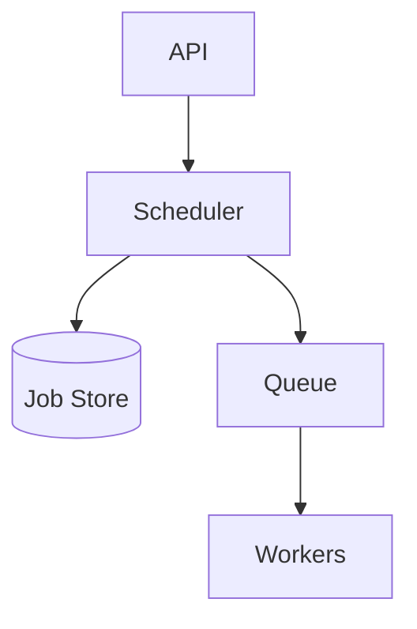
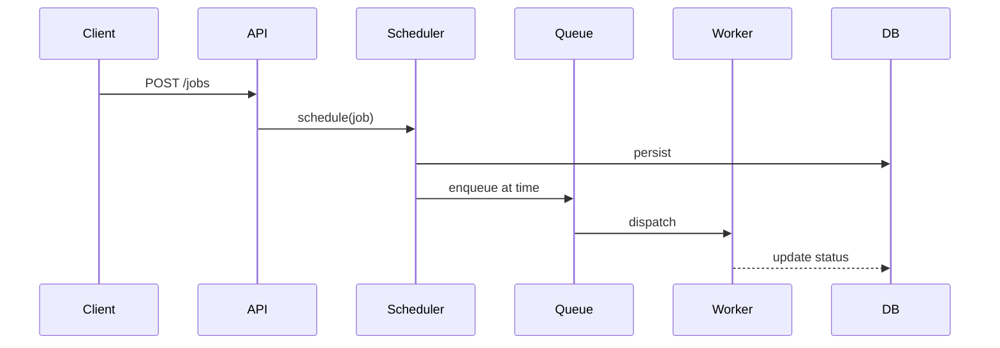

# High-Level Design: Distributed Job Scheduler

## 1. Overview

A system that schedules and runs jobs (one-off or recurring) across a distributed worker pool with reliability, no double execution, and support for retries and observability.

---

## System Design Process
- **Step 1: Clarify Requirements** — See §2 below (schedule, cron, retry, no double run).
- **Step 2: High-Level Design** — Scheduler, queue, workers; see §4–§6 below.
- **Step 3: Detailed Design** — DB for job defs; queue (Kafka/SQS) for dispatch; see LLD for full API list.
- **Step 4: Scale & Optimize** — Partitioning, worker scaling: see Scaling below.

#### High-Level Architecture

**Mermaid:**



#### Flow Diagram — Schedule and run job

**Mermaid:**



**API endpoints (required):** POST `/v1/jobs`, GET `/v1/jobs/:id`, DELETE `/v1/jobs/:id`, GET `/v1/jobs`. See LLD for full list.

---

## 2. Requirements

### Functional
- Schedule job: run at time T or with cron expression
- One-off and recurring (cron) jobs
- Job payload (type, parameters); multiple job types (email, report, sync)
- Retry on failure (with backoff)
- Cancel and view job status
- Optional: priority, dependencies (run B after A completes)

### Non-Functional
- At-most-once or exactly-once execution per schedule
- High availability: no single point of failure
- Scale: millions of jobs, thousands of executions per minute
- Observability: logs, metrics, alert on failures

---

## 3. Capacity Estimation

- **Jobs:** 10M recurring + 1M one-off per day
- **Executions:** 100K/min peak
- **Workers:** 500 nodes
- **Storage:** Job definitions and execution history; state store for locks

---

## 4. High-Level Architecture

```
┌─────────────┐                    ┌──────────────────┐
│   Client    │                    │  API / Control   │
│   (submit   │                    │  Plane           │
│    jobs)    │                    └────────┬─────────┘
└─────────────┘                             │
                                            │
                    ┌───────────────────────┼───────────────────────┐
                    │                       │                       │
                    ▼                       ▼                       ▼
           ┌────────────────┐      ┌────────────────┐      ┌────────────────┐
           │  Job Store     │      │  Scheduler     │      │  Execution     │
           │  (definitions, │      │  (cron eval,   │      │  Queue         │
           │   next_run_at) │      │   enqueue)     │      │  (Kafka/SQS)   │
           └────────────────┘      └───────┬────────┘      └───────┬────────┘
                    │                       │                       │
                    │                       └───────────┬───────────┘
                    │                                   │
                    │                                   ▼
                    │                           ┌────────────────┐
                    │                           │  Workers       │
                    │                           │  (pull job,    │
                    │                           │   execute,     │
                    │                           │   ack/fail)    │
                    │                           └───────┬────────┘
                    │                                   │
                    │                           ┌───────▼───────┐
                    │                           │  Lock / State  │
                    └──────────────────────────►│  (prevent     │
                                                │   duplicate)  │
                                                └────────────────┘
```

---

## 5. Core Components

| Component | Responsibility |
|-----------|----------------|
| **Job Store** | Persist job definition (type, cron, params, next_run_at); list jobs due in window |
| **Scheduler** | Periodically (e.g. every 1 min) find jobs where next_run_at <= now; enqueue execution to queue; update next_run_at for recurring |
| **Execution Queue** | Kafka or SQS: partition by job_id or type; at-least-once delivery |
| **Workers** | Consume from queue; acquire lock (e.g. job_run_id in Redis); execute job handler; ack on success; retry or DLQ on failure |
| **Lock Store** | Prevent duplicate run: key = job_id + run_time; value = worker_id; TTL = max job duration; only one worker can set |
| **Execution Log** | Record start, end, status, output for observability |

---

## 6. Data Flow

### Schedule recurring job
1. Client POST job (cron, type, params). Job Store saves; compute next_run_at from cron; store.

### Scheduler loop (every 1 min)
1. Query Job Store: jobs where next_run_at <= now + 1 min (window to allow for clock skew).
2. For each job: try acquire lock (job_id, run_id = next_run_at). If acquired, enqueue message (job_id, run_id, type, params) to queue; update next_run_at to next cron occurrence; release lock after enqueue.
3. If lock not acquired, skip (another scheduler instance already enqueued).

### Worker
1. Poll queue; get message (job_id, run_id, type, params).
2. Try acquire execution lock (run_id) in Redis; if failed, ack message (already processed).
3. Execute handler for type (e.g. call HTTP, run script); on success ack; on failure retry with delay or send to DLQ.
4. Log execution (start, end, status) to execution store.
5. Release lock (or let TTL expire).

---

## 7. Avoiding Double Execution

- **Scheduler:** One scheduler instance acquires lock per (job_id, run_id) before enqueue; only one enqueue per run.
- **Worker:** Idempotency by run_id: before execute, check if run_id already completed (in DB); if yes, ack and skip. Or use run_id as dedup key in queue (SQS FIFO with dedup, or Kafka with idempotent consumer).
- **Cron overlap:** next_run_at is computed so same run is not scheduled twice; use run_id = next_run_at (timestamp) so each run is unique.

---

## 8. Data Model (Conceptual)

- **jobs:** job_id, type, cron (or run_at for one-off), params, next_run_at, enabled, created_at
- **executions:** execution_id, job_id, run_id, status (pending, running, success, failed), started_at, finished_at, output, error
- **locks:** key = job_id:run_id; value = owner; TTL

---

## 9. Scaling

- **Scheduler:** Single leader (e.g. leader election via DB or etcd) or multiple with partition by job_id so each job is owned by one scheduler.
- **Workers:** Scale horizontally; queue partitions for parallelism.
- **Job store:** DB with index on next_run_at; batch query for due jobs.

---

## 10. Trade-offs

| Decision | Choice | Rationale |
|----------|--------|-----------|
| Queue | Kafka or SQS | Durable; retry and DLQ support |
| Lock | Redis with TTL | Fast; prevent duplicate enqueue and duplicate run |
| Cron eval | In scheduler | Compute next_run_at on each tick; or store next N run times |
| Exactly-once | Run_id + idempotent handler | Application-level dedup; queue at-least-once |

---

## 11. Interview Steps

1. Clarify: one-off vs cron, retries, dependencies, scale.
2. Estimate: jobs, executions/min, workers.
3. Draw: Job Store, Scheduler, Queue, Workers, Lock, Execution Log.
4. Detail: scheduler loop (due jobs → lock → enqueue → update next_run_at); worker (dequeue → lock → execute → ack).
5. Discuss: leader election, idempotency by run_id, and DLQ.
