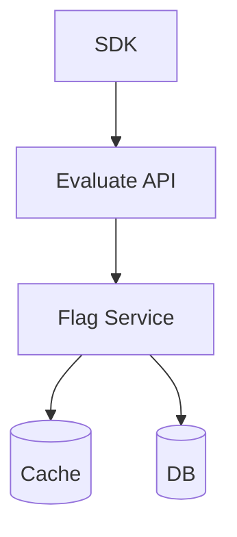
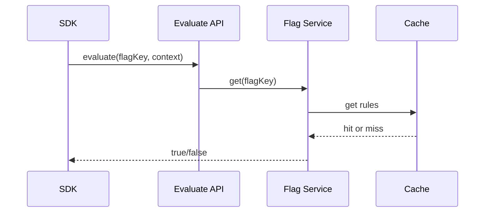

# High-Level Design: Feature Flag System

## 1. Overview

A system that allows turning features on/off or rolling them out to a percentage of users or segments without code deploy, with low latency and consistency across services.

---

## System Design Process
- **Step 1: Clarify Requirements** — See §2 below (create flags, rules, evaluate).
- **Step 2: High-Level Design** — Flag service, config store, SDK; see §4–§6 below.
- **Step 3: Detailed Design** — DB for flags and rules; cache for evaluation; see LLD for full API list.
- **Step 4: Scale & Optimize** — Caching, CDN for SDK: see Scaling below.

#### High-Level Architecture

**Mermaid:**



#### Flow Diagram — Evaluate flag

**Mermaid:**



**API endpoints (required):** GET `/v1/flags` (all for context), GET `/v1/flags/:key/evaluate`, POST/PUT `/v1/admin/flags`. See LLD for full list.

---

## 2. Requirements

### Functional
- Create/update/delete feature flags (key, description, on/off, rules)
- Rules: percentage rollout (e.g. 10% of users), user segment (list, attribute: country, plan), allowlist (user IDs)
- Evaluate flag for a context: user_id, attributes (country, plan) → true/false
- Optional: SDK for multiple languages; optional remote config (non-boolean values)
- Audit: who changed what and when

### Non-Functional
- Low latency for evaluation (< 10 ms); high read throughput
- Consistency: same user gets same result across instances (or eventual)
- Scale: millions of evaluations per second, thousands of flags

---

## 3. Capacity Estimation

- **Flags:** 10K
- **Evaluations:** 1M/s (every request may check 5–10 flags)
- **Updates:** 100/day (admin)
- **Storage:** 10K × 1 KB → 10 MB; evaluation is read-heavy

---

## 4. High-Level Architecture

```
┌─────────────┐                    ┌──────────────────┐
│  App (SDK)  │── evaluate(flag,  │  API / Edge       │
│             │   user, attrs)     │  (optional)       │
└──────┬──────┘                    └────────┬─────────┘
       │                                    │
       │                                    ▼
       │                           ┌────────────────┐
       │                           │  Flag Service  │
       │                           │  (evaluate)    │
       │                           └────────┬───────┘
       │                                    │
       │                    ┌───────────────┼───────────────┐
       │                    │               │               │
       │                    ▼               ▼               ▼
       │             ┌────────────┐  ┌────────────┐  ┌────────────┐
       │             │  Flag      │  │  Cache     │  │  Admin API │
       │             │  Store     │  │  (Redis)   │  │  (CRUD)    │
       │             │  (DB)      │  │  flags     │  │            │
       │             └────────────┘  └────────────┘  └────────────┘
       │
       │             Optional: SDK with local cache (file or in-memory) + periodic refresh
```

---

## 5. Core Components

| Component | Responsibility |
|-----------|----------------|
| **Flag Service** | Evaluate(flag_key, user_id, attributes) → true/false (or value); load flag definition from cache or DB |
| **Flag Store** | Persist flag: key, enabled (default), rules (percentage, segments, allowlist); version for cache invalidation |
| **Cache** | Redis or in-process: flag_key → full definition; TTL or invalidate on update |
| **Admin API** | CRUD flags; publish changes; invalidate cache |
| **SDK** | Embed in app; call Flag Service or use local copy; periodic poll or webhook to refresh |
| **Evaluator** | Apply rules in order: allowlist → segment → percentage → default |

---

## 6. Evaluation Logic

1. Load flag by key (from cache or DB). If not found, return default (false or config default).
2. If flag.enabled == false, return false (unless overrides).
3. For each rule in order:
   - **Allowlist:** if user_id in rule.user_ids, return rule.value (true).
   - **Segment:** if context matches (e.g. country in rule.countries, plan == rule.plan), return rule.value.
   - **Percentage:** hash(user_id + flag_key) % 100 < rule.percentage → return true.
4. Return flag.default_value (e.g. false).

---

## 7. Data Model (Conceptual)

- **flags:** flag_key (PK), name, description, enabled (boolean), default_value, rules (JSON), version, updated_at
- **rules schema:** [{ "type": "allowlist", "user_ids": [] }, { "type": "segment", "attrs": { "country": ["US"], "plan": "pro" } }, { "type": "percentage", "percentage": 10 }]
- **audit_log:** id, flag_key, action, old_value, new_value, user_id, created_at

---

## 8. Caching and Consistency

- **Cache:** Full flag definition per key; TTL 60–300 s or invalidate on update (publish event to Redis pub/sub; all instances evict key).
- **SDK:** Poll Flag Service every 60 s or on startup; optional server-sent event for instant invalidation. Local cache reduces latency and load.
- **Sticky rollout:** Use hash(user_id + flag_key) so same user always gets same result for percentage rule.

---

## 9. Scaling

- **Read:** Cache in Redis and/or in-process; CDN or edge for global latency.
- **Write:** Rare; DB + cache invalidation.
- **SDK:** Batch evaluate (multiple flags in one request) to reduce round-trips.

---

## 10. Trade-offs

| Decision | Choice | Rationale |
|----------|--------|-----------|
| Evaluation | Server-side with cache | Central control; consistent rules |
| Percentage | Hash-based | Deterministic per user; no need to store state |
| Invalidation | TTL + pub/sub on update | Balance freshness and load |
| SDK | Optional local cache | Sub-ms latency; eventual consistency |

---

## 11. Interview Steps

1. Clarify: boolean vs multi-variant, segments, percentage, audit.
2. Estimate: flags, evaluations/s, latency.
3. Draw: SDK/App → Flag Service → Cache + DB; Admin API.
4. Detail: rule types (allowlist, segment, percentage); evaluation order; hashing for percentage.
5. Scale: cache, invalidation, and SDK batching.
