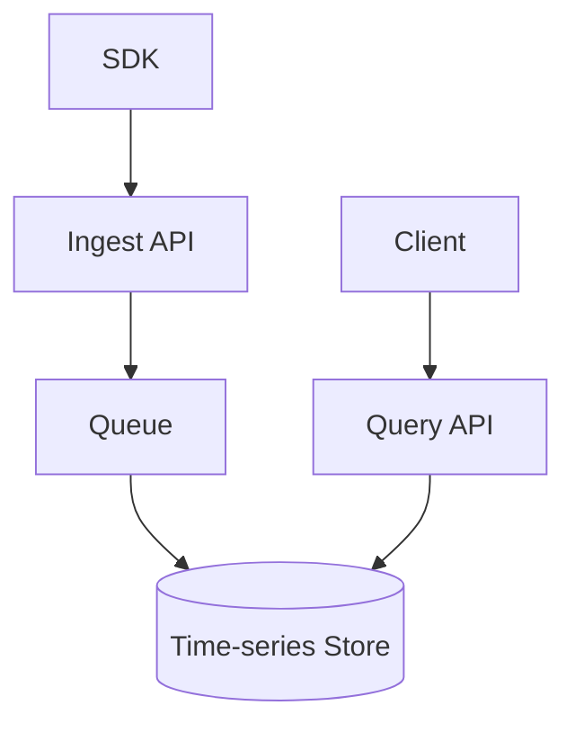
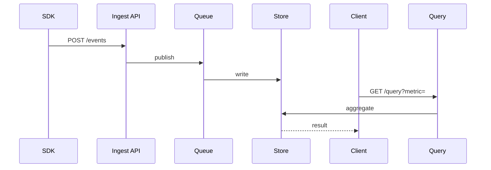

# High-Level Design: Metrics & Analytics Platform

## 1. Overview

A platform that ingests, stores, and queries event-based and metric data for dashboards, reporting, and ad-hoc analysis at scale (e.g. Mixpanel, Amplitude, or Prometheus + Grafana for metrics).

---

## System Design Process
- **Step 1: Clarify Requirements** — See §2 below (ingest events/metrics, query, dashboards).
- **Step 2: High-Level Design** — Ingest API, pipeline, storage, query API; see §4–§6 below.
- **Step 3: Detailed Design** — Time-series or columnar store; see LLD for full API list.
- **Step 4: Scale & Optimize** — Sharding by time/tenant, caching: see Scaling below.

#### High-Level Architecture

**Mermaid:**



#### Flow Diagram — Ingest event and query

**Mermaid:**



**API endpoints (required):** POST `/v1/events`, POST `/v1/metrics`, GET `/v1/query`, GET `/v1/dashboards/:id`. See LLD for full list.

---

## 2. Requirements

### Functional
- Ingest events: user_id, event_name, properties (key-value), timestamp
- Ingest metrics: counters, gauges, histograms (with dimensions/labels)
- Query: aggregations (count, sum, avg, p99) over time ranges, grouped by dimension (e.g. country, device)
- Dashboards: saved charts and refresh
- Optional: funnels, retention, segmentation, SQL-like query interface

### Non-Functional
- High ingest throughput (millions of events/s)
- Query latency: interactive (< 5 s for pre-aggregated; minutes for ad-hoc)
- Retention: hot (e.g. 30 days) and cold (1+ year) with different SLAs
- Scale: billions of events per day

---

## 3. Capacity Estimation

- **Events/day:** 10B; ~120K/s average; peak 1M/s
- **Storage:** 10B × 200 bytes → 2 TB/day raw; with replication and indexes ~10 TB/day; cold compressed ~1 TB/day
- **Queries:** 10K dashboard refreshes + 1K ad-hoc per day
- **Metrics:** 100K time series; 1-min granularity → 1440 points/day/series

---

## 4. High-Level Architecture

```
┌─────────────┐                    ┌──────────────────┐
│  SDK / App  │── events/metrics ──►│  Ingest API      │
└─────────────┘   (batch)          │  (validate,      │
                                   │   partition)     │
                                   └────────┬─────────┘
                                            │
                                            ▼
                                   ┌────────────────┐
                                   │  Message Queue │
                                   │  (Kafka)       │
                                   └────────┬───────┘
                                            │
                    ┌───────────────────────┼───────────────────────┐
                    │                       │                       │
                    ▼                       ▼                       ▼
           ┌────────────────┐      ┌────────────────┐      ┌────────────────┐
           │  Stream        │      │  Time-Series   │      │  Data Lake     │
           │  Processor     │      │  DB (metrics) │      │  (events,      │
           │  (aggregate    │      │  (Prometheus/ │      │   Parquet/S3)  │
           │   by minute)   │      │   M3, etc)     │      │   for ad-hoc   │
           └───────┬────────┘      └───────┬────────┘      └───────┬────────┘
                   │                       │                        │
                   └───────────────────────┼────────────────────────┘
                                           │
                                           ▼
                                  ┌────────────────┐
                                  │  Query Service  │
                                  │  (API, SQL,    │
                                  │   dashboards)   │
                                  └────────────────┘
```

---

## 5. Core Components

| Component | Responsibility |
|-----------|----------------|
| **Ingest API** | Accept batch events/metrics; validate; partition by time or tenant; write to Kafka |
| **Message Queue** | Buffer events; partition by (tenant, day) or event_type; multiple consumers |
| **Stream Processor** | Consume events; pre-aggregate (e.g. count by event_name, day, country); write to time-series DB or OLAP |
| **Time-Series DB** | Store metrics and pre-aggregates: (metric_name, labels) → [(timestamp, value)]; downsampling for long retention |
| **Data Lake** | Raw or lightly compressed events in columnar format (Parquet) for ad-hoc SQL (Spark/Presto/Athena) |
| **Query Service** | Serve dashboards (query TSDB and/or OLAP); run ad-hoc queries against data lake; cache results |
| **Dashboard Store** | Save chart configs (metric, filters, group by, time range); render via Query Service |

---

## 6. Data Flow

### Ingest
1. Client POST /track with batch of events (each: event_name, user_id, properties, timestamp).
2. Ingest API validates (schema, size); assigns partition key (e.g. tenant_id + date); produces to Kafka.
3. Return 202 accepted.

### Processing
1. Stream processor consumes from Kafka; parses events.
2. For real-time metrics: increment counters or update gauges in time-series DB (e.g. event signup per day, per country).
3. For raw analytics: write to data lake (e.g. append to daily Parquet by date); or index in OLAP (ClickHouse, Druid) for fast aggregations.

### Query
1. Dashboard requests: "count signup last 7 days by country". Query Service translates to TSDB or OLAP query (e.g. group by country, sum(count), time range).
2. For ad-hoc: "SELECT event_name, count(*) FROM events WHERE ... GROUP BY event_name" → run against data lake (Presto/Athena); return result set.
3. Cache aggregated results by (query hash, time range) with TTL for dashboard refresh.

---

## 7. Data Model (Conceptual)

- **Event:** event_id, event_name, user_id, properties (JSON), timestamp; partition by date.
- **Metric (pre-aggregate):** (metric_name, dimensions: country, device, ...), timestamp (e.g. minute bucket), value (count/sum/avg).
- **Dashboard:** dashboard_id, charts[] (metric, filters, group_by, visualization).

---

## 8. Scaling

- **Ingest:** Kafka partitions for parallelism; multiple producers; batch size and compression.
- **Processing:** Consumer groups; scale consumers; partition by tenant/date.
- **TSDB:** Shard by metric or time; downsampling (1m → 1h → 1d) for retention.
- **Data lake:** Partition by date; columnar format; run query engine (Presto/Spark) on demand.
- **Query:** Cache hot queries; limit ad-hoc scan size and timeout.

---

## 9. Trade-offs

| Decision | Choice | Rationale |
|----------|--------|-----------|
| Raw events | Data lake + OLAP | Flexible analysis; cost vs latency |
| Real-time metrics | TSDB + stream agg | Low latency for dashboards |
| Retention | Hot 30d in OLAP/TSDB; cold in S3 | Cost and query pattern |
| Query interface | Pre-built aggregations + SQL | Balance ease and power |

---

## 10. Interview Steps

1. Clarify: events vs metrics, retention, query types (dashboard vs ad-hoc), real-time vs batch.
2. Estimate: events/s, storage, query QPS.
3. Draw: Ingest → Kafka → Stream Processor + Data Lake; TSDB/OLAP; Query Service + Dashboards.
4. Detail: event schema, pre-aggregation logic, and query path (TSDB vs SQL on lake).
5. Scale: partitioning, downsampling, caching, and cost of full scan.

---

## Interview-Readiness Enhancements

### Capacity & SLO framing
- Define read/write QPS separately and estimate peak vs average traffic.
- Add latency budgets (p95/p99) per critical hop and target availability.
- State durability target and expected data growth/day.

### Critical path clarity
- Document write path (authoritative commit first, async side-effects second).
- Document read path (cache/read model first, fallback to source of truth).
- Identify likely hotspots (hot keys, hot partitions, fanout spikes).

### Failure handling
- Define retry strategy (bounded retries, backoff, jitter).
- Add circuit breakers and bulkheads for unstable dependencies.
- Cover queue failures (DLQ, replay) and datastore failover behavior.

### Security, operations, and cost
- Baseline security: AuthN/AuthZ, encryption in transit/at rest, secrets rotation.
- Observability: golden signals, SLO alerts, tracing, runbooks, canary/rollback.
- DR/cost: explicit RTO/RPO and top cost drivers with optimization levers.

### Trade-off table (mandatory)
- Include at least two realistic alternatives with decision rationale for this system.

