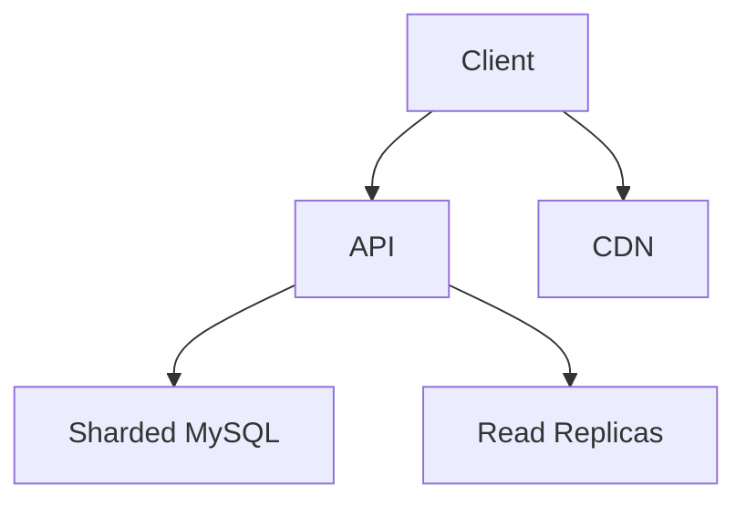
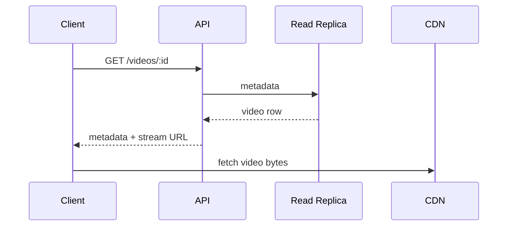

# High-Level Design: How YouTube Supported 2.49B Users With MySQL

## 1. Overview

Case study: scaling a video platform to billions of users while using MySQL as a core relational store for metadata, users, and engagement—complemented by sharding, read replicas, and separation of hot path from analytics.

---

## System Design Process
- **Step 1: Clarify Requirements** — See §3 below; constraint: MySQL for core metadata.
- **Step 2: High-Level Design** — Components and data flow: see §4–§6 below.
- **Step 3: Detailed Design** — MySQL sharding, schema; API: see LLD for full list.
- **Step 4: Scale & Optimize** — Sharding, read replicas, caching: see Scaling below.

#### High-Level Architecture

**Mermaid:**



#### Flow Diagram — Watch video (read path)

**Mermaid:**



**API endpoints (required):** GET/POST `/v1/videos`, GET `/v1/videos/:id`, POST `/v1/videos/:id/views`, GET `/v1/search`. See LLD for full list.

---

## 2. The Challenge

- **Scale:** 2.49B+ users; billions of videos; massive read/write for metadata, views, likes, comments.
- **Constraint:** Use MySQL (or similar RDBMS) for consistency and relational model without abandoning it at scale.
- **Goals:** Low latency for watch page and upload; strong consistency where needed; cost-effective storage.

---

## 3. Requirements

### Functional
- User accounts, channels, subscriptions
- Video metadata (title, description, uploader, privacy)
- Views, likes, comments (counts and list)
- Search and discovery (metadata + index)
- Recommendations (separate pipeline)

### Non-Functional
- Sub-100 ms for metadata reads; high throughput for writes (uploads, engagement)
- MySQL as source of truth for core relational data
- Scale reads without overloading primary; scale writes via sharding

---

## 4. High-Level Architecture

```
┌─────────────┐                    ┌──────────────────┐
│   Client    │                    │  API Gateway     │
└──────┬──────┘                    └────────┬─────────┘
       │                                    │
       │     ┌──────────────────────────────┼──────────────────────────────┐
       │     │                              │                              │
       │     ▼                              ▼                              ▼
       │  ┌────────────┐            ┌────────────┐            ┌────────────┐
       │  │ Metadata   │            │  Upload    │            │  Search    │
       │  │ Service    │            │  Service   │            │  Service   │
       │  └─────┬──────┘            └─────┬──────┘            └─────┬──────┘
       │        │                           │                          │
       │        │    ┌──────────────────────┼──────────────────────────┤
       │        │    │                     │                          │
       │        ▼    ▼                     ▼                          ▼
       │  ┌─────────────┐          ┌─────────────┐            ┌─────────────┐
       │  │ MySQL       │          │ MySQL       │            │ Search      │
       │  │ (sharded)   │          │ (sharded)   │            │ Index       │
       │  │ + Replicas  │          │ metadata    │            │ (ES/ custom)│
       │  └─────────────┘          └─────────────┘            └─────────────┘
       │        │
       │        │  Video bytes → Object Store + CDN (not MySQL)
       │        │  Counters (views) → async write / cache + batch to MySQL
       └────────┴────────────────────────────────────────────────────────────
```

---

## 5. How MySQL Fits at Scale

| Concern | Approach |
|--------|----------|
| **Read capacity** | Read replicas; application routes reads to replicas, writes to primary; eventual consistency for counts. |
| **Write capacity** | Shard by entity (e.g. user_id or video_id); each shard = one primary + N replicas. |
| **Large tables** | Partition by range or hash (e.g. videos by video_id hash); keep indexes minimal and query by shard key. |
| **Hot counters** | Don’t update view_count on every view in MySQL; use cache (Redis) + periodic or async batch update to MySQL. |
| **Comments / activity** | Store in MySQL sharded by video_id or user_id; paginate; optionally cache top comments. |

---

## 6. Sharding Strategy

- **Users:** Shard by user_id (hash or range); all data for a user in one shard (channel, subscriptions from others stored by subscriber user_id shard).
- **Videos:** Shard by video_id; metadata, engagement counts in same shard.
- **Subscriptions:** Shard by subscriber user_id; table (subscriber_id, channel_id) for “my subscriptions”; for “subscribers of channel” use a separate store or fan-out at write/read.
- **Comments:** Shard by video_id so all comments for a video are in one place; pagination and indexing by created_at.

---

## 7. Data Flow (Read Path)

1. Request video page: need video metadata, uploader, view_count, like_count, comments (paginated).
2. Metadata service: resolve video_id → shard; query MySQL (primary or replica of that shard) for video row and channel row.
3. View count: read from cache (Redis) or from MySQL; optionally increment in cache and async flush to MySQL.
4. Comments: query comments table (shard by video_id) with LIMIT and OFFSET or cursor.
5. Search: served from search index (built from MySQL or log stream), not direct MySQL for full-text.

---

## 8. Data Flow (Write Path – Upload)

1. Upload service: create video row in MySQL (sharded by video_id) with status=processing; store bytes in object store.
2. Async processing (transcode, thumbnails) updates same row (status, URLs); no need for cross-shard writes for single video.
3. Engagement (like, comment): resolve shard (video_id or user_id); write to MySQL; optionally invalidate cache.

---

## 9. Key Design Decisions

- **MySQL for:** Users, channels, videos metadata, subscriptions, comments, likes (normalized, transactional).
- **Not in MySQL:** Video/audio bytes (object store); real-time view counters (cache + batch); full-text search (dedicated index); recommendations (separate pipeline).
- **Consistency:** Strong per shard; cross-shard eventual or application-level; read replicas = eventual for reads.
- **Idempotency:** Use idempotency keys for critical writes (e.g. like, subscription) to avoid double-counts on retry.

---

## 10. Interview Steps

1. **Clarify:** Which parts must be in MySQL (metadata, users, engagement) vs can be offloaded (blobs, counters, search).
2. **Estimate:** Reads/s and writes/s per entity; size of largest tables; replica lag tolerance.
3. **Draw:** Services (Metadata, Upload, Search) → MySQL shards + replicas; cache for counters; object store for media.
4. **Detail:** Shard key choice (user_id, video_id); how view count is cached and batched to MySQL; comment sharding by video_id.
5. **Scale:** Read replicas, sharding, counter batching, and moving search/recs out of MySQL.

---

## Interview-Readiness Enhancements

### Capacity & SLO framing
- Define read/write QPS separately and estimate peak vs average traffic.
- Add latency budgets (p95/p99) per critical hop and target availability.
- State durability target and expected data growth/day.

### Critical path clarity
- Document write path (authoritative commit first, async side-effects second).
- Document read path (cache/read model first, fallback to source of truth).
- Identify likely hotspots (hot keys, hot partitions, fanout spikes).

### Failure handling
- Define retry strategy (bounded retries, backoff, jitter).
- Add circuit breakers and bulkheads for unstable dependencies.
- Cover queue failures (DLQ, replay) and datastore failover behavior.

### Security, operations, and cost
- Baseline security: AuthN/AuthZ, encryption in transit/at rest, secrets rotation.
- Observability: golden signals, SLO alerts, tracing, runbooks, canary/rollback.
- DR/cost: explicit RTO/RPO and top cost drivers with optimization levers.

### Trade-off table (mandatory)
- Include at least two realistic alternatives with decision rationale for this system.

