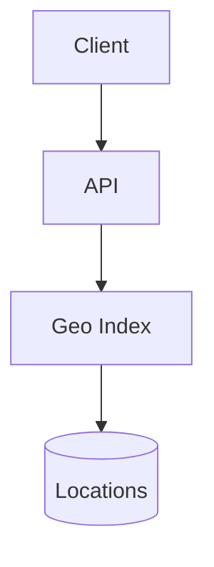
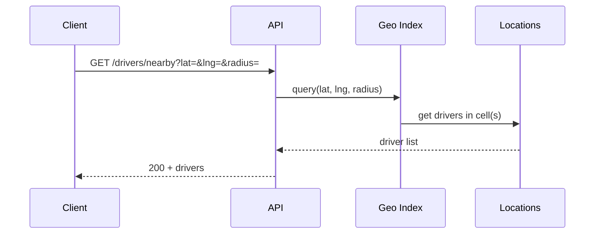

# High-Level Design: How Uber Finds Nearby Drivers at 1M Requests/Second

## 1. Overview

Case study: supporting ~1 million requests per second to find nearby available drivers (and later match to a ride) using geospatial indexing, in-memory state, and horizontal scaling.

---

## System Design Process
- **Step 1: Clarify Requirements** — See §3 below (find nearby drivers, 1M RPS, sub-100 ms).
- **Step 2: High-Level Design** — Geo index, location store, API; see §4–§6 below.
- **Step 3: Detailed Design** — Geohash/quad-tree, Redis/DB; see LLD for full API list.
- **Step 4: Scale & Optimize** — Sharding by region, in-memory index: see Scaling below.

#### High-Level Architecture

**Mermaid:**



#### Flow Diagram — Find nearby drivers

**Mermaid:**



**API endpoints (required):** GET `/v1/drivers/nearby?lat=...&lng=...&radius=...`, POST `/v1/drivers/location`. See LLD for full list.

---

## 2. The Challenge

- **Scale:** 1M requests/second to “find drivers near (lat, lng)” (e.g. for ETA or dispatch).
- **Latency:** Sub-100 ms so the app feels instant.
- **Data:** Driver locations change every few seconds; availability (on/off, on-trip) changes in real time.
- **Query:** “All available drivers within radius R of point P.”

---

## 3. Requirements

### Functional
- Update driver location and status (available, on-trip, offline) at high frequency.
- Query: given (lat, lng), return available drivers within radius (e.g. 5 km) sorted by distance or ETA.
- Support multiple cities/regions; optional filters (vehicle type, rating).

### Non-Functional
- 1M QPS for “nearby” queries; p99 latency < 100 ms.
- Location data is ephemeral (no long-term storage required for raw locations).
- Strong consistency not required for “list of nearby drivers”; eventual consistency acceptable.

---

## 4. High-Level Architecture

```
┌─────────────┐                    ┌──────────────────┐
│  Rider App  │── nearby?lat,lng ─►│  API Gateway     │
└─────────────┘                    └────────┬─────────┘
       │                                    │
       │  Driver locations (high write)     │
       │  ┌─────────────────────────────────┼─────────────────────────────────┐
       │  │                                 │                                 │
       │  ▼                                 ▼                                 ▼
       │  ┌────────────┐            ┌────────────────┐            ┌────────────┐
       │  │ Location   │            │  Geo Service   │            │  Driver    │
       │  │ Ingestion  │            │  (query        │            │  State     │
       │  │ (driver    │───────────►│   nearby)      │◄──────────│  (available│
       │  │  updates)  │            │                │            │   / on-trip)│
       │  └─────┬──────┘            └───────┬────────┘            └─────┬──────┘
       │        │                            │                          │
       │        │                            │                          │
       │        ▼                            ▼                          ▼
       │  ┌─────────────────────────────────────────────────────────────────┐
       │  │  In-Memory Geo Index (per cell/shard)                            │
       │  │  - Grid or Geohash cells; each cell = list of driver_ids          │
       │  │  - Driver writes: update cell membership                        │
       │  │  - Query: get cells covering (lat,lng)+radius → merge, sort       │
       │  └─────────────────────────────────────────────────────────────────┘
       │        │
       │        │  Optional: Redis with GEOSPATIAL (GEOADD, GEORADIUS)
       │        ▼
       │  ┌────────────┐
       │  │  Redis     │  (or custom in-memory grid per node)
       │  │  Cluster   │  Key: driver_id → (lng, lat); GEORADIUS on query
       │  └────────────┘
       └─────────────────────────────────────────────────────────────────────
```

---

## 5. Core Components

| Component | Responsibility |
|-----------|----------------|
| **Location Ingestion** | Accept driver (id, lat, lng, status); update geo index and driver state; high write throughput. |
| **Geo Index** | Store (driver_id, location) and support “points within radius”; implemented as grid, geohash, or Redis GEOSPATIAL. |
| **Geo Service** | Handle “nearby” request: query index for (lat, lng, radius); filter by status=available; sort by distance; return top N. |
| **Driver State** | Available / on-trip / offline; filter results to available only; updated with location or separately. |

---

## 6. Geo Index Options

### Option A: Redis with GEOSPATIAL
- GEOADD key (e.g. “drivers:city_1”) lng lat driver_id for each driver.
- GEORADIUS drivers:city_1 lng lat radius km WITHDIST COUNT 50 → list of driver_id and distance.
- Update: GEOADD overwrites same member (driver_id); so each location update is GEOADD.
- **Scale:** Partition key by city/region (e.g. “drivers:sf”) so one Redis key doesn’t hold all drivers; client hashes (lat,lng) or city to pick key. For 1M QPS, many Redis nodes; each query one key.

### Option B: Grid (in-memory per service instance)
- Divide world into grid cells (e.g. 0.01° ≈ 1 km); cell_id = f(lat, lng).
- Each cell: set of driver_ids. Driver update: remove from old cell, add to new cell.
- Query: compute cells that overlap circle (lat, lng, radius); union driver_ids from those cells; filter by distance (haversine) and status; sort.
- **Scale:** Shard by region; each shard owns a subset of cells; sticky routing by (lat, lng) to same shard.

### Option C: Geohash
- Encode (lat, lng) to geohash string; prefix = coarser region. Store driver_id in sorted set keyed by geohash prefix; query by expanding geohash prefixes that cover the circle, then filter by distance.
- Similar to grid but with hierarchical cells.

**Practical choice for 1M QPS:** Redis Cluster with GEOSPATIAL per region key, or custom in-memory grid with many replicas and load balancing.

---

## 7. Data Flow

### Location update (driver)
1. Driver app sends (driver_id, lat, lng, status) to Location Ingestion.
2. Ingestion hashes driver_id (or region) to partition; sends update to the partition’s geo store (Redis GEOADD or grid update).
3. Optionally update driver state store (available/on-trip) in same or separate store.
4. No synchronous DB write for every location tick; optional async write for analytics.

### Nearby query (rider)
1. Rider sends (lat, lng, radius, limit).
2. Geo Service determines partition (e.g. city or grid region) from (lat, lng).
3. Query geo index: GEORADIUS or grid overlap → list of (driver_id, distance).
4. Filter by driver state (available) if not already in index (e.g. second key “available:city_1” with only available driver ids; intersect with GEORADIUS result, or store availability in same structure and filter in app).
5. Sort by distance; take top N; optionally enrich with ETA (separate service); return.

---

## 8. Scaling to 1M QPS

- **Partitioning:** By geography (city/region) so each partition handles a subset of drivers and queries; route by (lat, lng) or city.
- **Read scaling:** Many replicas of Geo Service (stateless); each partition’s index replicated (Redis replica or copy of grid).
- **Write scaling:** Location updates are keyed by driver_id; spread across partitions (e.g. by driver_id hash); each partition receives ~(total drivers × update rate / num_partitions) writes/s.
- **Caching:** “Nearby” results are not long-lived cached (locations change); but the geo index itself is the “cache”; avoid extra hop to DB for each query.
- **Connection pooling:** Clients (mobile) may use one request per “find drivers”; backend uses connection pools to Redis or in-memory index.

---

## 9. Trade-offs

| Decision | Choice | Rationale |
|----------|--------|-----------|
| Storage | In-memory (Redis or app grid) | Latency and throughput; no need to persist every location |
| Consistency | Eventual | Location is inherently delayed; strict consistency not required |
| Partitioning | By region/city | Locality; most queries and drivers in same region |
| Driver state | Separate key or field | Filter available only; avoid mixing offline drivers in geo index |

---

## 10. Interview Steps

1. **Clarify:** 1M QPS for “nearby” only or including ETA/match; radius; filters (vehicle type).
2. **Estimate:** Writes/s (drivers × update rate); reads/s (1M); memory per driver.
3. **Draw:** Ingestion → Geo Index (Redis or grid); Geo Service → query index + filter state.
4. **Detail:** GEORADIUS or grid overlap; partition by region; how to filter “available”.
5. **Scale:** Partitioning, replicas, and avoiding DB on hot path.

---

## Interview-Readiness Enhancements

### Capacity & SLO framing
- Define read/write QPS separately and estimate peak vs average traffic.
- Add latency budgets (p95/p99) per critical hop and target availability.
- State durability target and expected data growth/day.

### Critical path clarity
- Document write path (authoritative commit first, async side-effects second).
- Document read path (cache/read model first, fallback to source of truth).
- Identify likely hotspots (hot keys, hot partitions, fanout spikes).

### Failure handling
- Define retry strategy (bounded retries, backoff, jitter).
- Add circuit breakers and bulkheads for unstable dependencies.
- Cover queue failures (DLQ, replay) and datastore failover behavior.

### Security, operations, and cost
- Baseline security: AuthN/AuthZ, encryption in transit/at rest, secrets rotation.
- Observability: golden signals, SLO alerts, tracing, runbooks, canary/rollback.
- DR/cost: explicit RTO/RPO and top cost drivers with optimization levers.

### Trade-off table (mandatory)
- Include at least two realistic alternatives with decision rationale for this system.

