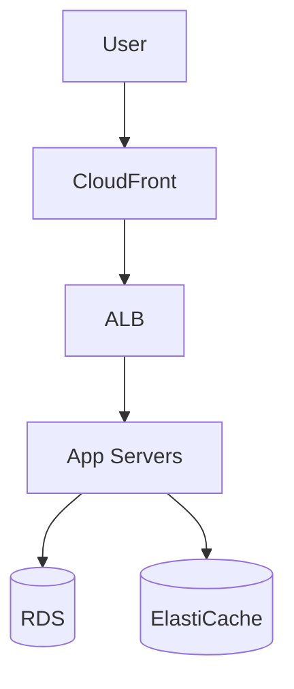
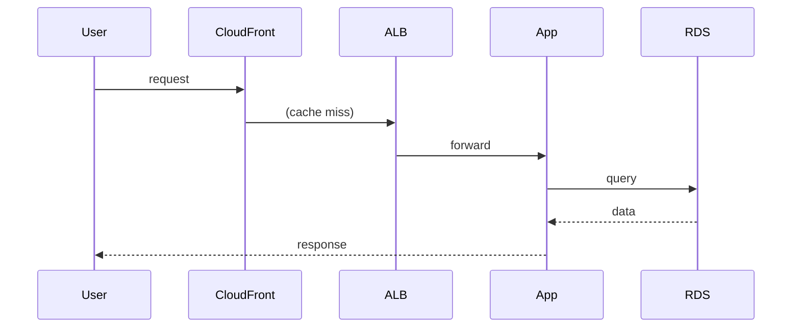

# High-Level Design: How to Scale an App to 10 Million Users on AWS

## 1. Overview

A phased approach to scaling a single-server application to 10M users on AWS using managed services: load balancing, horizontal scaling, database read replicas, caching, CDN, and async processing.

---

## System Design Process
- **Step 1: Clarify Requirements** — Scale from single server to 10M users; use AWS; availability and cost.
- **Step 2: High-Level Design** — LB, app tier, DB, cache, CDN; see §3–§4 below.
- **Step 3: Detailed Design** — RDS read replicas, ElastiCache, S3/CloudFront; see LLD for API list.
- **Step 4: Scale & Optimize** — Phased: 10K → 100K → 1M → 10M (LB, replicas, sharding, async). See §3 below.

#### High-Level Architecture

**Mermaid:**



#### Flow Diagram — Request path

**Mermaid:**



**API endpoints:** Application-dependent; see LLD for your app’s API list.

---

## 2. The Challenge

- Start with one server (or a small stack); grow to 10M users without full rewrites.
- Use AWS (or similar cloud) as the primary platform.
- Maintain availability, performance, and cost control at each phase.

---

## 3. Phased Scaling (10K → 100K → 1M → 10M)

| Phase | Users (approx) | Focus |
|-------|----------------|--------|
| **0** | &lt; 10K | Single EC2 + single RDS; optional S3 for static/assets. |
| **1** | 10K–100K | Add ALB; 2+ EC2 behind ALB; RDS single-AZ then Multi-AZ; Redis (ElastiCache) for session/cache. |
| **2** | 100K–1M | Auto Scaling Group (ASG); RDS read replicas for reads; S3 + CloudFront (CDN); async jobs (SQS + workers). |
| **3** | 1M–10M | Sharding or Aurora Global DB; ElastiCache Cluster; Kafka/SQS for events; dedicated services (auth, search); monitoring (CloudWatch, X-Ray). |

---

## 4. High-Level Architecture (Target: 10M Users)

```
                    ┌─────────────────────────────────────────┐
                    │            CloudFront (CDN)              │
                    │  (static assets, optional API cache)      │
                    └────────────────────┬──────────────────────┘
                                         │
                    ┌────────────────────▼──────────────────────┐
                    │         Application Load Balancer         │
                    └────────────────────┬──────────────────────┘
                                         │
        ┌────────────────────────────────┼────────────────────────────────┐
        │                                │                                │
        ▼                                ▼                                ▼
┌───────────────┐              ┌───────────────┐              ┌───────────────┐
│  EC2 / ECS    │              │  EC2 / ECS    │              │  EC2 / ECS    │
│  App Server 1 │              │  App Server 2 │              │  App Server N │
│  (ASG)        │              │  (ASG)        │              │  (ASG)        │
└───────┬───────┘              └───────┬───────┘              └───────┬───────┘
        │                              │                              │
        └──────────────────────────────┼──────────────────────────────┘
                                       │
        ┌──────────────────────────────┼──────────────────────────────┐
        │                              │                              │
        ▼                              ▼                              ▼
┌───────────────┐              ┌───────────────┐              ┌───────────────┐
│  ElastiCache  │              │  RDS Primary  │              │  SQS / SNS    │
│  (Redis)      │              │  + Replicas   │              │  (async jobs) │
└───────────────┘              └───────┬───────┘              └───────┬───────┘
                                       │                              │
                                       │                              ▼
                                       │                      ┌───────────────┐
                                       │                      │  Workers      │
                                       │                      │  (Lambda/EC2) │
                                       │                      └───────────────┘
                                       │
                                       ▼
                              ┌───────────────┐
                              │  S3 (blobs,    │
                              │   backups)     │
                              └───────────────┘
```

---

## 5. Key AWS Components and When to Use Them

| Component | Purpose | When to introduce |
|-----------|---------|--------------------|
| **ALB** | Distribute traffic; health checks; TLS termination | When you add a second app server |
| **ASG** | Auto-scale EC2 by CPU/request count; min/max/desired | When traffic is variable or &gt; 1 server |
| **RDS Multi-AZ** | Failover for DB | Before 100K users |
| **RDS Read Replicas** | Offload reads; scale read capacity | When DB read IO/CPU is bottleneck |
| **ElastiCache (Redis)** | Session store; cache (DB results, API responses) | When DB or latency is bottleneck |
| **CloudFront** | CDN for static assets and optional API caching | When global users or static traffic grows |
| **S3** | Static files; user uploads; backups | From day one for assets; later for blobs |
| **SQS** | Decouple async work (email, reports, notifications) | When sync path gets slow or unreliable |
| **Lambda** | Event-driven tasks; lightweight workers | Optional for events (S3, SQS, API Gateway) |
| **Route 53** | DNS; health-based routing; failover | When you need multi-region or failover |
| **CloudWatch / X-Ray** | Logs, metrics, tracing | As soon as you have multiple components |

---

## 6. Data and Session Strategy

- **Sessions:** Store in Redis (ElastiCache); stateless app servers; scale horizontally.
- **Cache:** Cache hot DB queries and API responses in Redis; TTL and invalidation on write.
- **DB:** Write to primary; read from replicas for read-heavy workloads; use connection pooling (e.g. RDS Proxy).
- **Blobs:** S3 with CloudFront for delivery; presigned URLs for private content.
- **Async:** Long or non-critical work (emails, notifications, reports) → SQS → worker (Lambda or EC2).

---

## 7. Security and Resilience

- **VPC:** App and DB in private subnets; ALB in public; no direct DB access from internet.
- **Secrets:** Secrets Manager or Parameter Store for DB credentials and API keys.
- **Backups:** RDS automated backups; S3 versioning for critical data.
- **Multi-AZ:** RDS Multi-AZ; ASG across 2+ AZs; optional multi-region with Route 53.

---

## 8. Cost and Optimization

- **Right-sizing:** Start with smaller instance types; scale up or out based on metrics.
- **Reserved Instances / Savings Plans:** For stable baseline load.
- **Spot:** For batch workers where interruption is acceptable.
- **Cache hit ratio:** Reduce DB and origin load; monitor hit rate.
- **CDN:** Reduce origin traffic and latency for static and cacheable content.

---

## 9. Interview Steps

1. **Clarify:** Type of app (API, web, mobile); read vs write ratio; global vs single region.
2. **Estimate:** 10M users → DAU, requests/s, DB size; identify bottlenecks (CPU, DB, network).
3. **Draw:** ALB → ASG → App; Redis; RDS primary + replicas; S3 + CloudFront; SQS + workers.
4. **Phases:** Describe what you add at 10K, 100K, 1M, 10M (ALB, replicas, cache, CDN, sharding).
5. **Trade-offs:** Cost vs performance; managed vs self-hosted; when to shard or go multi-region.

---

## Interview-Readiness Enhancements

### Capacity & SLO framing
- Define read/write QPS separately and estimate peak vs average traffic.
- Add latency budgets (p95/p99) per critical hop and target availability.
- State durability target and expected data growth/day.

### Critical path clarity
- Document write path (authoritative commit first, async side-effects second).
- Document read path (cache/read model first, fallback to source of truth).
- Identify likely hotspots (hot keys, hot partitions, fanout spikes).

### Failure handling
- Define retry strategy (bounded retries, backoff, jitter).
- Add circuit breakers and bulkheads for unstable dependencies.
- Cover queue failures (DLQ, replay) and datastore failover behavior.

### Security, operations, and cost
- Baseline security: AuthN/AuthZ, encryption in transit/at rest, secrets rotation.
- Observability: golden signals, SLO alerts, tracing, runbooks, canary/rollback.
- DR/cost: explicit RTO/RPO and top cost drivers with optimization levers.

### Trade-off table (mandatory)
- Include at least two realistic alternatives with decision rationale for this system.

