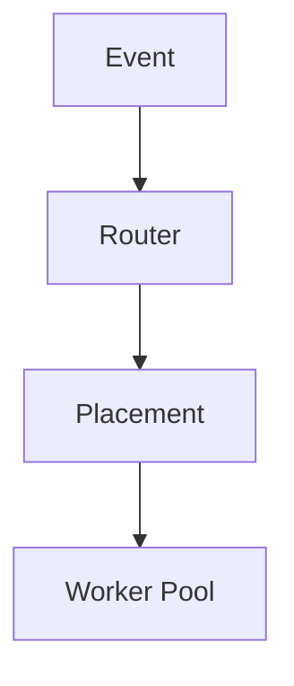
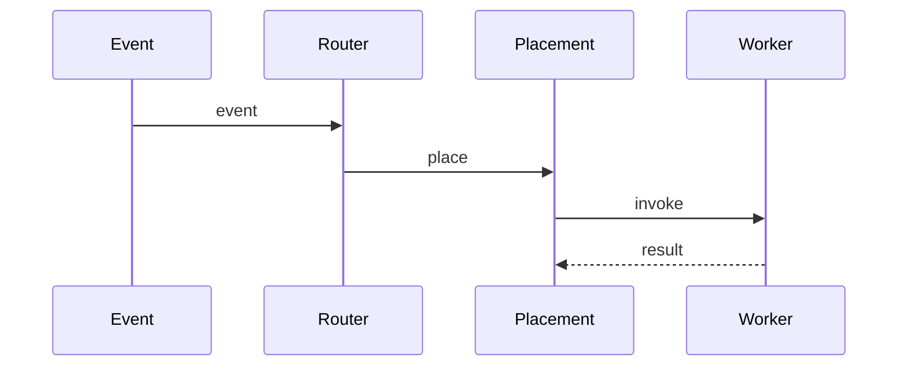

# High-Level Design: How Meta Handles 11.5M Serverless Function Calls per Second

## 1. Overview

Case study: scaling serverless (function-as-a-service) to tens of millions of invocations per second through disaggregated compute, efficient cold start, placement, and event-driven routing—inspired by Meta’s scale.

---

## System Design Process
- **Step 1: Clarify Requirements** — 11.5M invocations/s; low cold start; mixed workload; cost. See §2–§3 below.
- **Step 2: High-Level Design** — Disaggregated compute, placement, routing; see §4–§6 below.
- **Step 3: Detailed Design** — No DB for “API” in traditional sense; invoke API; see LLD for interfaces.
- **Step 4: Scale & Optimize** — Placement, warm pools, sharding: see Scaling below.

#### High-Level Architecture

**Mermaid:**



#### Flow Diagram — Invoke function

**Mermaid:**



**API endpoints:** Function invocations (event-driven); see LLD for admin and invoke APIs.

---

## 2. The Challenge

- **Scale:** 11.5M function invocations per second globally.
- **Latency:** Low cold start and execution time; predictable p99.
- **Workload:** Mix of tiny (API handlers) and heavier (image processing, ML inference); bursty and steady.
- **Cost:** Efficient resource utilization; avoid over-provisioning per customer.

---

## 3. Requirements

### Functional
- Execute user-defined functions in response to events (HTTP, queue, DB change, schedule).
- Support multiple runtimes (e.g. Node, Python, Go); configurable memory and timeout.
- Isolation between tenants (security and resource limits).
- Observability: invocation count, duration, errors, traces.

### Non-Functional
- Throughput: 11.5M invocations/s; linear scaling with more workers.
- Cold start: Minimize (pooled containers, keep-warm, smaller base images).
- Placement: Route to nearest or least-loaded region; bin-pack for efficiency.
- Billing: Per invocation and per GB-second (or similar).

---

## 4. High-Level Architecture

```
┌─────────────┐     Events (HTTP, Queue, etc.)    ┌──────────────────┐
│  Triggers   │───────────────────────────────────►│  API Gateway /   │
│  (API GW,   │                                    │  Event Router    │
│   SQS, etc) │                                    └────────┬─────────┘
└─────────────┘                                             │
                                                             │
                    ┌────────────────────────────────────────┼────────────────────────────────────────┐
                    │                                        │                                        │
                    ▼                                        ▼                                        ▼
           ┌────────────────┐                       ┌────────────────┐                       ┌────────────────┐
           │  Invocation    │                       │  Placement     │                       │  Config /      │
           │  Router        │                       │  Service       │                       │  Registry       │
           │  (which        │                       │  (where to     │                       │  (function      │
           │   region/zone) │                       │   run)         │                       │   code, env)    │
           └───────┬────────┘                       └───────┬────────┘                       └───────┬────────┘
                   │                                        │                                        │
                   └────────────────────────────────────────┼────────────────────────────────────────┘
                                                            │
                                                            ▼
                                                   ┌────────────────┐
                                                   │  Worker Pool    │
                                                   │  (per region)   │
                                                   │  - Warm pool    │
                                                   │  - Cold start   │
                                                   │  - Exec sandbox │
                                                   └───────┬────────┘
                                                           │
                                    ┌──────────────────────┼──────────────────────┐
                                    │                      │                      │
                                    ▼                      ▼                      ▼
                           ┌──────────────┐        ┌──────────────┐        ┌──────────────┐
                           │  Container   │        │  Container   │        │  Container   │
                           │  Executor 1  │        │  Executor 2  │        │  Executor N  │
                           │  (functions  │        │  (functions  │        │  (functions  │
                           │   in process │        │   in process │        │   in process │
                           │   or VM)     │        │   or VM)      │        │   or VM)      │
                           └──────────────┘        └──────────────┘        └──────────────┘
```

---

## 5. Core Components

| Component | Responsibility |
|-----------|----------------|
| **Event Router** | Accept HTTP or pull from queue; validate; forward to Invocation Router. |
| **Invocation Router** | Select region/zone and worker based on latency, load, and tenant affinity. |
| **Placement Service** | Decide which worker (and whether to reuse warm container or cold start); maintain warm pool per function version. |
| **Worker Pool** | Many worker nodes; each runs multiple execution environments (containers or microVMs); execute function code in sandbox. |
| **Warm Pool** | Pre-initialized containers (or processes) per (function_id, version); reduce cold start for repeat invocations. |
| **Config / Registry** | Store function code (or reference to blob); environment variables; runtime; limits. |

---

## 6. Achieving 11.5M Invocations/Second

- **Horizontal scaling:** Thousands of worker nodes across regions; each node runs many concurrent executions (multi-threaded or multi-container).
- **Efficient execution:** Reuse same process/container for multiple invocations (warm); lightweight sandbox (e.g. gVisor, Firecracker) for isolation without full VM overhead.
- **Routing:** Stateless router; partition by function_id or tenant so bursts go to different shards; load balance within region.
- **Async where possible:** Invocation request is accepted immediately; execution runs asynchronously; result delivered via callback or polling (for long-running); so “invocation” count includes fire-and-forget.
- **Batching:** For high-throughput event sources (e.g. Kafka), batch invocations (one function call processing N events) to reduce per-invocation overhead.

---

## 7. Cold Start Minimization

- **Warm pool:** Keep a number of pre-initialized containers per (function, version); new request gets one from pool; refill pool in background.
- **Keep-warm / proactive:** Predict traffic (e.g. cron at 9 AM); pre-warm before peak.
- **Small base image:** Minimal runtime and dependencies; lazy load heavy libs.
- **Snapshot / resume:** Restore from snapshot instead of full boot (e.g. Firecracker snapshot restore) for faster cold start.
- **Pool by tenant:** High-volume tenants get dedicated or larger pools to avoid cold start.

---

## 8. Placement and Load Balancing

- **Region:** Route by client region or explicit config; failover to next region if overloaded.
- **Worker selection:** Least loaded (in-flight invocations) or round-robin within worker set; avoid overloaded nodes.
- **Bin-packing:** Schedule multiple functions on same node to improve utilization; use memory/CPU limits per function.

---

## 9. Data Flow (Single Invocation)

1. Request hits API Gateway or event source (e.g. SQS); event router validates and extracts function_id, payload.
2. Invocation router chooses region and requests placement (which worker, warm or cold).
3. Placement service: if warm container available for (function_id, version), assign; else trigger cold start (allocate container, load code, then assign).
4. Request sent to worker; worker runs function in sandbox; returns result (or writes to callback URL).
5. Router returns response to client (or acknowledges event).
6. Worker returns container to warm pool for same function or reclaims after idle timeout.

---

## 10. Trade-offs

| Decision | Choice | Rationale |
|----------|--------|-----------|
| Isolation | Lightweight VM or sandbox | Balance security and cold start |
| Warm pool | Per function version | High hit rate for popular functions; cost vs latency |
| Batching | For event-driven | Reduces invocation count and overhead for high-throughput streams |
| Multi-tenant | Shared workers | Cost; use limits and isolation to avoid noisy neighbor |

---

## 11. Interview Steps

1. **Clarify:** What counts as “invocation” (sync HTTP vs async); cold start SLA; multi-region.
2. **Estimate:** 11.5M/s → invocations per node if 100K nodes; concurrency per node.
3. **Draw:** Event Router → Invocation Router → Placement → Worker Pool (warm + cold).
4. **Detail:** Warm pool strategy; cold start path; how routing and placement scale.
5. **Scale:** Partitioning by function/tenant; batching; and snapshot restore for cold start.

---

## Interview-Readiness Enhancements

### Capacity & SLO framing
- Define read/write QPS separately and estimate peak vs average traffic.
- Add latency budgets (p95/p99) per critical hop and target availability.
- State durability target and expected data growth/day.

### Critical path clarity
- Document write path (authoritative commit first, async side-effects second).
- Document read path (cache/read model first, fallback to source of truth).
- Identify likely hotspots (hot keys, hot partitions, fanout spikes).

### Failure handling
- Define retry strategy (bounded retries, backoff, jitter).
- Add circuit breakers and bulkheads for unstable dependencies.
- Cover queue failures (DLQ, replay) and datastore failover behavior.

### Security, operations, and cost
- Baseline security: AuthN/AuthZ, encryption in transit/at rest, secrets rotation.
- Observability: golden signals, SLO alerts, tracing, runbooks, canary/rollback.
- DR/cost: explicit RTO/RPO and top cost drivers with optimization levers.

### Trade-off table (mandatory)
- Include at least two realistic alternatives with decision rationale for this system.

