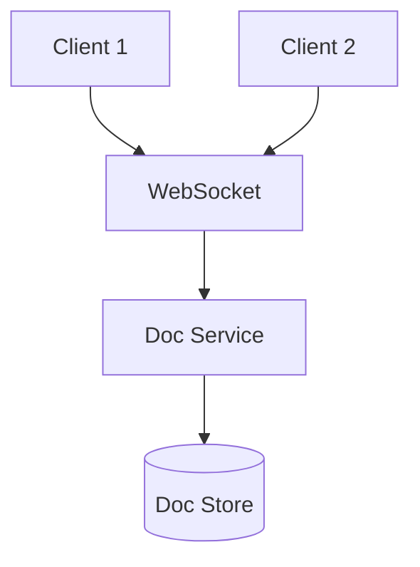
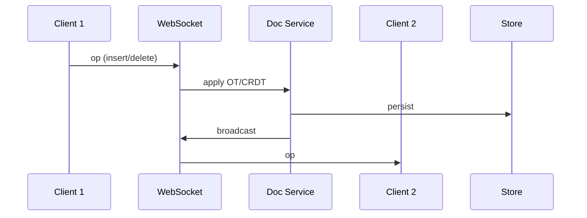

# High-Level Design: How Google Docs Works

## 1. Overview

Real-time collaborative document editing: multiple users see each other’s changes with low latency, with conflict resolution (e.g. OT or CRDT), presence, and persistence.

---

## System Design Process
- **Step 1: Clarify Requirements** — See §2 below (edit, real-time sync, presence, version history).
- **Step 2: High-Level Design** — Doc service, OT/CRDT, WebSocket, persistence; see §4–§6 below.
- **Step 3: Detailed Design** — Doc store, conflict resolution; see LLD for full API list.
- **Step 4: Scale & Optimize** — Sharding by doc_id, WebSocket scaling: see Scaling below.

#### High-Level Architecture

**Mermaid:**



#### Flow Diagram — Real-time edit sync

**Mermaid:**



**API endpoints (required):** GET/PUT `/v1/documents/:id`, WebSocket for ops stream. See LLD for full list.

---

## 2. Requirements

### Functional
- Create, open, save documents (rich text: paragraphs, formatting, lists).
- Multiple users edit simultaneously; changes appear in near real-time for others.
- Cursor/selection and presence (who is viewing/editing).
- Version history (optional): list and restore previous versions.
- Comments and suggestions (optional).

### Non-Functional
- Low latency for applying and broadcasting operations (< 200 ms).
- Consistency: eventually all clients converge to same document state.
- Offline or flaky network: queue operations; sync when back online; resolve conflicts.

---

## 3. High-Level Architecture

```
┌─────────────┐     ┌─────────────┐                    ┌──────────────────┐
│  Client A   │     │  Client B   │                    │  API Gateway     │
│  (Editor)   │     │  (Editor)   │                    │  / Load Balancer │
└──────┬──────┘     └──────┬──────┘                    └────────┬─────────┘
       │                   │                                    │
       │    Operations     │    Operations                      │
       │    (OT/CRDT)      │    (OT/CRDT)                      │
       └───────────────────┴────────────────┬───────────────────┘
                                            │
                                            ▼
                                   ┌────────────────┐
                                   │  Collaboration │
                                   │  Service       │
                                   │  (transform,   │
                                   │   broadcast)   │
                                   └───────┬────────┘
                                            │
                    ┌───────────────────────┼───────────────────────┐
                    │                       │                       │
                    ▼                       ▼                       ▼
           ┌────────────────┐      ┌────────────────┐      ┌────────────────┐
           │  Document      │      │  Presence       │      │  Message       │
           │  Store (DB)    │      │  (who's here,  │      │  Bus /         │
           │  (snapshot +   │      │   cursor)      │      │  WebSocket     │
           │   operations?) │      │  Redis         │      │  (broadcast)   │
           └────────────────┘      └────────────────┘      └────────────────┘
```

---

## 4. Core Components

| Component | Responsibility |
|-----------|----------------|
| **Client** | Maintain local document state; send operations (insert/delete/format) to server; apply operations from server; render. |
| **Collaboration Service** | Receive ops from clients; transform against server state or other concurrent ops (OT/CRDT); persist if needed; broadcast to other clients in same document. |
| **Document Store** | Full snapshot (e.g. JSON or custom format) and/or operation log; load on open; periodic snapshot from applied ops. |
| **Presence** | Track connected users per document; cursor position and selection; broadcast to collaborators. |
| **Message Channel** | WebSocket or long-poll per client; server pushes transformed ops and presence to other clients in same doc. |

---

## 5. Conflict Resolution: OT vs CRDT

### Operational Transformation (OT)
- Each change is an **operation** (e.g. insert(position, text), delete(position, length)).
- When two ops are concurrent, **transform** them so they can be applied in any order and yield the same result: e.g. transform(op_A, op_B) → (op_A', op_B') so apply(A then B') = apply(B then A').
- Server has canonical order; client sends op; server transforms against pending ops, applies, and broadcasts transformed op to others.
- **Challenge:** Transform rules get complex for rich text (formatting, blocks).

### CRDT (Conflict-free Replicated Data Type)
- Document is a CRDT (e.g. per-character with unique IDs and logical timestamps); merge is commutative and associative.
- Each client applies remote updates by **merging** with local state; no central “transform” step; eventual consistency.
- **Challenge:** Size and complexity of CRDT structure; need compaction and pruning.

**Practical:** Many systems use a hybrid or OT-like central server that orders and transforms, then broadcasts; or use CRDT for simplicity and offline-first.

---

## 6. Data Flow (User Types)

1. Client A has local state S; user types "X" at position 5.
2. Client A generates op = Insert(5, "X"); sends to Collaboration Service; optimistically applies locally (optional).
3. Service receives op; loads document state (or operation log) for doc_id; transforms op against any concurrent ops already applied; applies to server state; persists op (and optionally new snapshot periodically).
4. Service broadcasts transformed op to all other connected clients for that doc (B, C, ...) via WebSocket.
5. Client B receives op; applies to local state; re-renders. Client B sees "X" appear.
6. Presence: A sends cursor position periodically; server broadcasts to B; B shows A’s cursor.

---

## 7. Document State and Persistence

- **Snapshot:** Full document (e.g. JSON tree of blocks); saved on “save” or periodically (e.g. every N ops or every 30 s).
- **Operation log:** Append-only log of operations (op_id, doc_id, op, author, timestamp); used to rebuild state or replay for new client joining.
- **Load:** New client opens doc → load latest snapshot from DB; optionally fetch ops after snapshot version and replay to catch up (or server sends current state).
- **Version history:** Store snapshots at version boundaries (e.g. every 100 ops or on explicit “version”); list and restore by version id.

---

## 8. Scaling

- **Sticky session:** Same document’s connections should hit same Collaboration Service instance (or shared state via Redis) so broadcast is local or via pub/sub.
- **Pub/sub:** Document channel = "doc:{doc_id}"; service publishes transformed op to channel; all instances subscribed to that doc forward to their connected clients.
- **Document store:** Shard by doc_id; read/write snapshot and ops from same shard.
- **Presence:** Redis: key "presence:doc:{doc_id}", hash of user_id → cursor JSON; TTL on heartbeat; broadcast on change.

---

## 9. Trade-offs

| Decision | Choice | Rationale |
|----------|--------|-----------|
| Model | OT or CRDT | OT: central ordering, smaller messages; CRDT: offline-first, no single server |
| Transport | WebSocket | Low latency, bidirectional; fallback long-poll |
| Persistence | Snapshot + op log | Fast load from snapshot; log for history and replay |
| Presence | Separate channel | Decouple from ops; throttle cursor updates |

---

## 10. Interview Steps

1. **Clarify:** Rich text only or tables/images; version history; offline support.
2. **Estimate:** Concurrent editors per doc; ops/s per doc; document size.
3. **Draw:** Clients → Collaboration Service → Document Store; WebSocket; Presence.
4. **Detail:** Operation format (insert/delete); transform/merge; broadcast and apply.
5. **Scale:** Sticky session or pub/sub; snapshot + log; presence in Redis.
