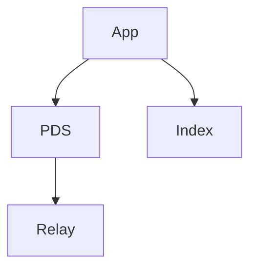
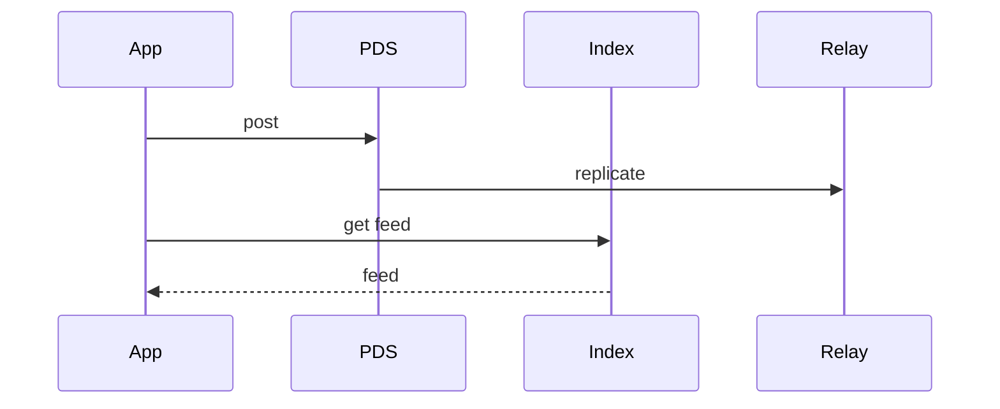

# High-Level Design: How Bluesky Works

## 1. Overview

Bluesky is a decentralized social network built on the **AT Protocol (ATP)**:
- **Decentralized identity** (DIDs and handles)
- **User-controlled data** (Personal Data Servers / PDS)
- **Federated feed** (repositories of posts; indexes and feeds built by app views or relay services)
- **Portability:** Users can move providers without losing identity or social graph.

---

## System Design Process
- **Step 1: Clarify Requirements** — See §2 below (DID, PDS, federated feed).
- **Step 2: High-Level Design** — PDS, relay, app view; see §4–§6 below.
- **Step 3: Detailed Design** — Repos, indexes; see LLD for full API list.
- **Step 4: Scale & Optimize** — Federation, caching: see Scaling below.

#### High-Level Architecture

**Mermaid:**



#### Flow Diagram — Post and read feed

**Mermaid:**



**API endpoints (required):** ATP endpoints (DID, repo, feed). See LLD for full list.

---

## 2. Requirements

### Functional
- Users have a **handle** (e.g. user.bsky.social) and a **DID** (decentralized identifier); handle can point to different PDS over time.
- **Posts** (and likes, reposts, follows) are stored in a **repository** hosted by a PDS chosen by the user.
- **Feed:** Timeline of posts from followed accounts; can be computed by PDS or by a separate “feed generator” / App View.
- **Discovery:** Resolve handle → DID → PDS; fetch profile and posts from PDS or cache.
- **Moderation:** Per-PDS or per-app; optional labeling and filtering.

### Non-Functional
- No single point of failure; multiple PDS providers and app views.
- Users can migrate: change PDS and repoint DID document (handle → DID → PDS).
- Open protocol: multiple clients and servers can interoperate.

---

## 3. High-Level Architecture

```
┌─────────────┐                    ┌──────────────────┐
│  App        │                    │  App View /      │
│  (client)   │◄──────────────────│  Feed Generator  │
└──────┬──────┘   (feed API)       └────────┬────────┘
       │                                    │
       │  Resolve handle → DID → PDS        │  Fetch posts from
       │  Fetch profile, posts              │  PDSs (followed users)
       │                                    │
       ▼                                    ▼
┌─────────────────────────────────────────────────────────────────┐
│  DID Resolution (DNS or DID document)                             │
│  handle (e.g. alice.bsky.social) → DID (e.g. did:plc:xxx)        │
│  DID document → service endpoint (PDS URL)                        │
└─────────────────────────────────────────────────────────────────┘
       │                                    │
       ▼                                    ▼
┌─────────────┐     ┌─────────────┐  ┌─────────────┐
│  PDS A      │     │  PDS B      │  │  PDS C      │
│  (user repo │     │  (user repo │  │  (user repo │
│   commits)  │     │   commits)  │  │   commits)  │
└─────────────┘     └─────────────┘  └─────────────┘
       │                    │                │
       └────────────────────┴────────────────┘
                            │
                    Repository = append-only log of records
                    (posts, likes, follows, profile) per user
```

---

## 4. Core Components

| Component | Responsibility |
|-----------|----------------|
| **Identity / DID** | Handle → DID resolution (e.g. DNS TXT or DID document); DID document points to PDS (and optionally signing keys). |
| **PDS (Personal Data Server)** | Hosts one or more user “repositories”; each repo is an append-only log of records (post, like, follow, profile); serve records to clients and to feed generators. |
| **Repository** | Per-user log of commits; each commit contains record operations (create/update/delete); records are JSON (post, profile, etc.) with CID/content-addressable reference. |
| **App View / Feed Generator** | Reads from one or more PDSs (followed users’ repos); merges and ranks posts; serves feed API to app; can be run by app provider or third party. |
| **Client (App)** | Resolves handle; fetches profile and posts from PDS; requests feed from App View; posts by submitting commit to user’s PDS. |

---

## 5. Data Flow (View Feed)

1. User opens app; app has user’s DID and follow list (or fetches from PDS).
2. App calls Feed Generator (App View): “feed for DID X, cursor, limit.”
3. Feed Generator: for each followed DID, knows their PDS URL (from DID doc or cache); fetches recent commits/records from those PDSs; merges by timestamp; applies ranking/filtering; returns list of post refs (or hydrated posts).
4. App displays feed; optionally fetches full post content from respective PDSs if not embedded in feed response.

---

## 6. Data Flow (Create Post)

1. User composes post in app.
2. App gets user’s PDS URL (from DID document or session).
3. App creates a **commit** for the user’s repo: “add record: type=post, text=..., createdAt=...” (signed by user or session).
4. App POSTs commit to PDS; PDS validates (signature, schema); appends to user’s repo; returns success.
5. Post is now in user’s repo; any feed generator that indexes this user will eventually include it.

---

## 7. Repository Model

- **Repo** = Merkle-style or append-only log of **commits**.
- Each **commit** = one or more record operations: create(rkey, record), update(rkey, record), delete(rkey).
- **Records** = JSON objects: post (text, createdAt, reply?), profile (displayName, avatar?), follow (subject), like (subject), etc.
- **rkey** = record key (e.g. unique id per post); used for updates/deletes and for referencing (e.g. reply points to at://did/rkey).

---

## 8. Moderation and Labels

- **Labeling:** Third-party or PDS can emit “labels” on records (e.g. spam, nsfw); stored in labeler service or in PDS.
- **App View:** When building feed, can filter or blur based on labels and user preferences.
- **No single authority:** Each app/PDS can choose which labelers to trust and how to filter.

---

## 9. Scaling and Federation

- **PDS:** Each PDS scales independently (many users’ repos); replication and backup per PDS.
- **Feed Generator:** Can cache PDS responses; index repos in background; partition by user or time; multiple instances.
- **DID resolution:** Cached (handle → DID → PDS); DNS and DID docs are cacheable.
- **Discovery:** Global “who to follow” can be built from public repos or from relay/indexers that crawl PDSs.

---

## 10. Interview Steps

1. **Clarify:** Focus on identity, repos, or feed; moderation; migration.
2. **Draw:** Client → DID resolution → PDS (repos); Client → App View (feed) → PDSs.
3. **Detail:** Handle → DID → PDS; repo = commit log; post = record in commit; feed = merge from multiple PDSs.
4. **Portability:** User changes PDS; DID document updated; repo can be migrated or replayed.
5. **Trade-offs:** Eventually consistent feed; no global ordering; multiple feed generators possible.

---

## Interview-Readiness Enhancements

### Capacity & SLO framing
- Define read/write QPS separately and estimate peak vs average traffic.
- Add latency budgets (p95/p99) per critical hop and target availability.
- State durability target and expected data growth/day.

### Critical path clarity
- Document write path (authoritative commit first, async side-effects second).
- Document read path (cache/read model first, fallback to source of truth).
- Identify likely hotspots (hot keys, hot partitions, fanout spikes).

### Failure handling
- Define retry strategy (bounded retries, backoff, jitter).
- Add circuit breakers and bulkheads for unstable dependencies.
- Cover queue failures (DLQ, replay) and datastore failover behavior.

### Security, operations, and cost
- Baseline security: AuthN/AuthZ, encryption in transit/at rest, secrets rotation.
- Observability: golden signals, SLO alerts, tracing, runbooks, canary/rollback.
- DR/cost: explicit RTO/RPO and top cost drivers with optimization levers.

### Trade-off table (mandatory)
- Include at least two realistic alternatives with decision rationale for this system.

