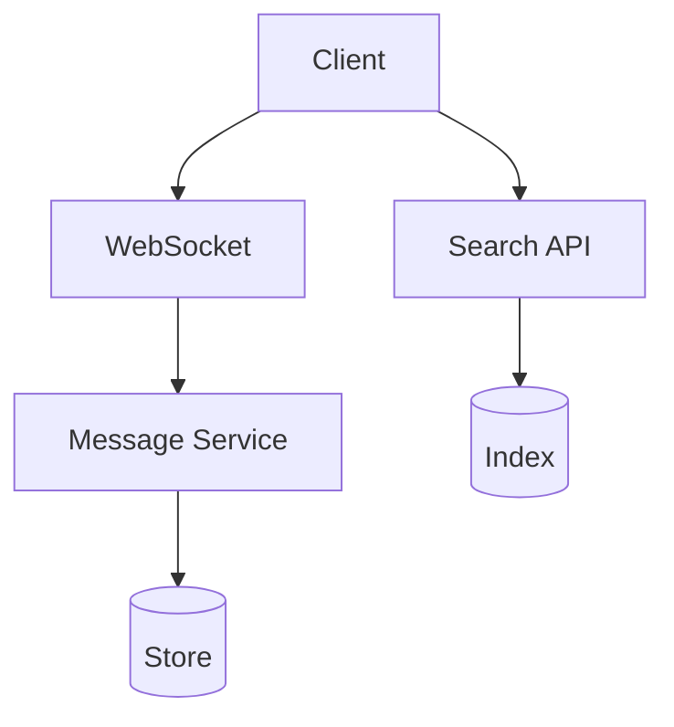
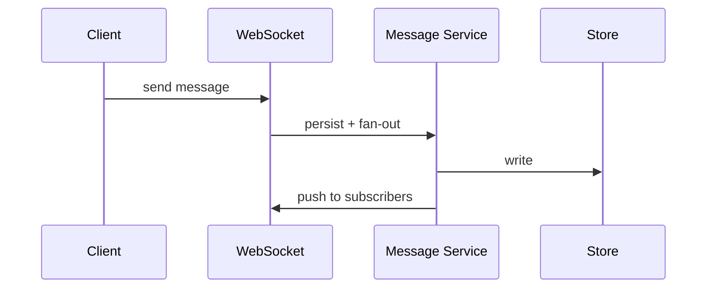

# High-Level Design: How Slack Works

## 1. Overview

Real-time team messaging: channels, DMs, threads, presence, notifications, search, and integrations—with emphasis on reliability, search, and cross-device sync.

---

## System Design Process
- **Step 1: Clarify Requirements** — See §2 below (workspaces, channels, messages, presence, search).
- **Step 2: High-Level Design** — Message service, presence, search index; see §4–§6 below.
- **Step 3: Detailed Design** — Message store, search index; see LLD for full API list.
- **Step 4: Scale & Optimize** — Sharding, WebSocket, search scaling: see Scaling below.

#### High-Level Architecture

**Mermaid:**



#### Flow Diagram — Send message

**Mermaid:**



**API endpoints (required):** POST/GET `/v1/channels/:id/messages`, WebSocket, GET `/v1/search`. See LLD for full list.

---

## 2. Requirements

### Functional
- **Workspaces:** Teams; members; channels (public/private) and DMs.
- **Messages:** Send in channel or DM; threads (replies to a message); edit/delete.
- **Presence:** Online/away/DND; typing indicator.
- **Search:** Full-text over messages and files; filters (channel, user, date).
- **Notifications:** In-app, email, push; preferences and mentions.
- **Integrations:** Bots; incoming webhooks; slash commands; apps.

### Non-Functional
- Real-time delivery (WebSocket or long-poll); low latency.
- Message ordering and consistency per channel.
- Scale: millions of workspaces; billions of messages; high read/write throughput.
- Retention and compliance: configurable retention; e-discovery.

---

## 3. High-Level Architecture

```
┌─────────────┐                    ┌──────────────────┐
│   Client    │  HTTP + WebSocket   │  API Gateway     │
└──────┬──────┘                    └────────┬─────────┘
       │                                    │
       │     ┌──────────────────────────────┼──────────────────────────────┐
       │     │                              │                              │
       │     ▼                              ▼                              ▼
       │  ┌────────────┐            ┌────────────┐            ┌────────────┐
       │  │  Message   │            │  Presence  │            │  Search    │
       │  │  Service   │            │  Service   │            │  Service   │
       │  └─────┬──────┘            └─────┬──────┘            └─────┬──────┘
       │        │                          │                          │
       │        │                          │                          │
       │        ▼                          ▼                          ▼
       │  ┌────────────┐            ┌────────────┐            ┌────────────┐
       │  │  Message   │            │  Redis     │            │  Elastic-   │
       │  │  Store     │            │  (presence,│            │  search /  │
       │  │  (sharded  │            │   typing)  │            │  index      │
       │  │   by       │            └────────────┘            └────────────┘
       │  │   channel) │
       │  └─────┬──────┘
       │        │
       │        ▼
       │  ┌────────────┐            ┌────────────┐
       │  │  Message   │            │  Notify    │
       │  │  Queue     │            │  / Push    │
       │  │  (fan-out) │───────────►│  Service   │
       │  └────────────┘            └────────────┘
       └─────────────────────────────────────────────────────────────────────
```

---

## 4. Core Components

| Component | Responsibility |
|-----------|----------------|
| **Message Service** | Validate; persist message to store (shard by channel_id); publish to message queue for fan-out; return to sender. |
| **Message Store** | Append-only or indexed by (channel_id, message_ts); support pagination and threads (thread_ts). |
| **Presence Service** | Track online/away/DND and typing; heartbeat; store in Redis with TTL; broadcast to channel members. |
| **Real-time Layer** | WebSocket per client; sticky to server; server pushes new messages and presence to connected clients; fallback long-poll. |
| **Search Service** | Index messages (and files) in Elasticsearch; query with filters; return ranked results. |
| **Notification Service** | On new message (or mention): check preferences; send push (FCM/APNs) and/or email; badge and in-app. |
| **Integration Layer** | Incoming webhooks, bots, slash commands; validate and post as bot or user; event subscriptions for apps. |

---

## 5. Data Flow (Send Message)

1. Client sends message (channel_id, text, thread_ts?) via HTTP or WebSocket.
2. Message Service: auth; check channel membership; generate message_id and ts; write to Message Store (partition by channel_id).
3. Publish to message queue (topic = channel_id or fan-out topic) with payload (message, channel_id).
4. Real-time layer: subscribers to this channel (other clients on same WebSocket server) get push; if client on different server, that server consumes from queue and pushes to its connections.
5. Notification workers: consume queue; for each message check mentions and channel mute; send push/email to offline or configured users.
6. Search indexer: consume queue or tail DB; index message in Elasticsearch for search.

---

## 6. Channels and Threads

- **Channel:** channel_id; members; messages ordered by ts (or message_id).
- **Thread:** Reply has thread_ts = root message’s ts; list thread = query messages where channel_id = X and thread_ts = Y.
- **DM:** Channel-like with type=im and two members; same message store with channel_id = dm_channel_id.

---

## 7. Presence and Typing

- **Presence:** User connects → Presence Service sets user online in Redis (key user_id, value status, TTL 60s); heartbeat every 30s. On disconnect, set offline or let TTL expire. Channel members subscribe to presence updates for others in same channel.
- **Typing:** Client sends “typing” with channel_id; server writes to Redis (key channel_id, field user_id, value 1, TTL 5s); broadcast to channel; clients show “X is typing.”

---

## 8. Search

- **Index:** Message body, channel_id, user_id, ts, thread_ts; optionally file content.
- **Query:** Full-text + filters (channel, user, date range); pagination; highlight snippets.
- **Consistency:** Near real-time (indexer lag a few seconds); or explicit refresh after send.

---

## 9. Scaling

- **Message store:** Shard by channel_id (or workspace_id + channel_id); wide-column or SQL with partition; index for (channel_id, ts) and (channel_id, thread_ts, ts).
- **Real-time:** Sticky WebSocket to server; server subscribes to queue for channels that its connected users are in; or fan-out via Redis pub/sub (channel_id) and each server subscribes to channels it serves.
- **Presence:** Redis Cluster; key per user or per channel presence map; scale Redis.
- **Search:** Elasticsearch index per workspace or shared index with workspace_id filter; scale ES cluster.

---

## 10. Interview Steps

1. **Clarify:** Channels vs DMs; threads; search; notifications; scale (workspaces, messages/s).
2. **Estimate:** Messages/s; concurrent connections; storage per message.
3. **Draw:** Message Service → Store + Queue; Real-time (WebSocket) + Presence; Search index; Notify.
4. **Detail:** Send path (persist → queue → push to online, notify offline, index); presence heartbeat and typing TTL.
5. **Scale:** Sharding by channel; sticky WebSocket; queue fan-out and search indexer.

---

## Interview-Readiness Enhancements

### Capacity & SLO framing
- Define read/write QPS separately and estimate peak vs average traffic.
- Add latency budgets (p95/p99) per critical hop and target availability.
- State durability target and expected data growth/day.

### Critical path clarity
- Document write path (authoritative commit first, async side-effects second).
- Document read path (cache/read model first, fallback to source of truth).
- Identify likely hotspots (hot keys, hot partitions, fanout spikes).

### Failure handling
- Define retry strategy (bounded retries, backoff, jitter).
- Add circuit breakers and bulkheads for unstable dependencies.
- Cover queue failures (DLQ, replay) and datastore failover behavior.

### Security, operations, and cost
- Baseline security: AuthN/AuthZ, encryption in transit/at rest, secrets rotation.
- Observability: golden signals, SLO alerts, tracing, runbooks, canary/rollback.
- DR/cost: explicit RTO/RPO and top cost drivers with optimization levers.

### Trade-off table (mandatory)
- Include at least two realistic alternatives with decision rationale for this system.

