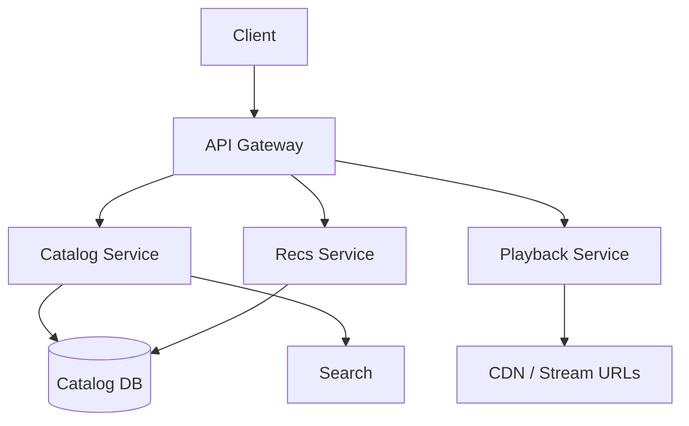
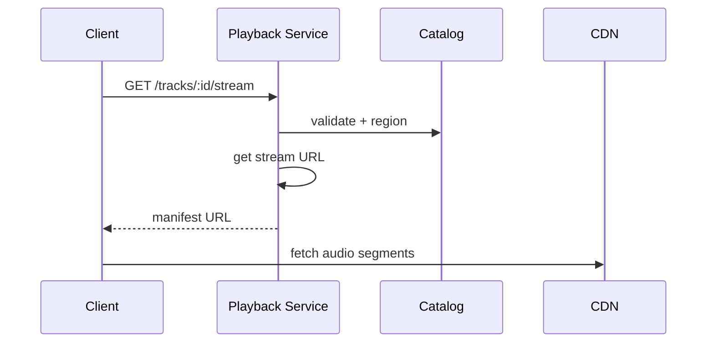

# High-Level Design: How Spotify Works

## 1. Overview

Music streaming at scale: catalog management, playback (streaming and offline), recommendations, search, playlists, and global CDN for low-latency audio delivery.

---

## System Design Process

### Step 1: Clarify Requirements
- **Functional:** Catalog (tracks, albums, artists, licensing/region); playback (stream, progress, queue); playlists (create, edit, collaborative); search; recommendations (home, next track); optional offline and social.
- **Non-functional:** Low start latency (< 2 s); global scale; region/license enforcement.
- **Constraints:** Rights and region; serve only licensed content.

### Step 2: High-Level Design — Components, Data Flow
- **Components:** API Gateway, Catalog Service, Playback Service, Recommendation Service, Playlist Service; Catalog DB + Search; Stream URLs (CDN); see §3–§5 below.

#### High-Level Architecture

**Mermaid:**



#### Flow Diagram — Play track

**Mermaid:**



### Step 3: Detailed Design — Database & API
- **Database:** SQL/NoSQL for catalog, playlists, user_library, progress; Elasticsearch for search; object store + CDN for audio.
- **API endpoints (required):**

| Method | Endpoint | Description |
|--------|----------|-------------|
| GET | `/v1/tracks/:id` | Track metadata |
| GET | `/v1/tracks/:id/stream` | Resolve stream URL / manifest + progress |
| PUT | `/v1/me/player` | Set progress (position_ms, device_id) |
| GET | `/v1/me/player` | Current playback state and queue |
| GET | `/v1/search?q=...&type=...` | Search tracks, artists, playlists |
| GET | `/v1/playlists/:id` | Playlist metadata + tracks |
| POST | `/v1/playlists/:id/tracks` | Add tracks to playlist |
| GET | `/v1/recommendations` | Home / Made for you |
| GET | `/v1/recommendations/next` | Next track suggestion |

### Step 4: Scale & Optimize
- **Load balancing:** Stateless services behind LB; CDN for audio (no backend bandwidth for bytes).
- **Sharding:** Catalog and progress by user_id or entity id; search index scaled (Elasticsearch).
- **Caching:** CDN for audio; per-user recommendation cache; catalog metadata cache.

---

## 2. Requirements (Detail)

### Functional
- **Catalog:** Tracks, albums, artists; metadata and cover art; licensing and region availability.
- **Playback:** Stream audio (multiple qualities); progress save and resume; queue and shuffle.
- **Playlists:** Create, edit, reorder; collaborative playlists; library (liked songs, followed playlists).
- **Search:** Full-text over tracks, albums, artists, playlists.
- **Recommendations:** Home feed; “Made for you”; related artists/tracks; radio.
- **Offline:** Download for offline listen (optional; DRM and sync).
- **Social:** Share; follow friends; activity (optional).

### Non-Functional
- Low start latency (< 2 s to first byte); minimal buffering; global audience.
- Scale: millions of tracks; hundreds of millions of users; billions of streams per day.
- Rights and region: serve only licensed and region-available content.

---

## 3. High-Level Architecture

```
┌─────────────┐                    ┌──────────────────┐
│   Client    │                    │  API Gateway     │
└──────┬──────┘                    └────────┬─────────┘
       │                                    │
       │     ┌──────────────────────────────┼──────────────────────────────┐
       │     │                              │                              │
       │     ▼                              ▼                              ▼
       │  ┌────────────┐            ┌────────────┐            ┌────────────┐
       │  │  Catalog   │            │  Playback   │            │  Recs      │
       │  │  Service   │            │  Service   │            │  Service   │
       │  └─────┬──────┘            └─────┬──────┘            └─────┬──────┘
       │        │                          │                          │
       │        ▼                          ▼                          ▼
       │  ┌────────────┐            ┌────────────┐            ┌────────────┐
       │  │  Catalog   │            │  Stream    │            │  ML /      │
       │  │  DB +      │            │  URLs      │            │  Ranking   │
       │  │  Search    │            │  (CDN)     │            │  + Catalog │
       │  └────────────┘            └────────────┘            └────────────┘
       │                                    │
       │  Audio bytes                       │
       │  ┌─────────────────────────────────▼─────────────────────────────────┐
       │  │  CDN (audio segments: 96/160/320 kbps; chunked by time)             │
       │  │  Origin: object store (encoded tracks)                             │
       │  └────────────────────────────────────────────────────────────────────┘
       └─────────────────────────────────────────────────────────────────────
```

---

## 4. Core Components

| Component | Responsibility |
|-----------|----------------|
| **Catalog Service** | Tracks, albums, artists, playlists metadata; region and license checks; serve to client and other services. |
| **Catalog DB + Search** | Relational or document store for metadata; Elasticsearch (or similar) for search; index by title, artist, album. |
| **Playback Service** | Resolve track_id → stream URL (CDN); save progress (user_id, track_id, position_ms); return next chunk URL or manifest. |
| **Stream / CDN** | Audio files (or chunks) stored in object store; CDN caches and serves; multiple bitrates; optional HLS/DASH for adaptive. |
| **Recommendation Service** | Use listening history, likes, playlist membership; ML models (collaborative filtering, embeddings); return personalized playlists and home feed. |
| **Playlist Service** | CRUD playlists; list of track_ids with order; collaborative = multi-writer with conflict resolution or last-write-wins. |
| **User Library** | Liked tracks, followed playlists; stored per user; used for recs and “Your Library.” |

---

## 5. Data Flow (Play Track)

1. Client requests “play track_id” (and optional position_ms).
2. Playback Service: validate user and track (catalog + license/region); get stream URL for track (e.g. signed CDN URL or manifest URL for HLS).
3. Return stream URL(s) and optional progress; client starts fetching audio from CDN.
4. Client reports progress periodically (position_ms); Playback Service saves to progress store (user_id, context, track_id, position_ms).
5. On track end or skip: save final position; next track from queue or recommendation.

---

## 6. Streaming and CDN

- **Storage:** Encoded tracks (e.g. 96, 160, 320 kbps) in object store (S3); key = track_id + quality or segment index.
- **Delivery:** CDN (CloudFront, etc.) in front of origin; client requests by track_id + bitrate + segment (or byte range); signed URL with expiry for private catalog.
- **Adaptive:** Optional HLS/DASH: manifest lists segments per bitrate; client chooses bitrate by bandwidth; same CDN serves segments.
- **Chunking:** Fixed segment length (e.g. 4 s) so CDN and client can range-request and cache.

---

## 7. Recommendations

- **Inputs:** User listening history (track, timestamp, skip/finish); likes; playlist adds; follow graph; track/artist metadata.
- **Models:** Collaborative filtering (user–item matrix); embedding models (user and track vectors); sequence models (next track).
- **Serving:** Precompute “Made for you” playlists periodically (e.g. daily); real-time for “continue listening” and “next track”; cache per user.
- **Catalog filter:** Only recommend licensed and region-available tracks; filter in ranking layer.

---

## 8. Search

- **Index:** Track title, artist name, album name; normalized and full-text indexed; filter by region and license at query time.
- **Query:** User types; autocomplete (suggest tracks/artists/playlists); full search returns ranked results (relevance + popularity).
- **Fuzzy:** Handle typos and alternate spellings (edit distance or fuzzy match in search engine).

---

## 9. Data Model (Conceptual)

- **tracks:** track_id, title, duration_ms, artist_id, album_id, isrc, available_regions[], stream_key (object path).
- **artists, albums:** ids and metadata.
- **playlists:** playlist_id, owner_id, name, track_ids[] (ordered), collaborative.
- **user_library:** user_id, liked_track_ids[], followed_playlist_ids[].
- **progress:** user_id, context_id (e.g. device), track_id, position_ms, updated_at.

---

## 10. Scaling

- **Catalog:** DB sharded by entity type or id; read replicas; search index scaled with Elasticsearch cluster.
- **Playback:** Stateless; progress store (DB or Redis) by user_id; stream URLs are CDN so no backend bandwidth for audio.
- **CDN:** Multiple edge locations; origin = object store; cache hit ratio high for popular tracks.
- **Recs:** Batch jobs for playlists; real-time service reads from feature store and model server; cache per user.

---

## 11. Interview Steps

1. **Clarify:** Offline mode; licensing; adaptive streaming; social features.
2. **Estimate:** Tracks; streams/day; storage and bandwidth; recommendation QPS.
3. **Draw:** Catalog, Playback, Recs, Playlist → DB + Search; Playback → CDN (stream URLs); CDN → object store.
4. **Detail:** How stream URL is generated (signed URL, manifest); progress save; recommendation inputs and output.
5. **Scale:** CDN for audio; sharding catalog and progress; batch vs real-time recs.

---

## Interview-Readiness Enhancements

### Capacity & SLO framing
- Define read/write QPS separately and estimate peak vs average traffic.
- Add latency budgets (p95/p99) per critical hop and target availability.
- State durability target and expected data growth/day.

### Critical path clarity
- Document write path (authoritative commit first, async side-effects second).
- Document read path (cache/read model first, fallback to source of truth).
- Identify likely hotspots (hot keys, hot partitions, fanout spikes).

### Failure handling
- Define retry strategy (bounded retries, backoff, jitter).
- Add circuit breakers and bulkheads for unstable dependencies.
- Cover queue failures (DLQ, replay) and datastore failover behavior.

### Security, operations, and cost
- Baseline security: AuthN/AuthZ, encryption in transit/at rest, secrets rotation.
- Observability: golden signals, SLO alerts, tracing, runbooks, canary/rollback.
- DR/cost: explicit RTO/RPO and top cost drivers with optimization levers.

### Trade-off table (mandatory)
- Include at least two realistic alternatives with decision rationale for this system.

