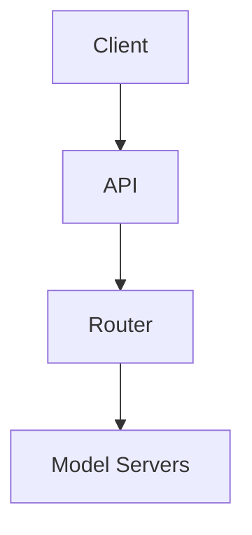
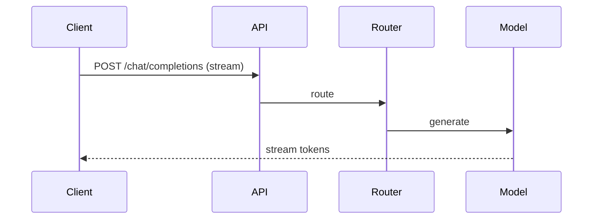

# High-Level Design: How LLMs Like ChatGPT Actually Work

## 1. Overview

System-design view of serving Large Language Models (LLMs) at scale: inference architecture, prompt handling, token generation, streaming, context management, and scaling for latency and throughput.

---

## System Design Process
- **Step 1: Clarify Requirements** — See §2 below (prompt, stream, context, multi-tenant).
- **Step 2: High-Level Design** — API, router, model servers; see §4–§6 below.
- **Step 3: Detailed Design** — Model serving, batching; see LLD for full API list.
- **Step 4: Scale & Optimize** — Load balancing, GPU scaling, KV cache: see Scaling below.

#### High-Level Architecture

**Mermaid:**



#### Flow Diagram — Chat completion (stream)

**Mermaid:**



**API endpoints (required):** POST `/v1/chat/completions` (stream), POST `/v1/completions`. See LLD for full list.

---

## 2. Requirements

### Functional
- **Input:** User prompt (text); optional system prompt; optional conversation history (multi-turn).
- **Output:** Text response (full or streamed token-by-token).
- **Context:** Model has fixed context window (e.g. 4K–128K tokens); must truncate or summarize if over.
- **Features:** Streaming; stop sequences; max_tokens; temperature/top_p for sampling; optional tools/function calling.
- **Multi-tenancy:** Many users; rate limits; optional isolation (e.g. per-org).

### Non-Functional
- **Latency:** Time to first token (TTFT) < 1 s for short prompts; sustained throughput for long outputs.
- **Throughput:** Scale to millions of requests per day; batch and continuous batching where applicable.
- **Cost:** GPU utilization; batching; quantization and smaller models for some tiers.
- **Reliability:** Retries; fallback models; graceful degradation.

---

## 3. High-Level Architecture

```
┌─────────────┐                    ┌──────────────────┐
│   Client    │  POST /chat        │  API Gateway      │
└──────┬──────┘                    │  (auth, rate      │
       │                           │   limit, route)   │
       │                           └────────┬─────────┘
       │                                    │
       │                                    ▼
       │                           ┌────────────────┐
       │                           │  Orchestrator   │
       │                           │  (queue,        │
       │                           │   model select) │
       │                           └────────┬───────┘
       │                                    │
       │                    ┌───────────────┼───────────────┐
       │                    │               │               │
       │                    ▼               ▼               ▼
       │             ┌────────────┐  ┌────────────┐  ┌────────────┐
       │             │  Preprocess│  │  Inference │  │  Post-      │
       │             │  (tokenize,│  │  (model    │  │  process   │
       │             │   context  │  │   forward  │  │  (detoken- │
       │             │   window)  │  │   + decode)│  │   ize)     │
       │             └─────┬──────┘  └─────┬──────┘  └─────┬──────┘
       │                   │               │               │
       │                   └───────────────┼───────────────┘
       │                                   │
       │                           ┌───────▼───────┐
       │                           │  GPU Cluster   │
       │                           │  (model       │
       │                           │   sharding,   │
       │                           │   batching)   │
       │                           └───────────────┘
       │
       │  Stream: SSE or WebSocket token-by-token
       └────────────────────────────────────────────────────────────
```

---

## 4. Core Components

| Component | Responsibility |
|-----------|----------------|
| **API Gateway** | Auth (API key / session); rate limit per user/org; route to orchestrator; optional caching for identical prompts. |
| **Orchestrator** | Queue requests; select model (and tier); optional priority; dispatch to inference layer; aggregate streamed tokens. |
| **Preprocess** | Tokenize prompt (and history); apply context window (truncate or summarize old turns); build input tensor; optional prompt cache for long context. |
| **Inference** | Load model (full or sharded); run forward pass (prefill for prompt, then decode step-by-step for new tokens); sampling (temperature, top_p); stop sequences. |
| **Postprocess** | Detokenize; apply safety filters; stream token or chunk to client. |
| **GPU Cluster** | Multiple GPUs per model (tensor parallel); or multiple replicas (data parallel); continuous batching to maximize utilization. |

---

## 5. Inference Flow (Single Request)

1. **Prefill:** Encode full prompt (and history) into key-value cache; one forward pass for entire prompt; output logits for last position only (or for all if needed).
2. **Decode (autoregressive):** From last token, sample next token (temperature, top_p); append to sequence; run one forward pass for new token only (KV cache for previous tokens); repeat until EOS or max_tokens.
3. **Streaming:** After each decoded token (or every N tokens), send to client via SSE/WebSocket; client renders incrementally.
4. **Stop:** On stop sequence or EOS token, end generation; return final response and usage (prompt_tokens, completion_tokens).

---

## 6. Context Window and History

- **Limit:** Model has max context (e.g. 8K tokens). Total input = system + conversation + user message must fit.
- **Truncation:** Drop oldest messages or tokens (sliding window) or keep only last N turns.
- **Summarization:** Optional: summarize older turns with a smaller model or rule-based; prepend summary + recent turns to stay under limit.
- **Prompt cache:** For long system prompts or RAG context, cache their KV state and reuse across requests (same user/session) to save compute.

---

## 7. Scaling Inference

- **Tensor parallelism:** Split model layers across GPUs (e.g. 4 GPUs for 70B); single request uses all; low latency, limited throughput per replica.
- **Data parallelism:** Multiple replicas of same model; requests distributed across replicas; scale throughput.
- **Continuous batching:** Batch multiple requests in decode phase even if they started at different times; newly ready requests join batch; finished requests leave; improves GPU utilization.
- **Quantization:** INT8/INT4 to reduce memory and increase batch size or allow larger model on same GPU.
- **Speculative decoding:** Small model drafts several tokens; large model verifies in one pass; reduces decode steps for large model.

---

## 8. Rate Limiting and Cost

- **Per user/org:** Limit requests per minute and tokens per minute; queue or 429 when over.
- **Billing:** By prompt_tokens + completion_tokens (and model); track in gateway or orchestrator; persist for invoicing.
- **Priority:** Optional paid tier for lower queue time or dedicated capacity.

---

## 9. Safety and Moderation

- **Input:** Filter prompt (blocklist, classifier) before inference; reject or redact.
- **Output:** Post-process generated text (safety model or rules); truncate or block response; optional user-facing message.
- **Alignment:** Model trained with RLHF/DPO; served model may still have guardrails in pipeline.

---

## 10. Trade-offs

| Decision | Choice | Rationale |
|----------|--------|-----------|
| Streaming | Default on | Better perceived latency; client can start rendering early |
| Batching | Continuous batching | Higher GPU utilization; some added latency for batching |
| Context | Truncate or summarize | Fixed window; avoid OOM and keep latency predictable |
| Multi-tenant | Shared GPU pool | Cost; use rate limits and QoS to isolate |
| Caching | Prompt cache for long context | Reuse KV cache; save compute on repeated context |

---

## 11. Interview Steps

1. **Clarify:** Scale (QPS, context size); streaming; multi-turn; tools/plugins.
2. **Estimate:** Tokens/s per GPU; number of GPUs for target QPS; memory per model.
3. **Draw:** Gateway → Orchestrator → Preprocess → Inference (GPU) → Postprocess → Stream.
4. **Detail:** Prefill vs decode; KV cache; continuous batching; context window handling.
5. **Scale:** Tensor vs data parallelism; quantization; speculative decoding; prompt cache.
