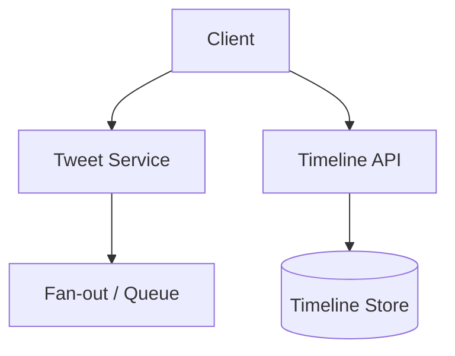
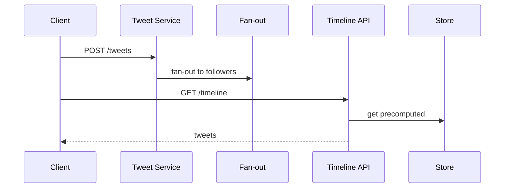

# High-Level Design: How Twitter Timeline Works

## 1. Overview

Home timeline: a ranked, real-time(ish) feed of tweets from accounts the user follows, with optional ads and “in case you missed it,” at massive scale.

---

## System Design Process
- **Step 1: Clarify Requirements** — See §2 below (tweets, timeline, fan-out, engagement).
- **Step 2: High-Level Design** — Tweet service, timeline service (push/pull/hybrid), follow graph; see §4–§6 below.
- **Step 3: Detailed Design** — Tweet store, timeline store; see LLD for full API list.
- **Step 4: Scale & Optimize** — Fan-out, caching, sharding: see Scaling below.

#### High-Level Architecture

**Mermaid:**



#### Flow Diagram — Post tweet and read timeline

**Mermaid:**



**API endpoints (required):** POST `/v1/tweets`, GET `/v1/timeline`, GET `/v1/tweets/:id`, POST `/v1/tweets/:id/like`. See LLD for full list.

---

## 2. Requirements

### Functional
- **Tweets:** 280-char posts; replies, retweets, likes; media; threads.
- **Timeline:** For logged-in user, show tweets from followed accounts, ordered by time or ranking.
- **Real-time:** New tweets from followed accounts appear in timeline (push or pull).
- **Engagement:** Like, retweet, reply; counts and state (liked by me).
- **Optional:** Ads insertion; “who to follow”; trends; search.
- **Optional:** Multiple timelines (home, list, profile).

### Non-Functional
- Low latency for timeline load (< 500 ms p99); high read QPS (millions).
- Write throughput: tweets, likes, retweets at scale.
- Consistency: eventually consistent timeline; read-your-writes for own tweet.

---

## 3. High-Level Architecture

```
┌─────────────┐                    ┌──────────────────┐
│   Client    │                    │  API Gateway     │
└──────┬──────┘                    └────────┬─────────┘
       │                                    │
       │     ┌──────────────────────────────┼──────────────────────────────┐
       │     │                              │                              │
       │     ▼                              ▼                              ▼
       │  ┌────────────┐            ┌────────────┐            ┌────────────┐
       │  │  Timeline  │            │  Tweet     │            │  Social     │
       │  │  Service   │            │  Service   │            │  Graph      │
       │  └─────┬──────┘            └─────┬──────┘            └─────┬──────┘
       │        │                          │                          │
       │        │                          │                          │
       │        ▼                          ▼                          ▼
       │  ┌────────────┐            ┌────────────┐            ┌────────────┐
       │  │  Timeline  │            │  Tweet     │            │  Follow    │
       │  │  Cache     │            │  Store     │            │  Graph     │
       │  │  (push or  │            │  (sharded  │            │  (who      │
       │  │   hybrid)  │            │   by       │            │   follows  │
       │  │            │            │   user_id) │            │   whom)    │
       │  └─────┬──────┘            └────────────┘            └────────────┘
       │        │
       │        │  Fan-out on write (push) or read-time merge (pull)
       │        ▼
       │  ┌────────────┐
       │  │  Fan-out   │
       │  │  Workers   │
       │  │  (on new   │
       │  │   tweet)   │
       │  └────────────┘
       └─────────────────────────────────────────────────────────────────────
```

---

## 4. Core Components

| Component | Responsibility |
|-----------|----------------|
| **Tweet Service** | Create tweet (user_id, text, reply_to?); persist in Tweet Store (shard by user_id or tweet_id); publish event for fan-out. |
| **Tweet Store** | Tweets by tweet_id; index by author_id and created_at for “user’s tweets”; sharded. |
| **Social Graph** | Follow relationship: follower_id, followee_id; “followees of user X” for timeline; “followers of user Y” for fan-out. |
| **Timeline Service** | For user X: return ordered list of tweet_ids (and optionally hydrated tweets). Read from Timeline Cache (push) or merge from Tweet Store (pull). |
| **Timeline Cache** | Per-user home timeline: sorted list/set of (tweet_id, timestamp or score); push = precomputed on each new tweet from followees; pull = not stored, computed on read. |
| **Fan-out Workers** | On new tweet from user Y: get followers of Y; for each follower Z, insert (tweet_id, ts) into Z’s timeline cache. For celebrities (many followers), optional: skip push or fan-out to subset; rest via pull. |
| **Ranking** | Optional: instead of pure time order, score = f(recency, likes, retweets, relevance); computed at fan-out or at read; store (tweet_id, score) in timeline. |

---

## 5. Push vs Pull vs Hybrid

### Push (fan-out on write)
- When user Y tweets: for each follower Z, add tweet to Z’s timeline cache (Redis sorted set or similar).
- **Read:** Timeline = read user’s cache (one read); very fast.
- **Write cost:** One tweet → N followers writes; celebrity with 50M followers = 50M writes (expensive). Mitigation: cap fan-out (e.g. only push to first 100K or to “active” followers); rest get tweets via pull or separate path.

### Pull (read-time merge)
- Timeline = get followees; fetch their recent tweets; merge sort by time; return.
- **Read cost:** High (many authors, many DB/cache reads); latency grows with followees.
- **Write cost:** Low (only write tweet once).

### Hybrid
- **Push** for “normal” users (followers below threshold).
- **Pull** for celebrities (or mix: push to sample, pull for rest).
- Or: push recent tweets to cache; for “in case you missed it” or older, pull from tweet store.

**Twitter’s approach (simplified):** Hybrid; precompute timeline for most users via fan-out; for very high-follower accounts, don’t fan-out to all; merge at read or use a separate “celebrity tweets” stream.

---

## 6. Data Flow (Post Tweet)

1. User posts tweet; Tweet Service validates; stores in Tweet Store (shard by user_id); returns tweet_id.
2. Publish event (author_id, tweet_id, ts) to message queue.
3. Fan-out worker: get followers of author_id (from Social Graph).
4. If follower count < threshold (e.g. 100K): for each follower, add (tweet_id, ts) to follower’s timeline cache (e.g. Redis ZADD timeline:user_id ts tweet_id; ZREMRANGEBYRANK to keep last 800).
5. If follower count >= threshold: skip push for this tweet for timeline; or push only to “active” followers; timeline service will merge from tweet store for this author when building timeline.
6. Optional: ranking service scores tweet and stores score in timeline instead of raw ts.

---

## 7. Data Flow (Read Timeline)

1. Client requests home timeline (limit=20, cursor?).
2. Timeline Service: read timeline cache for user (e.g. ZREVRANGE timeline:user_id 0 19 or with cursor).
3. If cache miss (new user) or cursor beyond cache: pull merge from followees’ recent tweets (or from tweet store by author_ids); optionally backfill cache.
4. Resolve tweet_ids to full tweets (batch from Tweet Store or cache); filter (e.g. muted, blocked); apply ranking if stored as score; return list and next_cursor.
5. Optional: inject ads or “who to follow” at fixed positions.

---

## 8. Data Model (Conceptual)

- **tweets:** tweet_id, user_id, text, created_at, reply_to_id, retweet_of_id, like_count, retweet_count (or separate counts table).
- **follows:** follower_id, followee_id.
- **timeline_cache:** user_id → sorted set (tweet_id, score/ts); keep last 800–3000 entries.
- **social_graph:** Shard by follower_id for “who I follow”; or by followee_id for “my followers” (for fan-out).

---

## 9. Ranking (Optional)

- **Score:** recency + engagement (likes, retweets) + personal relevance (embedding similarity).
- **When:** At fan-out (store score in timeline) or at read (compute when building timeline).
- **Model:** Lightweight model (e.g. logistic regression or small neural net) with features: age, like_count, retweet_count, follow relationship strength; output score; sort timeline by score.

---

## 10. Scaling

- **Tweet store:** Shard by user_id or tweet_id; read replicas; cache hot tweets by tweet_id.
- **Timeline cache:** Redis Cluster; key per user; trim to last N tweets; TTL optional.
- **Fan-out:** Async workers; batch inserts (pipeline to Redis); skip or limit for celebrities.
- **Social graph:** Shard by follower_id; cache “followees” list per user; “followers” for fan-out from DB or dedicated store (e.g. Cassandra for followers list).

---

## 11. Interview Steps

1. **Clarify:** Ranking vs chronological; real-time requirement; ads; scale (tweets/s, followers).
2. **Estimate:** Fan-out writes per tweet (avg and max); timeline reads/s; cache size per user.
3. **Draw:** Tweet Service → Store + Queue; Fan-out → Timeline Cache; Timeline Service → Cache + Tweet Store; Social Graph.
4. **Detail:** Push vs pull; celebrity handling (cap fan-out); cursor and cache trim.
5. **Scale:** Redis for timeline; sharding; ranking pipeline.

---

## Interview-Readiness Enhancements

### Capacity & SLO framing
- Define read/write QPS separately and estimate peak vs average traffic.
- Add latency budgets (p95/p99) per critical hop and target availability.
- State durability target and expected data growth/day.

### Critical path clarity
- Document write path (authoritative commit first, async side-effects second).
- Document read path (cache/read model first, fallback to source of truth).
- Identify likely hotspots (hot keys, hot partitions, fanout spikes).

### Failure handling
- Define retry strategy (bounded retries, backoff, jitter).
- Add circuit breakers and bulkheads for unstable dependencies.
- Cover queue failures (DLQ, replay) and datastore failover behavior.

### Security, operations, and cost
- Baseline security: AuthN/AuthZ, encryption in transit/at rest, secrets rotation.
- Observability: golden signals, SLO alerts, tracing, runbooks, canary/rollback.
- DR/cost: explicit RTO/RPO and top cost drivers with optimization levers.

### Trade-off table (mandatory)
- Include at least two realistic alternatives with decision rationale for this system.

