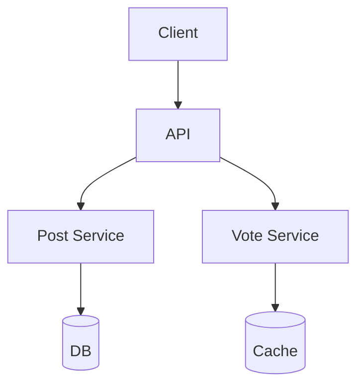
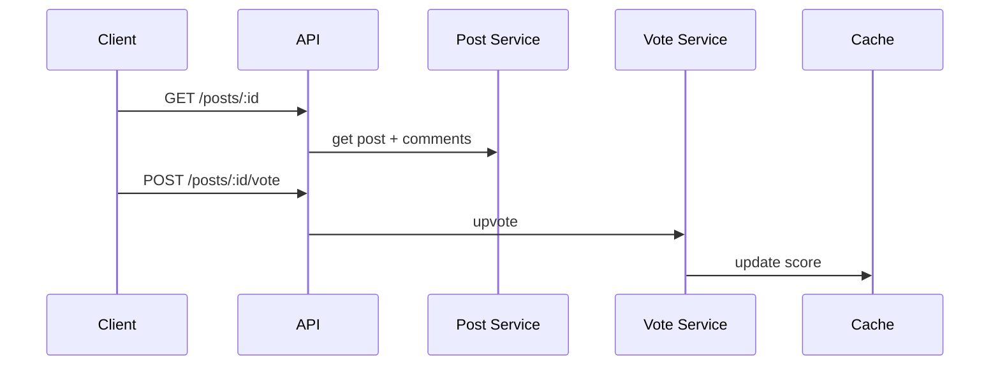

# High-Level Design: How Reddit Works

## 1. Overview

Community-driven content platform: subreddits, posts, comments (nested threads), voting (upvote/downvote), sorting (hot, new, top), and moderation at scale.

---

## System Design Process
- **Step 1: Clarify Requirements** — See §2 below (subreddits, posts, comments, voting, sort).
- **Step 2: High-Level Design** — Post service, comment tree, vote aggregation; see §4–§6 below.
- **Step 3: Detailed Design** — DB and cache for posts/comments/scores; see LLD for full API list.
- **Step 4: Scale & Optimize** — Sharding, caching, ranking: see Scaling below.

#### High-Level Architecture

**Mermaid:**



#### Flow Diagram — View post and vote

**Mermaid:**



**API endpoints (required):** GET/POST `/v1/subreddits/:id/posts`, GET/POST `/v1/posts/:id/comments`, POST `/v1/posts/:id/vote`. See LLD for full list.

---

## 2. Requirements

### Functional
- **Subreddits:** Communities; subscribe/unsubscribe; list posts in subreddit with sort (hot, new, top, rising).
- **Posts:** Title, body, link, or media; belong to one subreddit; author; timestamp.
- **Comments:** Nested (tree); reply to post or comment; score (upvotes - downvotes); sort (best, top, new, controversial).
- **Voting:** Upvote/downvote post or comment; one vote per user per item; score and rank.
- **Moderation:** Mods can remove, sticky, lock; rules and automod.
- **Feed:** Home feed = posts from subscribed subreddits, sorted (hot/new/top).
- **Search:** Posts and subreddits by keyword.

### Non-Functional
- Scale: millions of subreddits, billions of posts/comments; very high read (feed, comments) and write (votes).
- **Score consistency:** Vote count and score eventually consistent; no double-vote.
- **Comment tree:** Efficient load and pagination (e.g. load top-level, then “load more” for a thread).
- **Sorting:** Hot/top require precomputation or efficient query (score + time decay).

---

## 3. High-Level Architecture

```
┌─────────────┐                    ┌──────────────────┐
│   Client    │                    │  API Gateway     │
└──────┬──────┘                    └────────┬─────────┘
       │                                    │
       │     ┌──────────────────────────────┼──────────────────────────────┐
       │     │                              │                              │
       │     ▼                              ▼                              ▼
       │  ┌────────────┐            ┌────────────┐            ┌────────────┐
       │  │  Feed      │            │  Post      │            │  Comment   │
       │  │  Service   │            │  Service   │            │  Service   │
       │  └─────┬──────┘            └─────┬──────┘            └─────┬──────┘
       │        │                          │                          │
       │        ▼                          ▼                          ▼
       │  ┌────────────┐            ┌────────────┐            ┌────────────┐
       │  │  Feed      │            │  Posts    │            │  Comments  │
       │  │  Cache     │            │  Store    │            │  Store     │
       │  │  (subreddit│            │  (shard   │            │  (tree by  │
       │  │   + sort)  │            │   by      │            │   post_id, │
       │  │            │            │   sub_id) │            │   parent)  │
       │  └────────────┘            └─────┬──────┘            └─────┬──────┘
       │        │                          │                          │
       │        │                          │                          │
       │        │                    ┌─────▼─────┐                    │
       │        │                    │  Vote     │                    │
       │        │                    │  Service  │                    │
       │        │                    │  (score   │                    │
       │        │                    │   per     │                    │
       │        │                    │   item)   │                    │
       │        │                    └─────┬─────┘                    │
       │        │                          │                          │
       │        │                          ▼                          │
       │        │                    ┌────────────┐                  │
       │        │                    │  Votes      │                  │
       │        │                    │  (Redis or  │                  │
       │        │                    │   DB)       │                  │
       │        │                    └────────────┘                  │
       │        └────────────────────────────────────────────────────┘
       └─────────────────────────────────────────────────────────────────────
```

---

## 4. Core Components

| Component | Responsibility |
|-----------|----------------|
| **Post Service** | Create/edit post (subreddit_id, title, body/link); list posts in subreddit with sort (hot, new, top); store in Posts Store. |
| **Comment Service** | Add comment (post_id, parent_comment_id, body); list comments for post (tree or flat with parent_id); sort by best/top/new; store in Comments Store. |
| **Vote Service** | Record vote (user_id, item_id, direction: +1/-1); update score (post or comment); prevent double-vote; high write volume. |
| **Feed Service** | Home feed = merge posts from subscribed subreddits; sort by hot/new/top; use Feed Cache (per user or per subreddit+sort). |
| **Posts Store** | Posts by post_id; index (subreddit_id, created_at) and (subreddit_id, score) for listing; shard by subreddit_id. |
| **Comments Store** | Comments by comment_id; parent_id for tree; index (post_id, parent_id, score or created_at) for thread load; shard by post_id. |
| **Vote Store** | (user_id, item_id) → +1/-1; item_id = post_id or comment_id; score = sum of votes per item (cached and periodically synced to DB). |
| **Subreddit Service** | CRUD subreddits; subscribe(user_id, subreddit_id); list subscribed subreddits for user. |

---

## 5. Sorting: Hot, New, Top

- **New:** Order by created_at DESC; index (subreddit_id, created_at).
- **Top:** Order by score DESC; index (subreddit_id, score DESC); score updated on vote.
- **Hot:** Formula combining score and time (e.g. reddit hot: log(score) + age_in_seconds/45000); can be computed at write (periodic job) and stored, or computed at read with index (subreddit_id, hot_score). Precompute hot_score periodically (e.g. every minute) for recent posts.
- **Rising:** Posts with recent vote velocity; similar to hot with different decay.

---

## 6. Comment Tree

- **Storage:** Each comment has comment_id, post_id, parent_id (null for top-level), author_id, body, score, created_at.
- **Load:** Option A: fetch all comments for post_id, build tree in app; Option B: fetch top-level only (parent_id IS NULL) sorted by best/top; “load more” for a thread = fetch where parent_id = X.
- **Best/top:** Pre-sort children by score or best algorithm (e.g. Wilson score); store order or compute at read.
- **Depth limit:** Optional max depth (e.g. 10); deeper comments collapsed by default or “continue thread.”

---

## 7. Voting and Score

- **Vote:** (user_id, item_id) → +1 or -1; upsert; idempotent (same vote again = no change; change vote = update).
- **Score:** score = SUM(direction) for item; update on every vote (Redis INCR/DECR or DB update); or batch: store votes in DB and periodically aggregate score.
- **Scale:** Votes are huge; store votes in DB (user_id, item_id, direction) with unique constraint; score in Redis or denormalized in post/comment row; update score on vote (async or sync); read score from cache/row.
- **Anti-cheat:** Rate limit votes per user; detect bot patterns.

---

## 8. Data Flow (Home Feed)

1. User opens home; Feed Service gets subscribed subreddits for user.
2. For each subscribed subreddit (or from cache): get post list for sort=hot (or new/top) with limit per subreddit.
3. Merge lists (by hot_score or created_at); take top N; return post_ids.
4. Hydrate posts (title, author, subreddit, score, comment_count) from Post Store; return to client.
5. Cache: cache per (subreddit_id, sort) = list of post_ids; or per user feed (subscribed subreddits merged) with short TTL.

---

## 9. Data Model (Conceptual)

- **subreddits:** subreddit_id, name, description, created_at.
- **subscriptions:** user_id, subreddit_id.
- **posts:** post_id, subreddit_id, author_id, title, body/link, score, hot_score, created_at.
- **comments:** comment_id, post_id, parent_id, author_id, body, score, created_at.
- **votes:** user_id, item_id (post or comment), direction (+1/-1); unique (user_id, item_id).
- **scores:** Denormalized in posts and comments (score column); or separate table keyed by item_id; or Redis.

---

## 10. Scaling

- **Posts:** Shard by subreddit_id; index (subreddit_id, created_at) and (subreddit_id, score); hot_score updated by cron or on vote.
- **Comments:** Shard by post_id; index (post_id, parent_id, score); tree load = query by post_id and parent_id.
- **Votes:** High write; store in DB with unique (user_id, item_id); score in Redis (key = item_id) and sync to DB periodically; or use Cassandra for votes.
- **Feed:** Cache merged feed per user (TTL 1–5 min) or merge from subreddit caches; subreddit cache = (subreddit_id, sort) → list of post_ids.

---

## 11. Interview Steps

1. **Clarify:** Nested depth; hot formula; moderation; search.
2. **Estimate:** Posts/s, comments/s, votes/s; storage per post and comment.
3. **Draw:** Post, Comment, Vote, Feed services; Stores (posts, comments, votes); Feed Cache.
4. **Detail:** Comment tree (parent_id, load top-level then “load more”); vote → score update; hot/top/new indexes.
5. **Scale:** Sharding by subreddit and post_id; score in Redis; feed cache.

---

## Interview-Readiness Enhancements

### Capacity & SLO framing
- Define read/write QPS separately and estimate peak vs average traffic.
- Add latency budgets (p95/p99) per critical hop and target availability.
- State durability target and expected data growth/day.

### Critical path clarity
- Document write path (authoritative commit first, async side-effects second).
- Document read path (cache/read model first, fallback to source of truth).
- Identify likely hotspots (hot keys, hot partitions, fanout spikes).

### Failure handling
- Define retry strategy (bounded retries, backoff, jitter).
- Add circuit breakers and bulkheads for unstable dependencies.
- Cover queue failures (DLQ, replay) and datastore failover behavior.

### Security, operations, and cost
- Baseline security: AuthN/AuthZ, encryption in transit/at rest, secrets rotation.
- Observability: golden signals, SLO alerts, tracing, runbooks, canary/rollback.
- DR/cost: explicit RTO/RPO and top cost drivers with optimization levers.

### Trade-off table (mandatory)
- Include at least two realistic alternatives with decision rationale for this system.

