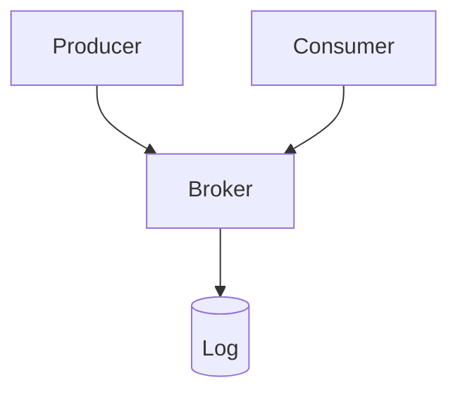
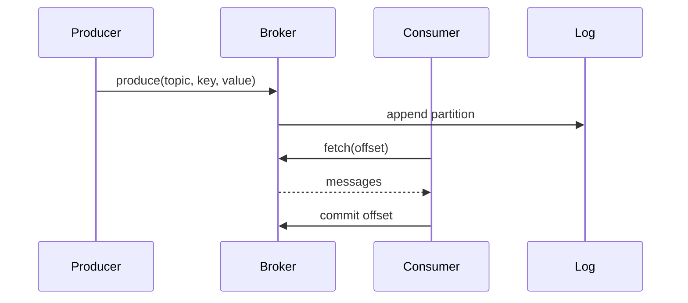

# High-Level Design: How Apache Kafka Works

## 1. Overview

Kafka is a distributed event streaming platform: publish-subscribe messaging with persistence, partitioning, replication, and ordering guarantees—used for event sourcing, log aggregation, and stream processing.

---

## System Design Process
- **Step 1: Clarify Requirements** — See §2 below (produce, consume, topics, retention).
- **Step 2: High-Level Design** — Brokers, partitions, replicas; see §4–§6 below.
- **Step 3: Detailed Design** — Protocol (produce/fetch); see LLD for full API list.
- **Step 4: Scale & Optimize** — Partitioning, replication, retention: see Scaling below.

#### High-Level Architecture

**Mermaid:**



#### Flow Diagram — Produce and consume

**Mermaid:**



**API endpoints (required):** Produce API, Fetch API, Admin API (create topic, etc.). See LLD for full list.

---

## 2. Requirements

### Functional
- **Produce:** Send messages to a topic (key optional); at-least-once, at-most-once, or exactly-once semantics.
- **Consume:** Read messages from a topic (or topic partition) from a position (offset); consumer groups for parallel consumption and commit offset.
- **Topics:** Named streams; each topic split into partitions; order per partition.
- **Retention:** Keep messages for configurable time or size; compacted topics (key-based retention).
- **Admin:** Create topic, alter partitions, list topics and consumer groups.

### Non-Functional
- **Throughput:** Millions of messages per second; linear scale with brokers and partitions.
- **Durability:** Replicated across brokers; committed when written to replica; survive broker failure.
- **Latency:** Sub-second produce and consume for typical configs.
- **Ordering:** Per-partition order; no global order across partitions.

---

## 3. High-Level Architecture

```
┌─────────────┐     Produce      ┌──────────────────┐
│  Producers  │─────────────────►│  Broker 1        │
└─────────────┘                  │  (leader for     │
       │                         │   P0, P3)        │
       │                         └────────┬────────┘
       │                                  │
       │                         ┌────────┴────────┐
       │                         │  Replication     │
       │                         │  (ISR)           │
       │                         └────────┬────────┘
       │                                  │
       │     ┌────────────────────────────┼────────────────────────────┐
       │     │                            │                            │
       │     ▼                            ▼                            ▼
       │  ┌────────────┐            ┌────────────┐            ┌────────────┐
       │  │  Broker 2  │            │  Broker 3  │            │  ZooKeeper │
       │  │  (leader   │            │  (leader   │            │  / KRaft   │
       │  │   P1)      │            │   P2)      │            │  (metadata)│
       │  └────────────┘            └────────────┘            └────────────┘
       │
       │  ┌─────────────┐     Consume
       │  │  Consumers  │◄─────────────────────────────────────────────────
       │  │  (group)    │     Fetch from partition leaders
       │  └─────────────┘
       └─────────────────────────────────────────────────────────────────────
```

---

## 4. Core Components

| Component | Responsibility |
|-----------|----------------|
| **Broker** | Store partitions (log segments on disk); serve produce and fetch; replicate to followers; leader election per partition. |
| **Topic** | Logical stream; divided into **partitions** (ordered, immutable log per partition). |
| **Partition** | Ordered sequence of messages; each message has offset (monotonic); stored as segment files; replicated to N replicas. |
| **Producer** | Send to topic (optional key); key hashes to partition (or specify partition); acks=0/1/all for durability. |
| **Consumer** | Subscribe to topic(s); read from assigned partitions; commit offset (per group) for resume. |
| **Consumer Group** | Set of consumers; each partition assigned to one consumer in group; rebalance when members join/leave. |
| **Controller** | One broker (or KRaft node) elected as controller; manages partition assignment, leader election, metadata. |
| **ZooKeeper / KRaft** | Store cluster metadata (brokers, topics, partition assignment); used by controller. |

---

## 5. Partitioning and Ordering

- **Partition key:** Producer sends (key, value). partition = hash(key) % num_partitions (or custom partitioner). Same key → same partition → order preserved for that key.
- **No key:** Round-robin or sticky partition (batch by partition for efficiency).
- **Order:** Only within a partition; not across partitions. To get global order for a key, use single partition (or accept per-key order only).

---

## 6. Replication and Durability

- **Replica set:** Each partition has N replicas (replication factor); one **leader**, rest **followers** (in-sync replicas, ISR).
- **Produce:** Client sends to leader; leader appends to log; replicates to followers (in parallel); when acks=all, leader responds only after all ISR replicas have written; then producer gets ack.
- **Failure:** If leader fails, controller elects new leader from ISR; producers and consumers get new metadata and retry to new leader.
- **ISR:** Follower is in ISR if it’s caught up within replica.lag.time.max.ms; out-of-sync replicas not chosen as leader (to avoid data loss).

---

## 7. Consumer Group and Offset

- **Group:** Consumer subscribes with group_id. Each partition is assigned to exactly one consumer in the group.
- **Offset:** For each (group_id, topic, partition), Kafka stores **committed offset** (last offset the group has consumed). Consumer fetches from offset; processes; commits offset (sync or async).
- **Rebalance:** When consumer joins/leaves, coordinator (a broker) triggers rebalance: reassign partitions to members; consumers may get new partitions and resume from committed offset.
- **Delivery:** At-least-once if commit after process (crash before commit → redeliver); at-most-once if commit before process; exactly-once with transactional producer and read_committed consumer.

---

## 8. Log Storage (Partition)

- **Segment:** Partition log is split into segment files (e.g. 1 GB each). Segment = .log (messages) + .index (offset → position) + .timeindex.
- **Retention:** Delete segments older than retention.ms or when total size > retention.bytes. Or **compaction:** keep latest value per key (for compacted topics).
- **Read:** Consumer requests (topic, partition, offset); broker finds segment; reads from offset; returns batch.

---

## 9. Data Flow (Produce)

1. Producer gets metadata (topic → partition → leader broker) from any broker.
2. Producer sends produce request to leader of each partition (batch by partition); message = (key, value, timestamp, headers).
3. Leader appends to log; replicates to followers (in ISR).
4. When acks met (e.g. all ISR): leader responds to producer with partition, offset; producer may retry on failure.
5. Producer can use callback or future for async; optionally wait for flush.

---

## 10. Data Flow (Consume)

1. Consumer (with group_id) sends join group; coordinator assigns partitions to consumer.
2. Consumer fetches from leader of each assigned partition from last committed offset (or earliest/latest per config).
3. Broker returns batch of messages (offset, key, value, timestamp).
4. Consumer processes; commits offset (to __consumer_offsets topic or internal store); repeat fetch.
5. On rebalance: consumer may lose/gain partitions; resume from committed offset for new partitions.

---

## 11. Scaling

- **Throughput:** More partitions → more parallelism (one consumer per partition per group); more brokers to host partitions and replicas.
- **Storage:** Each broker holds replica of some partitions; add brokers and rebalance partitions to scale storage.
- **Producers:** Batching and compression (snappy, lz4) reduce network and increase throughput.
- **Consumers:** Scale by adding consumers in same group (up to number of partitions); or multiple groups for different use cases (e.g. search indexer vs analytics).

---

## 12. Trade-offs

| Decision | Choice | Rationale |
|----------|--------|-----------|
| Ordering | Per partition | Global order would limit parallelism; per-key order is enough for many use cases |
| Retention | Time + size | Balance storage cost and replay capability |
| Acks | all (ISR) | Durability; 1 or 0 for lower latency, higher risk |
| Exactly-once | Transactions | Producer idempotence + transactional commit + read_committed |
| Metadata | ZooKeeper vs KRaft | KRaft removes ZooKeeper dependency; same logical role |

---

## 13. Interview Steps

1. **Clarify:** Use case (event log, queue, stream processing); ordering and durability needs.
2. **Estimate:** Messages/s; retention; storage; number of consumers.
3. **Draw:** Producers → Brokers (partitions, replicas); Consumers (groups) → Brokers; Controller + ZooKeeper/KRaft.
4. **Detail:** Partition key and assignment; replication and ISR; consumer group and offset commit; rebalance.
5. **Scale:** Partitions and parallelism; batching and compression; retention and compaction.
