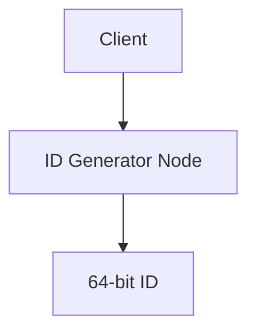
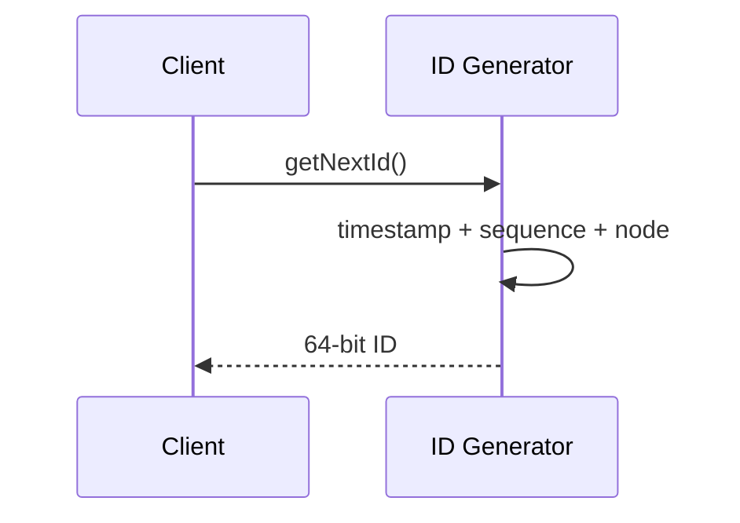

# High-Level Design: Distributed ID Generator (Snowflake-style)

## 1. Overview

Generate **globally unique, roughly time-ordered IDs** across many nodes without a single bottleneck. Used for primary keys, event IDs, and trace IDs at scale (e.g. Twitter Snowflake).

---

## System Design Process
- **Step 1: Clarify Requirements** — See §2 below (unique, ordered, no single master, high throughput).
- **Step 2: High-Level Design** — ID generator nodes, bit layout; see §4–§6 below.
- **Step 3: Detailed Design** — Snowflake bit layout; API: see LLD for full list.
- **Step 4: Scale & Optimize** — No central bottleneck; scale by adding nodes. See Scaling below.

#### High-Level Architecture

**Mermaid:**



#### Flow Diagram — Generate ID

**Mermaid:**



**API endpoints (required):** GET `/v1/id` or `generateId()` (returns next ID). See LLD for full list.

---

## 2. Requirements

### Functional
- Generate IDs that are **unique** across all nodes and time.
- **Ordering:** IDs roughly increase over time (sortable by creation time).
- **No coordination:** No single master; minimal cross-node communication for ID generation.
- **High throughput:** Millions of IDs per second per cluster.

### Non-Functional
- Low latency (< 1 ms per ID); 64-bit (or configurable bit width) for storage efficiency.
- Tolerate clock skew within bounds; optional durability (no requirement to persist IDs).

---

## 3. Capacity Estimation

- **IDs/s:** 1M per second cluster-wide.
- **Bits:** 64 bits → 2^64 unique IDs; at 1M/s, ~584k years before wrap (with time component).
- **Nodes:** 1K nodes; each generates up to ~1K IDs/s (or more with batching).

---

## 4. High-Level Architecture

```
┌─────────────┐     ┌─────────────┐                    ┌──────────────────┐
│  Node 1     │     │  Node 2     │     ...             │  Node N          │
│  ID Gen     │     │  ID Gen     │                    │  ID Gen          │
│  (local     │     │  (local     │                    │  (local          │
│   bits +    │     │   bits +    │                    │   bits +         │
│   time +    │     │   time +    │                    │   time +         │
│   seq)      │     │   seq)      │                    │   seq)           │
└──────┬──────┘     └──────┬──────┘                    └──────┬───────────┘
       │                    │                                  │
       │  No shared state   │   Optional: epoch / node_id      │
       │  (or only at       │   from config service at startup │
       │   startup)         │                                  │
       └────────────────────┴──────────────────────────────────┘
```

---

## 5. Bit Layout (64-bit Snowflake)

| Bits   | Purpose        | Example / Range |
|--------|----------------|------------------|
| 1      | Sign (0)       | Always 0 for positive |
| 41     | Timestamp (ms) | Epoch-relative; ~69 years |
| 10     | Node ID        | 0–1023 nodes     |
| 12     | Sequence       | 0–4095 per ms per node |

- **Total:** 1 + 41 + 10 + 12 = 64.
- **Ordering:** Same node: time then sequence; across nodes: time dominates (if clocks synced), then node_id, then sequence.
- **Uniqueness:** Same (timestamp_ms, node_id, sequence) never repeated: sequence resets each ms; if more than 4096 IDs in same ms on one node, wait for next ms or expand bits.

---

## 6. Core Components

| Component | Responsibility |
|-----------|----------------|
| **ID Generator (per node)** | Get current time (ms); ensure monotonic; increment sequence within same ms; pack bits (timestamp, node_id, sequence); return ID. |
| **Node ID assignment** | At startup: get unique node_id (0 to 2^node_bits - 1) from config, ZooKeeper, or IP/port hash; must be unique and stable for process lifetime. |
| **Clock** | Use system clock; NTP-sync to avoid going backward; handle clock skew (refuse to generate if time went backward, or wait). |
| **Sequence** | Counter per (node, ms); reset to 0 each new ms; max 4096 (12 bits) per ms per node. |

---

## 7. Algorithm (Single Node)

1. **Current time:** now_ms = current_epoch_ms().
2. **Clock rollback:** If now_ms < last_ms, wait or return error (or use logical clock).
3. **New millisecond:** If now_ms > last_ms, set sequence = 0, last_ms = now_ms.
4. **Sequence:** sequence++; if sequence >= 4096, spin-wait until next ms, then sequence = 0.
5. **Pack:** id = (now_ms - epoch) << (10+12) | node_id << 12 | sequence.
6. Return id.

---

## 8. Epoch and Time Range

- **Epoch:** Custom start time (e.g. 2020-01-01 00:00:00 UTC) so that (current_ms - epoch_ms) fits in 41 bits (~69 years).
- **Wrap:** After 69 years, epoch can be moved or bits extended; application may need migration.

---

## 9. Node ID Assignment

- **Static config:** node_id in env or config file; manual assignment (small clusters).
- **Coordinator:** ZooKeeper/etcd: create ephemeral node or get from pool; node_id 0..1023; release on shutdown.
- **Hash:** Hash(IP + port + pod_id) % 1024; risk of collision; use large space and retry or use coordinator.
- **AWS/cloud:** Use instance id or placement group id mapped to node_id range.

---

## 10. Handling Clock Skew

- **Never go backward:** If current_ms < last_ms (e.g. NTP correction), option A: block until time catches up; option B: use last_ms + 1 (may break ordering guarantee slightly); option C: add a “clock backward” counter and include in ID (complex).
- **Sync:** Run NTP; reject or alert if skew > threshold (e.g. 10 ms) vs other nodes.

---

## 11. Scaling

- **Throughput per node:** 4096 IDs/ms = ~4M/s per node (theoretical); in practice limited by clock granularity and lock-free sequence.
- **Cluster:** Linear scale with number of nodes (each has unique node_id).
- **No shared state** on hot path; optional coordination only at startup for node_id.

---

## 12. Trade-offs

| Decision | Choice | Rationale |
|----------|--------|-----------|
| Bits | 64 | Fits in long; sortable; enough for decades with 41-bit time |
| Node ID | 10 bits | 1024 nodes; increase if needed (reduce sequence or time bits) |
| Sequence | 12 bits | 4096/ms/node; wait for next ms if exceeded |
| Coordination | Only for node_id | Avoid single point of failure; node_id once at startup |

---

## 13. Interview Steps

1. **Clarify:** Ordering (strict vs rough); 64-bit vs 128-bit; durability.
2. **Estimate:** IDs/s; number of nodes; lifetime (years).
3. **Draw:** Per-node generator with (timestamp, node_id, sequence); no central server on hot path.
4. **Detail:** Bit layout; algorithm (time, sequence, pack); clock rollback handling.
5. **Scale:** More nodes = more IDs; sequence limit per ms; node_id assignment (config vs coordinator).
