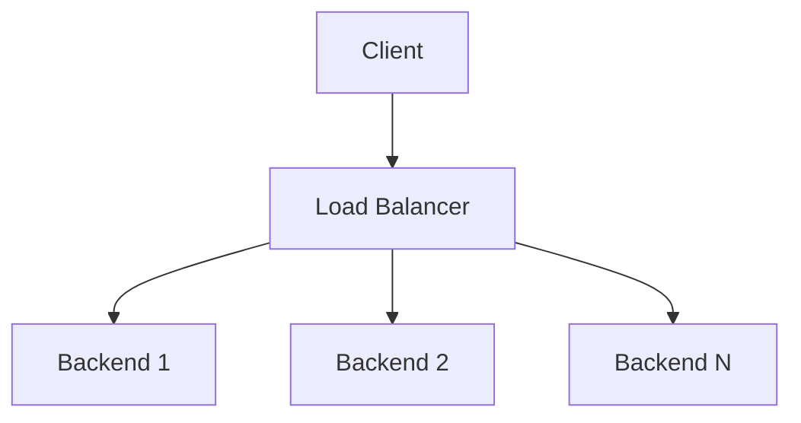
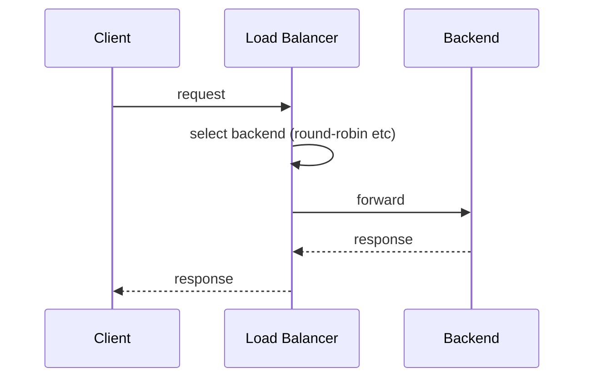

# High-Level Design: Load Balancer

## 1. Overview

Distribute incoming traffic across multiple backend servers to improve **availability**, **throughput**, and **latency**. Covers Layer 4 (TCP/UDP) and Layer 7 (HTTP) load balancing, health checks, and session affinity.

---

## System Design Process
- **Step 1: Clarify Requirements** — See §2 below (throughput, affinity, health checks).
- **Step 2: High-Level Design** — LB layer, backend pool; see §3–§6 below.
- **Step 3: Detailed Design** — L4 vs L7; backend APIs are application-specific. See LLD for config/APIs.
- **Step 4: Scale & Optimize** — Active-active LB; backend scaling; see §8–§10 below.

#### High-Level Architecture

**Mermaid:**



#### Flow Diagram — Request through LB

**Mermaid:**



**API endpoints:** N/A (LB is infrastructure). Backends expose application APIs; see LLD for admin/config.

---

## 2. Requirements

### Functional
- **Forward** requests to one of N backend servers (pools).
- **Health checks:** Mark backends up/down; stop sending traffic to unhealthy nodes.
- **Multiple pools:** Different backends for different paths or domains (e.g. /api → app servers, /static → CDN or static servers).
- **Session affinity (optional):** Same client → same backend (sticky session) for stateful apps.
- **TLS termination (L7):** Decrypt at LB; optional client cert validation.

### Non-Functional
- **Availability:** LB itself must be highly available (active-passive or active-active).
- **Latency:** Minimal added latency (connection setup, routing).
- **Scale:** Handle millions of connections or requests per second (horizontal scaling of LB layer).
- **Observability:** Logs, metrics (request count, latency, errors per backend).

---

## 3. High-Level Architecture

```
                    ┌─────────────────────────────────────────┐
                    │           Clients (users, apps)         │
                    └────────────────────┬────────────────────┘
                                         │
                    ┌────────────────────▼────────────────────┐
                    │  DNS (optional: resolve to LB VIP)       │
                    └────────────────────┬────────────────────┘
                                         │
                    ┌────────────────────▼────────────────────┐
                    │  Load Balancer (L4 or L7)                 │
                    │  - Health checks                         │
                    │  - Forwarding (round-robin, least conn)  │
                    │  - Optional: TLS, sticky, path routing   │
                    └────────────────────┬────────────────────┘
                                         │
        ┌────────────────────────────────┼────────────────────────────────┐
        │                                │                                │
        ▼                                ▼                                ▼
┌───────────────┐                ┌───────────────┐                ┌───────────────┐
│  Backend 1    │                │  Backend 2    │                │  Backend N    │
└───────────────┘                └───────────────┘                └───────────────┘
```

---

## 4. Layer 4 vs Layer 7

| Aspect | Layer 4 (L4) | Layer 7 (L7) |
|--------|--------------|--------------|
| **Works on** | IP + port (TCP/UDP) | HTTP: method, path, headers, body |
| **Routing** | By IP:port only | By host, path, header; content-aware |
| **TLS** | Pass-through (client→backend TLS) or terminate at LB | Terminate at LB common; backend plain HTTP |
| **Sticky** | By client IP (or source IP + port) | By cookie or header (e.g. session id) |
| **Use case** | High throughput, minimal logic; DB, custom TCP | Web/API; path-based routing; redirect, rewrite |
| **Examples** | AWS NLB, HAProxy (mode tcp) | AWS ALB, NGINX, HAProxy (mode http) |

---

## 5. Core Components

| Component | Responsibility |
|-----------|----------------|
| **Listener** | Bind to VIP:port; accept connections; optional TLS termination. |
| **Target Group / Pool** | Set of backends (IP:port or instance id); health check config. |
| **Health Check** | Periodically probe backend (TCP connect, HTTP GET, or custom); mark healthy/unhealthy; remove from pool if unhealthy for N consecutive failures. |
| **Scheduler / Algorithm** | Choose backend for each request: round-robin, least connections, weighted, random, IP hash. |
| **Session Affinity** | Sticky table: client key (IP, cookie) → backend; TTL; insert on first request; reuse for same client. |
| **Path / Host Routing (L7)** | Rule: if host=api.example.com or path=/api/* → pool A; else → pool B. |

---

## 6. Load Balancing Algorithms

- **Round-robin:** Rotate through list; fair but ignores load. **Weighted round-robin:** More requests to higher-capacity backends.
- **Least connections:** Forward to backend with fewest active connections; good for long-lived or variable request time.
- **Least response time:** Forward to backend with lowest latency (needs active probing or feedback).
- **Random:** Simple; with weights. **IP hash:** client_ip % N → same backend (sticky by IP without cookie).
- **Consistent hash:** Minimize reassignment when backends are added/removed; optional for cache affinity.

---

## 7. Health Check

- **TCP:** Connect to port; success = healthy. **HTTP:** GET /health; 2xx = healthy.
- **Interval:** e.g. every 10s; **Timeout:** 5s; **Unhealthy threshold:** 3 failures → mark down; **Healthy threshold:** 2 successes → mark up (avoid flapping).
- **Graceful shutdown:** On backend drain, LB stops new connections and waits for existing to finish (deregistration delay).

---

## 8. High Availability of LB

- **Active-Passive:** One active LB, one standby; failover via VIP failover (VRRP/keepalived) or DNS flip.
- **Active-Active:** Multiple LB nodes behind DNS (round-robin or geo); or single VIP with ECMP (equal-cost multi-path) so traffic spreads across LBs; each LB has full backend list and health state (or shared state).
- **State:** Sticky session state must be replicated or shared (e.g. Redis) if multiple LB nodes and sticky required.

---

## 9. Data Flow (L7 Request)

1. Client connects to LB (VIP:443); TLS handshake (LB terminates).
2. LB receives HTTP request (host, path, headers).
3. Match routing rule → target group; run scheduler (round-robin, least conn) on healthy backends only; optionally check sticky (cookie) → same backend.
4. LB opens connection to chosen backend (or reuses); forwards request (same or modified headers, e.g. X-Forwarded-For); streams response back to client.
5. Log request/response (status, latency, backend); update metrics.

---

## 10. Scaling

- **LB layer:** Scale horizontally (more LB nodes); DNS or anycast to distribute client connections.
- **Backend:** Add/remove backends; LB health check and pool update; no change to client.
- **Connection limits:** Per-backend and global limits; queue or 503 when all busy.

---

## 11. Trade-offs

| Decision | Choice | Rationale |
|----------|--------|-----------|
| L4 vs L7 | L7 for HTTP/API | Path routing, TLS termination, cookie sticky |
| Sticky | Use when needed | Enables stateful backend; avoid if stateless |
| Health check | HTTP /health | More accurate than TCP for app readiness |
| HA | Active-active + DNS or ECMP | No single point of failure |

---

## 12. Interview Steps

1. **Clarify:** L4 vs L7; sticky; TLS; scale (RPS, connections).
2. **Draw:** Clients → LB (listeners, pools, health, scheduler) → backends.
3. **Detail:** Algorithm (least conn vs round-robin); health check config; sticky (cookie vs IP hash).
4. **HA:** Active-passive vs active-active; state for sticky.
5. **Scale:** Horizontal LB; backend pool growth; connection limits.
