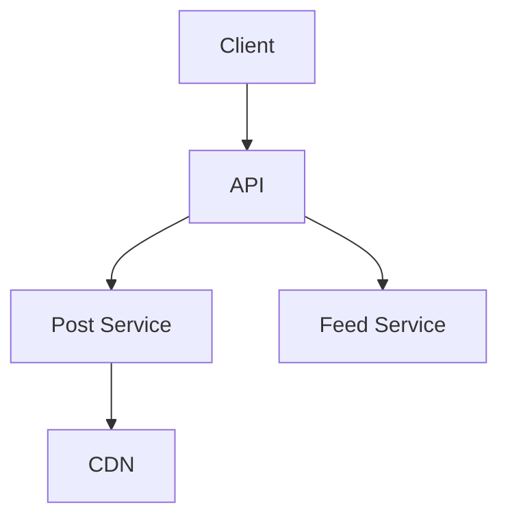
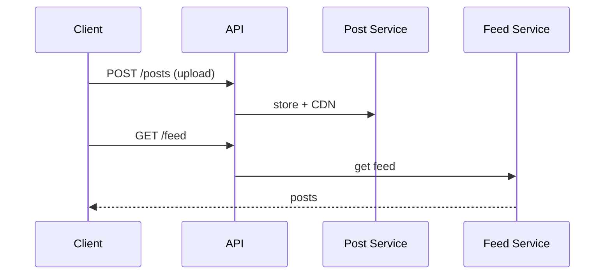

# High-Level Design: Design Instagram

## 1. Overview

Photo/video sharing app: feed (from followed accounts), stories (24h), explore (discovery), profiles, likes, comments, DMs, and notifications at massive scale.

---

## System Design Process
- **Step 1: Clarify Requirements** — See §2 below (posts, feed, stories, explore).
- **Step 2: High-Level Design** — Post, feed, media, story services; see §4–§6 below.
- **Step 3: Detailed Design** — DB and object store; see LLD for full API list.
- **Step 4: Scale & Optimize** — Sharding, CDN, caching: see Scaling below.

#### High-Level Architecture

**Mermaid:**



#### Flow Diagram — Post and load feed

**Mermaid:**



**API endpoints (required):** POST/GET `/v1/posts`, GET `/v1/feed`, GET `/v1/stories`, GET `/v1/explore`. See LLD for full list.

---

## 2. Requirements

### Functional
- **Posts:** Upload photo/video + caption; view feed (chronological or ranked) and profile.
- **Stories:** 24-hour ephemeral posts; view by followers; view count; disappear after 24h.
- **Explore:** Discover content (trending, by topic, personalized); infinite scroll.
- **Social:** Follow/unfollow; like, comment; DM (optional).
- **Notifications:** Push and in-app for likes, comments, new followers, story mentions.
- **Search:** Users and hashtags; optional places.

### Non-Functional
- **Upload:** Fast and reliable; support large media (photos + short video).
- **Feed latency:** Load in < 2 s; real-time or near-real-time for new posts.
- **Scale:** Billions of users; millions of uploads per day; very high read (feed, explore, stories).

---

## 3. High-Level Architecture

```
┌─────────────┐                    ┌──────────────────┐
│   Client    │                    │  API Gateway     │
└──────┬──────┘                    └────────┬─────────┘
       │                                    │
       │     ┌──────────────────────────────┼──────────────────────────────┐
       │     │                              │                              │
       │     ▼                              ▼                              ▼
       │  ┌────────────┐            ┌────────────┐            ┌────────────┐
       │  │  Feed      │            │  Post      │            │  Story      │
       │  │  Service   │            │  Service   │            │  Service   │
       │  └─────┬──────┘            └─────┬──────┘            └─────┬──────┘
       │        │                          │                          │
       │        ▼                          ▼                          ▼
       │  ┌────────────┐            ┌────────────┐            ┌────────────┐
       │  │  Feed      │            │  Media     │            │  Story      │
       │  │  Cache     │            │  Upload +  │            │  Store      │
       │  │  (push/    │            │  Object    │            │  (24h TTL)  │
       │  │   hybrid)  │            │  Store     │            │  + CDN      │
       │  └─────┬──────┘            └─────┬──────┘            └────────────┘
       │        │                          │
       │        │                    ┌─────┴─────┐
       │        │                    │  Metadata │
       │        │                    │  DB       │
       │        │                    │  (posts,  │
       │        │                    │   users,  │
       │        │                    │   follow) │
       │        │                    └───────────┘
       │        │
       │        ▼
       │  ┌────────────┐            ┌────────────┐
       │  │  Explore   │            │  Search    │
       │  │  (ranking  │            │  Index     │
       │  │   + recs)  │            │  (users,   │
       │  └────────────┘            │   hashtags)│
       │                            └────────────┘
       └─────────────────────────────────────────────────────────────────────
```

---

## 4. Core Components

| Component | Responsibility |
|-----------|----------------|
| **Post Service** | Create post (media refs, caption, user_id); store metadata in DB; trigger media upload; fan-out to followers’ feed cache (or hybrid). |
| **Media Service** | Accept upload (chunked); store in object store; generate thumbnails/variants; return CDN URLs. |
| **Feed Service** | Return home feed: read from feed cache (push) or merge from followees’ posts (pull/hybrid); rank (time or ML); paginate. |
| **Feed Cache** | Per-user sorted list of (post_id, timestamp or score); populated on new post from followees (fan-out); trim to last 500–1000. |
| **Story Service** | Create story (media, user_id); store with TTL 24h; list stories from followees (who has unviewed); view count; expire after 24h. |
| **Explore Service** | Ranked discovery: trending, by topic, personalized (embeddings, engagement); precomputed or real-time; cache hot explore. |
| **Social Graph** | Follow/unfollow; list followers/following; used for feed fan-out and “stories from followees.” |
| **Search** | Index users, hashtags, captions; full-text and autocomplete; filter by type. |
| **Notification** | On like, comment, follow, story mention; push and in-app; preferences. |

---

## 5. Feed (Push vs Pull)

- **Push (fan-out on write):** When user A posts, add post_id to feed cache of every follower. Read feed = read own cache → fast. Cost: celebrity with 100M followers = 100M writes; mitigate by cap (e.g. fan-out to first 500K or “active” followers) or skip push for very large accounts.
- **Pull:** Feed = get followees; fetch their recent posts; merge sort. No write amplification; read cost high.
- **Hybrid (Instagram-style):** Push for normal users; for celebrities don’t push to all; merge celebrity posts at read time with cached feed, or separate “celebrity feed” and merge in app.

---

## 6. Stories (24h)

- **Write:** Upload media → object store; metadata in DB or cache with created_at; TTL = 24h (delete job or store in Redis with TTL 24h).
- **Read:** For feed of stories: list followees who have story in last 24h; for each, get latest story(ies); return with CDN URLs; track “viewed” per user per story (for view count and “seen” state).
- **View count:** Increment on view (idempotent per user); store in DB or cache; display on story.

---

## 7. Explore

- **Inputs:** Trending (engagement velocity), topic/location, user embedding (from past likes/follows).
- **Pipeline:** Candidate generation (e.g. top 1K by engagement from last 24h, or by topic); ranking model (CTR, engagement prediction); filter (already seen, blocked); return top 50; cache per user or global trending.
- **Storage:** Precomputed explore feed per user (batch job) or real-time ranking service; media served via CDN.

---

## 8. Data Model (Conceptual)

- **users, follows:** user_id, profile; follower_id, followee_id.
- **posts:** post_id, user_id, caption, media_urls[], created_at; index (user_id, created_at); (post_id) for feed store.
- **stories:** story_id, user_id, media_url, created_at; TTL 24h; index by user_id and time.
- **feed_cache:** user_id → sorted set (post_id, timestamp); trim to 500–1000.
- **likes, comments:** post_id, user_id; counts denormalized on post.

---

## 9. Scaling

- **Media:** Object store + CDN; multiple resolutions; upload via presigned URL; async thumbnail generation.
- **Feed:** Redis (or similar) for feed cache; shard by user_id; fan-out workers with batching and celebrity cap.
- **Stories:** Short TTL; Redis or DB with TTL; CDN for media; view counts in cache then batch to DB.
- **Explore:** Batch ranking job + cache; or real-time ranking service with candidate store (e.g. trending post_ids).
- **Search:** Elasticsearch for users and hashtags; index captions for search; scale ES cluster.

---

## 10. Interview Steps

1. **Clarify:** Feed only vs stories vs explore; ranking; DMs; scale.
2. **Estimate:** DAU; posts/s; feed reads/s; storage for media and metadata.
3. **Draw:** Post, Feed, Story, Explore, Media; Feed Cache; Social Graph; Search.
4. **Detail:** Feed push vs pull and celebrity handling; story 24h TTL and view count; explore candidate + ranking.
5. **Scale:** Fan-out cap; CDN for media; Redis for feed and stories; batch explore.

---

## Interview-Readiness Enhancements

### Capacity & SLO framing
- Define read/write QPS separately and estimate peak vs average traffic.
- Add latency budgets (p95/p99) per critical hop and target availability.
- State durability target and expected data growth/day.

### Critical path clarity
- Document write path (authoritative commit first, async side-effects second).
- Document read path (cache/read model first, fallback to source of truth).
- Identify likely hotspots (hot keys, hot partitions, fanout spikes).

### Failure handling
- Define retry strategy (bounded retries, backoff, jitter).
- Add circuit breakers and bulkheads for unstable dependencies.
- Cover queue failures (DLQ, replay) and datastore failover behavior.

### Security, operations, and cost
- Baseline security: AuthN/AuthZ, encryption in transit/at rest, secrets rotation.
- Observability: golden signals, SLO alerts, tracing, runbooks, canary/rollback.
- DR/cost: explicit RTO/RPO and top cost drivers with optimization levers.

### Trade-off table (mandatory)
- Include at least two realistic alternatives with decision rationale for this system.

