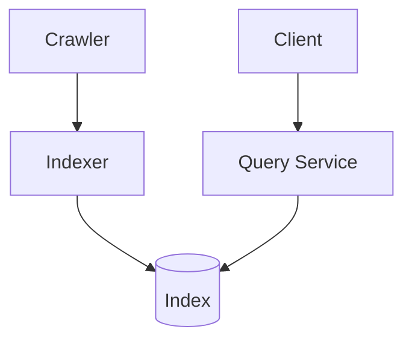
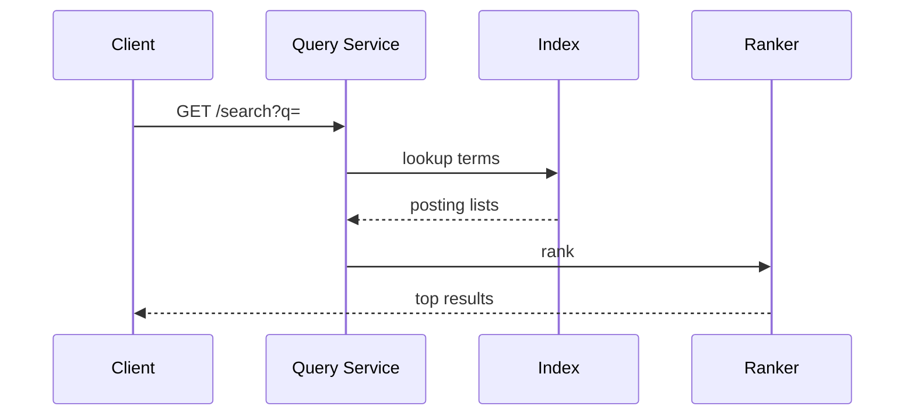

# High-Level Design: Search Engine (Google-Style)

## 1. Overview

A system that **crawls** the web, **indexes** pages (inverted index), **ranks** results by relevance and authority, and **serves** search queries at scale with low latency.

---

## System Design Process
- **Step 1: Clarify Requirements** — See §2 below (crawl, index, rank, query).
- **Step 2: High-Level Design** — Crawler, indexer, query service; see §3–§5 below.
- **Step 3: Detailed Design** — Inverted index, doc store; see LLD for full API list.
- **Step 4: Scale & Optimize** — Sharding, caching: see §6 below.

#### High-Level Architecture

**Mermaid:**



#### Flow Diagram — Search query

**Mermaid:**



**API endpoints (required):** GET `/v1/search?q=...`, optional crawl/ingest API. See LLD for full list.

---

## 2. Requirements

### Functional
- **Crawl:** Discover URLs (seed + links); fetch pages; respect robots.txt and rate limits; extract links and content.
- **Index:** Build inverted index (term → list of (doc_id, position, metadata)); store for query.
- **Rank:** Score documents by relevance (TF-IDF, BM25) and signals (PageRank, freshness, domain authority).
- **Query:** Parse query; lookup index; rank; return top-K with snippets; support filters (date, site).
- **Scale:** Billions of pages; millions of queries per second; sub-second latency.

### Non-Functional
- **Freshness:** Re-crawl periodically; prioritize important and frequently updated pages.
- **Fault tolerance:** Crawlers and indexers distributed; no single point of failure.
- **Storage:** Petabyte-scale index and document store.

---

## 3. High-Level Architecture

```
┌─────────────┐     Query      ┌──────────────────┐
│   Client    │────────────────►│  Query Service   │
└─────────────┘                │  (parse, rank,   │
                               │   snippet)        │
                               └────────┬─────────┘
                                        │
                    ┌───────────────────┼───────────────────┐
                    │                   │                   │
                    ▼                   ▼                   ▼
           ┌────────────────┐  ┌────────────────┐  ┌────────────────┐
           │  Index Service  │  │  Ranker        │  │  Snippet /     │
           │  (inverted      │  │  (scoring,    │  │  Doc Store      │
           │   index lookup) │  │   merge)       │  │  (title, snippet)│
           └────────────────┘  └────────────────┘  └────────────────┘
                    │
┌─────────────┐     │   ┌─────────────────────────────────────────────────┐
│  URL        │     │   │  Crawler  →  Parser  →  Indexer  →  Index       │
│  Frontier   │─────┼──►│  (fetch)     (extract)  (invert)    (sharded)    │
└─────────────┘     │   └─────────────────────────────────────────────────┘
       ▲            │
       │            ▼
       └─────  Link Extractor → Frontier
```

---

## 4. Core Components

| Component | Responsibility |
|-----------|----------------|
| **URL Frontier** | Priority queue of URLs; dedupe; politeness (per-domain rate). |
| **Crawler** | Fetch; store raw page; extract links; push to frontier. |
| **Parser** | Extract title, text, links; normalize; tokenize. |
| **Indexer** | Inverted index: term → posting list; shard by term. |
| **Document Store** | doc_id → url, title, snippet; for display. |
| **Query Service** | Parse query; lookup index; merge; rank (BM25 + signals); snippets; top-K. |
| **Ranker** | BM25 + PageRank + freshness; merge and sort. |

---

## 5. Crawling, Index, Ranking (Summary)

- **Crawl:** Pop URL → fetch → parse → extract links → frontier; respect robots.txt and per-domain delay.
- **Index:** Posting list per term; shard by term; compress; incremental or batch merge.
- **Ranking:** BM25(tf, idf) + PageRank + freshness; top-K; snippets from Doc Store.
- **Query:** Lookup terms → merge posting lists (AND/OR) → rank → fetch snippets → return.

---

## 6. Scaling

- **Crawlers:** Many workers; shared frontier; partition by domain.
- **Index:** Shard by term; replicas; cache hot terms.
- **Query:** Fan-out to shards; merge; cache popular queries.
- **Doc Store:** Shard by doc_id; replicate; tier hot/cold.

---

## 7. Interview Steps

1. Clarify: web vs vertical; scale; freshness.
2. Estimate: crawl rate; index size; QPS; storage.
3. Draw: Frontier → Crawler → Parser → Indexer → Index; Query → Index + Ranker + Doc Store.
4. Detail: Inverted index and sharding; BM25 and PageRank; politeness and dedupe.
5. Scale: Distributed crawlers; index shards; query merge and cache.
