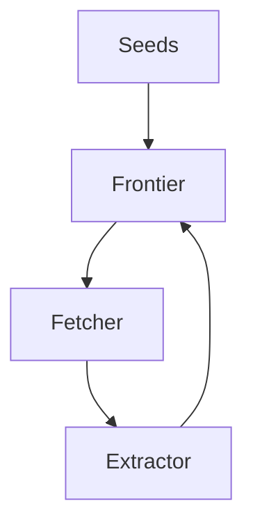
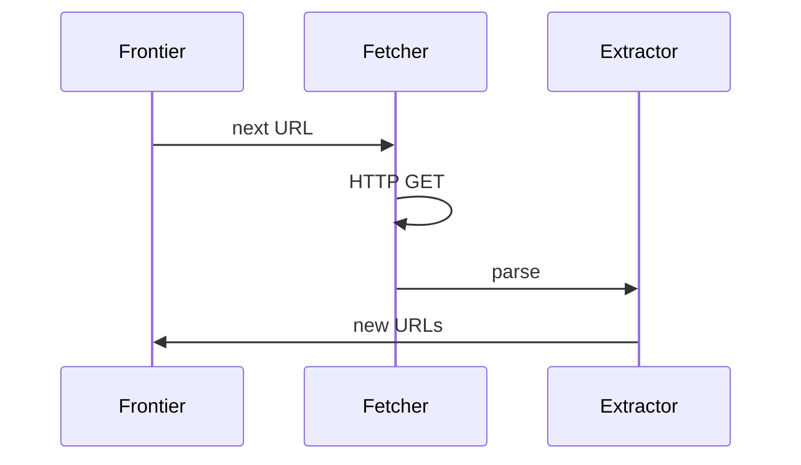

# High-Level Design: Web Crawler

## 1. Overview

A **focused** crawler that discovers URLs, fetches pages, extracts links and data, and respects politeness and scale constraints—building block for search engines, price scrapers, and archival.

---

## System Design Process
- **Step 1: Clarify Requirements** — See §2 below (seed, discover, fetch, politeness).
- **Step 2: High-Level Design** — Frontier, fetcher, extractor; see §4–§6 below.
- **Step 3: Detailed Design** — URL store, dedup; see LLD for full API list.
- **Step 4: Scale & Optimize** — Distributed workers, rate limits: see Scaling below.

#### High-Level Architecture

**Mermaid:**



#### Flow Diagram — Crawl one page

**Mermaid:**



**API endpoints (required):** POST `/v1/crawl` (submit job), GET `/v1/crawl/:id`. See LLD for full list.

---

## 2. Requirements

### Functional
- **Seed URLs:** Start from given list or sitemap.
- **Discover:** Extract links from fetched pages; add to crawl queue; follow same domain or cross-domain per policy.
- **Fetch:** HTTP GET; handle redirects; respect robots.txt and rate limits.
- **Parse:** Extract links, metadata, and optional structured data (e.g. product info).
- **Deduplication:** Don’t crawl same URL twice (normalize URL).
- **Politeness:** Limit requests per domain (e.g. 1 req/s); respect Crawl-delay if present.

### Non-Functional
- **Scale:** Millions of URLs; hundreds of concurrent workers; durable queue.
- **Fault tolerance:** Resume after crash; no duplicate fetch for same URL.
- **Observability:** Crawl progress; errors per domain; rate and backlog.

---

## 3. High-Level Architecture

```
┌─────────────┐                    ┌──────────────────┐
│  Seed URLs  │                    │  URL Frontier /  │
│  Sitemaps   │───────────────────►│  Queue           │
└─────────────┘                    │  (priority,      │
       │                           │   per-domain)    │
       │                           └────────┬─────────┘
       │                                    │
       │                                    ▼
       │                           ┌────────────────┐
       │                           │  Crawler       │
       │                           │  Workers       │
       │                           │  (fetch, parse)│
       │                           └────────┬───────┘
       │                                    │
       │                    ┌───────────────┼───────────────┐
       │                    │               │               │
       │                    ▼               ▼               ▼
       │             ┌────────────┐  ┌────────────┐  ┌────────────┐
       │             │  Dedupe   │  │  Robots    │  │  Fetcher   │
       │             │  (seen    │  │  Cache     │  │  (HTTP)    │
       │             │   URLs)   │  │            │  │            │
       │             └────────────┘  └────────────┘  └─────┬──────┘
       │                                                    │
       │                                                    ▼
       │                                             ┌────────────┐
       │                                             │  Parser    │
       │                                             │  Link      │
       │                                             │  Extractor │
       │                                             └─────┬──────┘
       │                                                   │
       │                                                   │  New URLs
       │                                                   ▼
       │                                             ┌────────────┐
       │                                             │  Frontier  │
       │                                             │  (enqueue) │
       │                                             └────────────┘
       │
       │  Optional: Store raw HTML / parsed data
       ▼
┌────────────┐
│  Document  │
│  Store     │
└────────────┘
```

---

## 4. Core Components

| Component | Responsibility |
|-----------|----------------|
| **URL Frontier** | Queue of URLs to crawl; priority (BFS, importance, or sitemap order); **per-domain** sub-queues and delay so we don’t hit same host too fast. |
| **Deduplication** | Track seen URLs (normalized); before enqueue, check; use Bloom filter + DB for scale (Bloom for fast “no”, DB for “yes” and persistence). |
| **Robots.txt** | Cache per host; before fetch, check Allow/Disallow for URL path; respect Crawl-delay if present. |
| **Fetcher** | HTTP client; follow redirects (limit 5); timeout; User-Agent; store response (status, body, headers). |
| **Parser** | Parse HTML; extract <a href>; normalize URL (resolve relative, remove fragment, lowercase scheme/host); filter (same domain only, or allow external); optional: extract title, meta, structured data. |
| **Scheduler** | Assign next URL to worker: pick domain whose “next fetch time” has passed; pop URL from that domain; update next fetch time = now + delay. |
| **Document Store** | Optional: store (url, html, fetched_at) for later indexing or archival. |

---

## 5. URL Normalization (Dedupe)

- **Scheme:** Prefer https; if same host supports both, treat as same URL (or keep both and dedupe by canonical).
- **Host:** Lowercase; strip www if configured.
- **Path:** Decode percent-encoding; remove trailing slash for consistency; collapse path.
- **Query:** Sort params or keep stable order; remove tracking params (utm_*) if desired.
- **Fragment:** Remove (#section); fragment not sent to server.
- **Result:** Normalized URL string as dedupe key.

---

## 6. Politeness (Per-Domain Rate)

- **Data structure:** Map<domain, (queue of URLs, next_fetch_timestamp)>.
- **Scheduler:** Global min-heap or sorted set by next_fetch_timestamp. When worker is free: pop domain with smallest next_fetch_timestamp <= now; pop URL from that domain’s queue; assign to worker; set domain’s next_fetch_timestamp = now + delay (e.g. 1s or Crawl-delay).
- **Crawl-delay:** If robots.txt has Crawl-delay: N, use N seconds for that host.

---

## 7. Robots.txt

- **Fetch:** Once per host (cache); GET http://host/robots.txt; parse Allow/Disallow rules; optional: Crawl-delay (non-standard but used by some).
- **Check:** Before fetching URL, match path against rules (longest match or first match); if Disallow, skip URL (don’t enqueue or drop from queue).
- **Cache:** TTL 24h or until next crawl of that host; store in Redis or DB.

---

## 8. Scaling

- **Workers:** Many crawler workers (threads or processes); each asks scheduler for next URL; scheduler returns (url, robots_ok); worker fetches, parses, pushes new URLs to frontier; frontier and dedupe must be thread-safe or distributed.
- **Frontier:** Single queue with lock; or distributed queue (Kafka, SQS) with partition by domain so same domain is consumed by same worker (or use global scheduler that enqueues per-domain).
- **Dedupe:** Bloom filter in memory (fast “no”); on “yes” or full, check DB (RocksDB, Cassandra) for persistence; or distributed set (Redis) with TTL if acceptable to re-crawl after TTL.
- **Document Store:** Optional; write asynchronously so crawler doesn’t block; object store or HDFS for raw HTML.

---

## 9. Trade-offs

| Decision | Choice | Rationale |
|----------|--------|-----------|
| Politeness | Per-domain delay | Avoid overwhelming hosts; reduce block risk |
| Dedupe | Normalize + Bloom + DB | Balance memory and persistence |
| Frontier | Priority + per-domain | Control order and rate; BFS or importance |
| Scale | Distributed queue + workers | Linear scale with workers; shared frontier |
| Robots | Cache per host | Avoid repeated fetches of robots.txt |

---

## 10. Interview Steps

1. **Clarify:** Scale (URLs); same domain only or whole web; store content or just links.
2. **Estimate:** URLs to crawl; crawl rate (politeness); storage for queue and dedupe.
3. **Draw:** Frontier (per-domain) → Scheduler → Workers → Fetcher → Parser → Link extract → Frontier + Dedupe.
4. **Detail:** URL normalization; per-domain delay; robots.txt check; dedupe (Bloom + DB).
5. **Scale:** Many workers; distributed queue; Bloom filter and persistent dedupe.

---

## Interview-Readiness Enhancements

### Capacity & SLO framing
- Define read/write QPS separately and estimate peak vs average traffic.
- Add latency budgets (p95/p99) per critical hop and target availability.
- State durability target and expected data growth/day.

### Critical path clarity
- Document write path (authoritative commit first, async side-effects second).
- Document read path (cache/read model first, fallback to source of truth).
- Identify likely hotspots (hot keys, hot partitions, fanout spikes).

### Failure handling
- Define retry strategy (bounded retries, backoff, jitter).
- Add circuit breakers and bulkheads for unstable dependencies.
- Cover queue failures (DLQ, replay) and datastore failover behavior.

### Security, operations, and cost
- Baseline security: AuthN/AuthZ, encryption in transit/at rest, secrets rotation.
- Observability: golden signals, SLO alerts, tracing, runbooks, canary/rollback.
- DR/cost: explicit RTO/RPO and top cost drivers with optimization levers.

### Trade-off table (mandatory)
- Include at least two realistic alternatives with decision rationale for this system.

