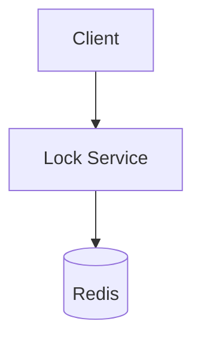
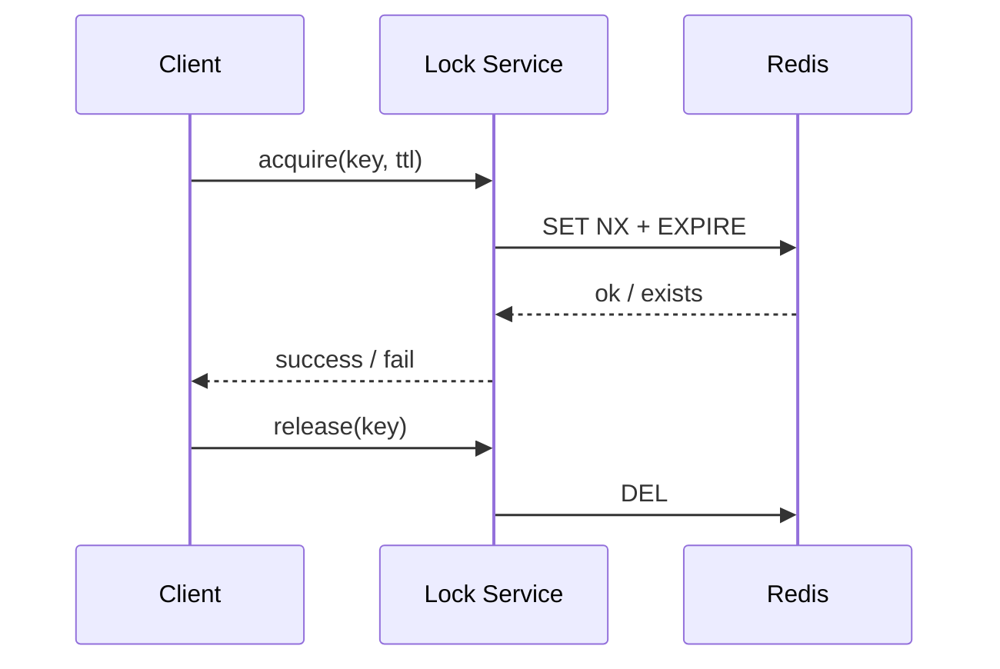

# High-Level Design: Distributed Lock Service

## 1. Overview

Provide **mutual exclusion** across distributed processes: one process holds the lock at a time; others block or fail until the lock is released or expired. Used for leader election, critical sections, and preventing duplicate processing.

---

## System Design Process
- **Step 1: Clarify Requirements** — See §2 below (acquire, release, TTL).
- **Step 2: High-Level Design** — Lock service, store (Redis/DB); see §4–§6 below.
- **Step 3: Detailed Design** — Key, owner, TTL; see LLD for full API list.
- **Step 4: Scale & Optimize** — Sharding by key; Redis Cluster. See Scaling below.

#### High-Level Architecture

**Mermaid:**



#### Flow Diagram — Acquire and release lock

**Mermaid:**



**API endpoints (required):** POST `/v1/lock` (acquire), DELETE `/v1/lock/:key` (release). See LLD for full list.

---

## 2. Requirements

### Functional
- **Acquire lock:** By key (e.g. "order_123"); optional TTL (lease); return success or failure (already held).
- **Release lock:** By key (and optional owner/token); only holder can release.
- **Optional:** Reentrancy (same owner can acquire again); lock extension (refresh TTL before expiry).
- **Optional:** Fairness (FIFO) or try-lock (non-blocking).

### Non-Functional
- **Safety:** At most one holder per key at any time (under correct clocks and TTL).
- **Liveness:** Lock eventually available after holder crashes (TTL expiry) or releases.
- **Latency:** Acquire/release in single-digit milliseconds.
- **Availability:** No single point of failure; tolerate minority node failures (e.g. Redis with Redlock, or etcd/ZooKeeper).

---

## 3. High-Level Architecture

```
┌─────────────┐     ┌─────────────┐                    ┌──────────────────┐
│  Client A   │     │  Client B   │                    │  Lock Service    │
│  (acquire   │     │  (acquire   │   Acquire /        │  (Redis Cluster  │
│   lock L)   │     │   lock L)   │   Release          │   or etcd)       │
└──────┬──────┘     └──────┬──────┘                    └────────┬─────────┘
       │                    │                                    │
       │  Only one gets     │                                    │
       │  lock; other       │                                    │
       │  gets "failed"     │                                    │
       └────────────────────┴────────────────────────────────────┘
```

---

## 4. Core Components

| Component | Responsibility |
|-----------|----------------|
| **Lock Store** | Key-value store supporting conditional write: set key only if not exists (or if value matches); TTL/lease. Redis SET key value NX PX ttl_ms; etcd compare-and-swap with lease. |
| **Lock Client** | Generate unique owner/token; acquire = SET key owner NX PX ttl; release = compare key == owner then DEL; optional refresh loop (extend TTL before expiry). |
| **Coordination Store** | Redis (single or cluster with Redlock) or etcd/ZooKeeper; provides atomicity and TTL. |

---

## 5. Redis-Based Lock (Single Instance)

- **Acquire:** SET lock:order_123 <unique_owner_id> NX PX 10000  
  - NX = set only if not exists; PX 10000 = 10s TTL.  
  - Return OK → acquired; nil → failed (already held).
- **Release:** GET lock:order_123; if value == my_owner_id then DEL lock:order_123. Use Lua script for atomicity: if redis.call("get", KEYS[1]) == ARGV[1] then return redis.call("del", KEYS[1]) else return 0 end.
- **Owner:** Unique per client (UUID or client_id + request_id) so only holder can release; prevents mistaken release by another process.

---

## 6. Redlock (Multi-Instance Redis)

- **Goal:** Tolerate single Redis failure; avoid split-brain (two holders).
- **Algorithm:** 5 independent Redis instances (or 5 masters). To acquire: get current time; for each instance, SET key owner NX PX ttl; count successes; if >= 3 and (elapsed time < ttl * 0.8), consider lock acquired; else release on all (DEL if owner matches). To release: DEL on all instances.
- **Controversy:** Clock skew and network delay can still cause overlapping holders in edge cases; use only when approximate safety is acceptable or combine with fencing tokens.

---

## 7. etcd / ZooKeeper

- **etcd:** Create key with prefix (e.g. /locks/order_123); use lease (TTL); only one create succeeds (key is unique); release = delete key; watch for deletion to implement “wait for lock.”
- **ZooKeeper:** Create ephemeral sequential node under /lock/order_123; smallest sequence holds lock; others watch predecessor and wait; session timeout = TTL; release = delete node.
- **Advantage:** Consensus-based; strong consistency; no split-brain when used correctly.

---

## 8. Lock Extension (Refresh)

- **Problem:** Long-running task may exceed TTL; lock expires and another process acquires.
- **Solution:** Background thread or timer: before TTL/2 (e.g. every 5s for 10s TTL), refresh: if still owner (GET == owner), PEXPIRE key ttl. If refresh fails (key changed or Redis down), abort task or re-acquire.
- **Reentrancy:** Store count in value (e.g. JSON {owner, count}); acquire: if key exists and owner matches, increment count; else SET NX. Release: decrement count; if 0, DEL.

---

## 9. Data Flow

**Acquire:**  
1. Client generates owner_id.  
2. SET key owner NX PX ttl → OK or nil.  
3. If OK, start optional refresh loop; return success.  
4. If nil, return failure (or block/wait by polling or watching).

**Release:**  
1. Lua: if GET key == owner then DEL key.  
2. Stop refresh loop.  
3. Return success.

**Crash:**  
- No release; TTL passes; key expires; lock available for others (liveness).

---

## 10. Trade-offs

| Decision | Choice | Rationale |
|----------|--------|-----------|
| Store | Redis (single or Redlock) vs etcd | Redis: simple, fast; etcd: stronger consistency |
| TTL | Required | Ensures liveness when holder crashes |
| Owner token | Required for release | Prevents mistaken release by non-holder |
| Refresh | For long tasks | Reduces risk of expiry during work; adds complexity |
| Fairness | Optional FIFO | etcd/ZK with watch; Redis needs application queue |

---

## 11. Interview Steps

1. **Clarify:** Single key vs many keys; blocking vs try-lock; reentrancy; TTL and long tasks.
2. **Draw:** Clients → Lock Store (Redis/etcd); acquire = conditional set; release = conditional delete.
3. **Detail:** SET NX PX; owner token; release with Lua; TTL for liveness.
4. **Failure:** Redlock or etcd for HA; clock skew and fencing if strict safety needed.
5. **Extension:** Refresh loop; reentrancy with count.
