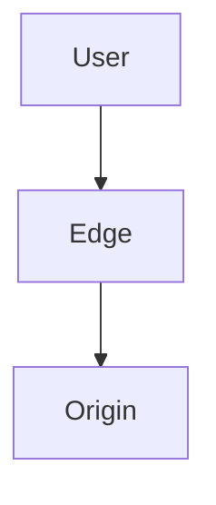
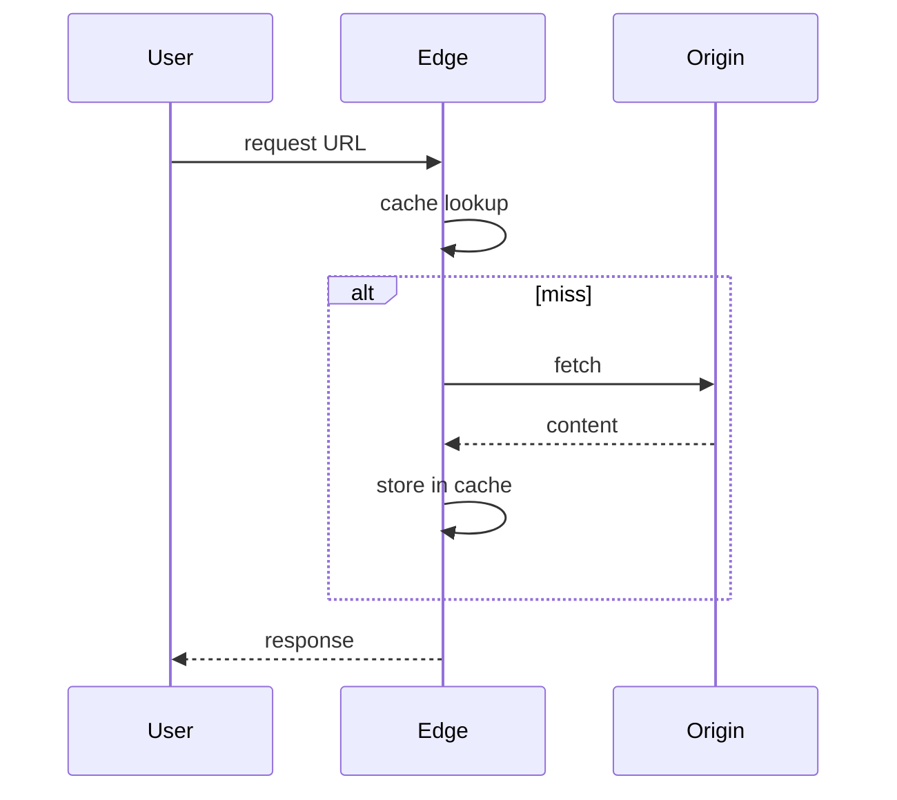

# High-Level Design: Content Delivery Network (CDN)

## 1. Overview

A **CDN** caches static and dynamic content at **edge locations** close to users to reduce latency, offload origin, and improve availability. Used for images, video, API responses, and static assets.

---

## System Design Process
- **Step 1: Clarify Requirements** — See §2 below (cache, origin, TTL, invalidation).
- **Step 2: High-Level Design** — Edge, origin, cache layer; see §4–§6 below.
- **Step 3: Detailed Design** — Cache key, headers; see LLD for config/APIs.
- **Step 4: Scale & Optimize** — Multiple edges, origin shield: see Scaling below.

#### High-Level Architecture

**Mermaid:**



#### Flow Diagram — Cache miss and serve

**Mermaid:**



**API endpoints:** Cache invalidation API (purge); origin is application. See LLD for full list.

---

## 2. Requirements

### Functional
- **Cache:** Store content (by URL or cache key) at edge; serve on request; TTL and invalidation.
- **Origin:** On cache miss, fetch from origin (app server or object store); store and serve; optional origin shield (mid-tier cache).
- **Delivery:** Low latency (edge near user); high throughput; support range requests (video).
- **Invalidation:** Purge by URL, path prefix, or tag so content can be updated.

### Non-Functional
- **Latency:** First byte from edge < 50 ms for cache hit; miss = origin latency + store.
- **Availability:** Multiple edges; origin failure → serve stale (if configured) or error.
- **Scale:** Millions of requests per second; petabytes of content; global edges.

---

## 3. High-Level Architecture

```
┌─────────────┐                    ┌──────────────────┐
│   User      │   Request URL      │  DNS (optional   │
│   (Asia)    │───────────────────►│   geo routing)   │
└─────────────┘                    └────────┬─────────┘
                                           │  Resolve to nearest edge
                                           ▼
                                  ┌────────────────┐
                                  │  Edge PoP 1     │
                                  │  (Asia)         │
                                  │  Cache hit?     │
                                  └────────┬────────┘
                                           │ miss
                                           ▼
                                  ┌────────────────┐
                                  │  Origin        │
                                  │  (or Shield)   │
                                  └────────┬────────┘
                                           │
                                  ┌────────┴────────┐
                                  │  Origin Server  │
                                  │  / Object Store │
                                  └─────────────────┘
```

---

## 4. Core Components

| Component | Responsibility |
|-----------|----------------|
| **Edge Server (PoP)** | Receive request; lookup cache (key = URL or normalized); hit → return; miss → fetch from origin (or shield); store and return; respect Cache-Control and TTL. |
| **DNS / Request Routing** | Resolve hostname to edge IP (anycast or geo-based); user gets nearest or least-loaded edge. |
| **Origin** | Application server or object store; source of truth; only contacted on miss or bypass. |
| **Origin Shield (optional)** | Mid-tier cache between edges and origin; reduces origin load; one fetch per content per region. |
| **Invalidation API** | Purge by URL, path prefix, or tag; edges evict and refetch on next request. |
| **Cache Key** | Default: full URL (including query string or not, configurable); or custom key (host + path + selected headers). |

---

## 5. Request Flow

1. **User** requests https://cdn.example.com/image.jpg; DNS returns IP of nearest edge (anycast or geo).
2. **Edge** receives request; computes cache key (e.g. host + path); looks up in local cache.
3. **Hit:** Return cached response (status, headers, body); no origin call.
4. **Miss:** Edge fetches from origin (GET same URL); origin returns 200 + body + Cache-Control; edge stores (key, response, TTL); returns to user.
5. **Revalidation:** If cached object has max-age and request has If-None-Match (ETag), edge can send conditional request to origin; 304 → serve cached body; 200 → update cache and return.

---

## 6. Caching Rules (Cache-Control)

- **Origin sends:** Cache-Control: public, max-age=3600 (1h); or private, no-store; ETag for validation.
- **CDN respects:** max-age for TTL; no-store → don’t cache; private → don’t cache in shared CDN (or cache in edge only per user if supported).
- **Default TTL:** If origin omits, CDN may use default (e.g. 24h) or not cache.
- **Query string:** Ignore or include in key (e.g. ?v=1 for cache busting).

---

## 7. Invalidation (Purge)

- **Purge URL:** Remove single object from all edges; next request = miss → refetch.
- **Purge prefix:** Remove all keys matching path prefix (e.g. /images/*); expensive if large.
- **Purge by tag:** Objects tagged at cache time (e.g. tag=product-123); purge all with tag; flexible for “invalidate all product pages.”
- **TTL expiry:** Simpler; no purge API; wait for TTL (eventual consistency).

---

## 8. Range Requests (Video / Large Files)

- **Request:** Range: bytes=0-1023. **Origin** returns 206 Partial Content + body.
- **Edge:** Cache by (key, range) or store full object and slice; on range request, return cached range or fetch range from origin; support concatenation of ranges if cached in chunks.
- **Large file:** Origin may support range; CDN caches segments; first request for range triggers fetch of that range (or full file); subsequent requests for same or overlapping range served from cache.

---

## 9. Dynamic Content (Optional)

- **Cache API responses:** Cache key = URL + auth header hash (or no auth); short TTL (e.g. 60s); or cache per user (private) at edge.
- **Bypass:** Certain paths (e.g. /api/cart) never cached; always forward to origin.
- **Edge compute:** Run logic at edge (e.g. redirect, header modification, A/B); limited compared to full app.

---

## 10. Scaling

- **Edges:** Add more PoPs; DNS/anycast routes to nearest; linear scale for read.
- **Origin:** CDN absorbs most traffic; origin sees only miss and invalidation traffic; scale origin for that.
- **Storage per edge:** Limited; eviction by LRU or TTL; hot content stays; cold evicted.
- **Origin shield:** Reduces origin load further; one fetch per region per object.

---

## 11. Trade-offs

| Decision | Choice | Rationale |
|----------|--------|-----------|
| Cache key | URL (path + optional query) | Simple; query string for cache busting |
| TTL | From origin Cache-Control | Respect application; default if missing |
| Purge | URL + prefix + tag | Balance granularity and cost |
| Stale on origin error | Optional | Serve stale if configured; availability vs freshness |
| HTTPS | Terminate at edge | Offload TLS; origin can be HTTP or TLS to shield |

---

## 12. Interview Steps

1. **Clarify:** Static only or API caching; invalidation; global vs single region.
2. **Estimate:** Request rate; cache size; origin load after CDN.
3. **Draw:** User → DNS → Edge (cache) → Origin; optional shield.
4. **Detail:** Cache key; TTL and Cache-Control; hit/miss flow; purge.
5. **Scale:** More edges; origin shield; range requests for video.
