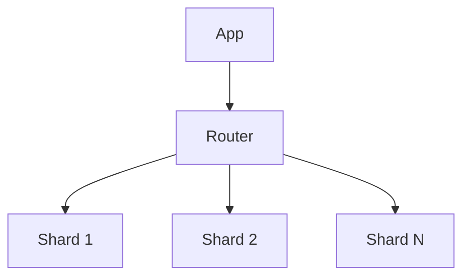
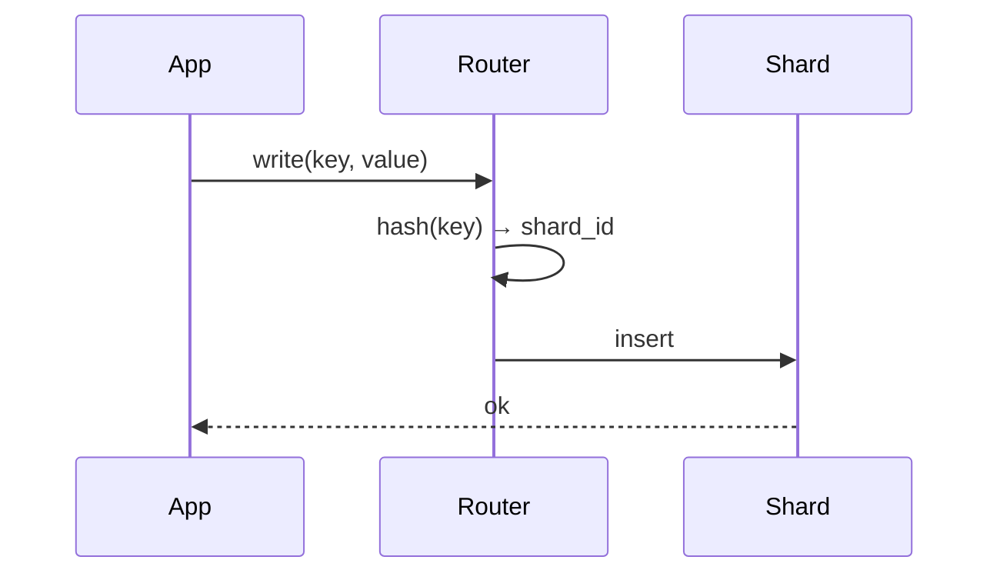

# High-Level Design: Database Sharding

## 1. Overview

**Sharding** splits a database into multiple **shards** (partitions), each holding a subset of data, to scale write and read capacity horizontally. Covers shard key choice, routing, rebalancing, and cross-shard operations.

---

## System Design Process
- **Step 1: Clarify Requirements** — See §2 below (route, CRUD, range, rebalance).
- **Step 2: High-Level Design** — Router, shards; see §4–§6 below.
- **Step 3: Detailed Design** — Shard key, routing logic; see LLD for full API list.
- **Step 4: Scale & Optimize** — Rebalancing, cross-shard: see Scaling below.

#### High-Level Architecture

**Mermaid:**



#### Flow Diagram — Write by shard key

**Mermaid:**



**API endpoints:** Application CRUD routed by shard key; see LLD for routing and admin APIs.

---

## 2. Requirements

### Functional
- **Route:** Each row belongs to one shard; application or middleware routes read/write by **shard key**.
- **CRUD:** Insert, get, update, delete by primary key (or shard key); must hit correct shard.
- **Range / scan:** Optional: range query within shard (e.g. by user_id + created_at); or scatter-gather across shards.
- **Rebalance:** Add new shards; move data from existing shards to new; minimal downtime or online migration.
- **Consistency:** Strong consistency within shard; cross-shard = eventual or application-level (e.g. saga).

### Non-Functional
- **Scale:** Linear write scaling with number of shards; read scaling via replicas per shard.
- **Balance:** Even distribution of data and load across shards (avoid hot shards).
- **Operational:** Backup, restore, and schema change per shard or coordinated.

---

## 3. High-Level Architecture

```
┌─────────────┐                    ┌──────────────────┐
│  Application│                    │  Shard Router    │
│             │───────────────────►│  (key → shard)   │
└─────────────┘                    └────────┬─────────┘
                                             │
                    ┌────────────────────────┼────────────────────────┐
                    │                        │                        │
                    ▼                        ▼                        ▼
           ┌────────────────┐      ┌────────────────┐      ┌────────────────┐
           │  Shard 0        │      │  Shard 1       │      │  Shard N       │
           │  (user_id       │      │  (user_id      │      │  (user_id      │
           │   hash % N = 0) │      │   hash % N = 1)│      │   hash % N = N)│
           │  Primary +     │      │  Primary +     │      │  Primary +     │
           │  Replicas      │      │  Replicas      │      │  Replicas      │
           └────────────────┘      └────────────────┘      └────────────────┘
```

---

## 4. Shard Key Selection

- **Goal:** Even distribution; minimize cross-shard queries; support common access patterns.
- **Examples:** user_id (all data for a user in one shard); order_id (orders spread; lookup by order_id); (tenant_id, entity_id) for multi-tenant.
- **Avoid:** Key that causes hot spots (e.g. timestamp alone → latest shard hot); or key that forces scatter-gather for every query (e.g. random id with no locality).
- **Composite:** (user_id, created_at) so range “user’s last 30 days” is single shard.

---

## 5. Routing Strategies

| Strategy | How | Pros / Cons |
|----------|-----|-------------|
| **Hash** | shard = hash(shard_key) % N | Even distribution; no range within shard unless key is composite. |
| **Range** | shard by range of key (e.g. user_id 0–1M → shard0) | Range queries easy; risk of hot shard if range is skewed. |
| **Consistent hash** | key → ring; shard = next node clockwise | Adding/removing shard moves only K/N keys; used in caches. |
| **Directory** | Lookup table: shard_key → shard_id | Flexible; move data and update directory; directory is bottleneck unless cached. |

---

## 6. Core Components

| Component | Responsibility |
|-----------|----------------|
| **Shard Router** | Given shard_key (from request or row), compute shard_id (hash or lookup); return connection or shard endpoint. |
| **Shard** | Full or partial DB (e.g. MySQL instance); holds subset of data; has own primary + replicas. |
| **Schema** | Same schema on all shards; optional: global table (replicated to every shard) for small reference data. |
| **Migration / Rebalance** | Move partition of data from shard A to shard B; dual-write during migration; switch read then write; remove old. |
| **Cross-shard** | No JOIN across shards in DB; application fetches from multiple shards and joins in app; or use distributed query engine (complex). |

---

## 7. Data Flow (Write)

1. Application has row (e.g. order_id, user_id, amount); shard_key = user_id (or order_id).
2. Router: shard_id = hash(user_id) % N; get connection to Shard(shard_id).
3. INSERT into Shard(shard_id); commit.
4. Replica replication within shard (async or sync per DB).

---

## 8. Data Flow (Read)

1. **By shard key:** Same: router → shard_id → query Shard(shard_id). Optional: read from replica of that shard.
2. **By non-shard key (e.g. order_id when shard key is user_id):** If order_id contains or maps to user_id, derive shard; else **scatter-gather:** query all shards (SELECT * FROM orders WHERE order_id = ?) and merge; or maintain secondary index (order_id → user_id) in separate store and then route by user_id.
3. **Range across shards:** Scatter-gather: query each shard with filter; merge and sort in app; pagination is hard (offset across shards).

---

## 9. Rebalancing (Add Shard)

1. **Double shards:** New topology has 2N shards; mapping: hash(key) % 2N.
2. **Data migration:** For each shard, scan rows; for each row, new_shard = hash(key) % 2N; if new_shard != current_shard, copy row to new shard (or new instance); delete from old after verification.
3. **Dual-write:** Application writes to both old and new shard during migration; read from old until migration done.
4. **Switch:** Update router to 2N shards; stop dual-write; drain old shard and decommission.
5. **Online:** Use consistent hashing or directory so only moved keys are affected; application can keep serving during move.

---

## 10. Global Table (Small Reference Data)

- **Problem:** Table “countries” is small and needed in every query that joins with users.
- **Solution:** Replicate “countries” to every shard (global table); or single “global” DB and application joins in app; or store in cache (e.g. Redis) and join in app.
- **Update:** Push updates to all shards or invalidate cache.

---

## 11. Trade-offs

| Decision | Choice | Rationale |
|----------|--------|-----------|
| Shard key | user_id or tenant_id | Locality: all user data together; even distribution if high cardinality |
| Hash vs range | Hash for even; range for range queries | Trade-off distribution vs query pattern |
| Cross-shard | Avoid or scatter-gather | No DB-level JOIN; application or dedicated engine |
| Rebalance | Directory or consistent hash | Minimize key movement; directory gives full control |
| Schema | Same on all shards | Simpler ops; global table for small ref data |

---

## 12. Interview Steps

1. **Clarify:** Scale (rows, QPS); access pattern (by user, by order); need for range or cross-shard.
2. **Estimate:** Rows per shard; QPS per shard; storage per shard.
3. **Draw:** App → Router (hash/directory) → Shards (each with primary + replica).
4. **Detail:** Shard key choice; hash formula; read by non-shard key (secondary index or scatter); rebalance when adding shard.
5. **Discuss:** Cross-shard JOIN (avoid or app-level); global table; failure (single shard down = partial unavailability).

---

## Interview-Readiness Enhancements

### Capacity & SLO framing
- Define read/write QPS separately and estimate peak vs average traffic.
- Add latency budgets (p95/p99) per critical hop and target availability.
- State durability target and expected data growth/day.

### Critical path clarity
- Document write path (authoritative commit first, async side-effects second).
- Document read path (cache/read model first, fallback to source of truth).
- Identify likely hotspots (hot keys, hot partitions, fanout spikes).

### Failure handling
- Define retry strategy (bounded retries, backoff, jitter).
- Add circuit breakers and bulkheads for unstable dependencies.
- Cover queue failures (DLQ, replay) and datastore failover behavior.

### Security, operations, and cost
- Baseline security: AuthN/AuthZ, encryption in transit/at rest, secrets rotation.
- Observability: golden signals, SLO alerts, tracing, runbooks, canary/rollback.
- DR/cost: explicit RTO/RPO and top cost drivers with optimization levers.

### Trade-off table (mandatory)
- Include at least two realistic alternatives with decision rationale for this system.

