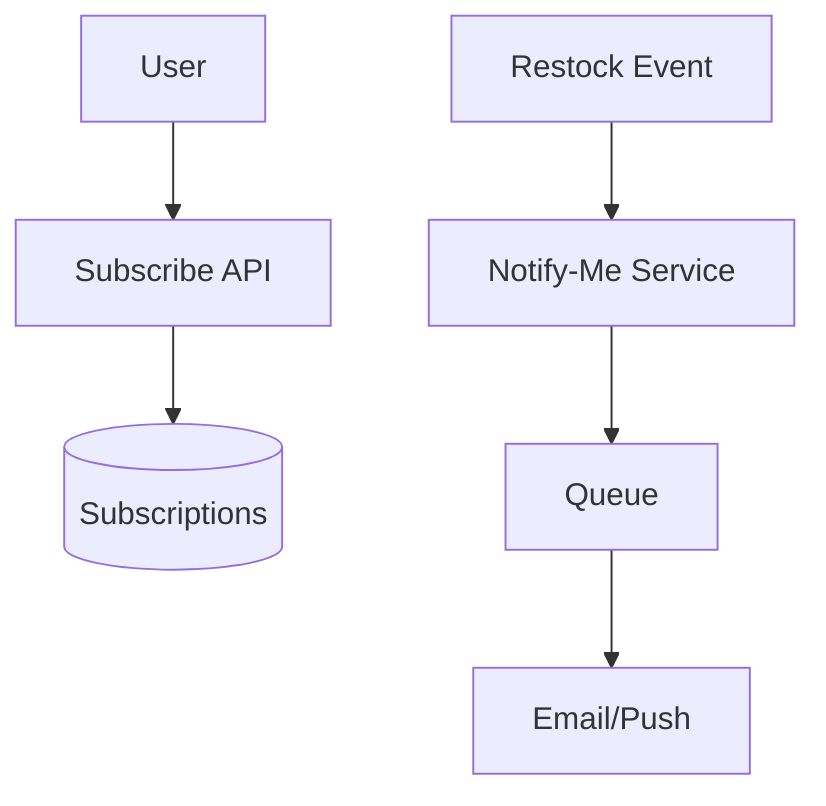
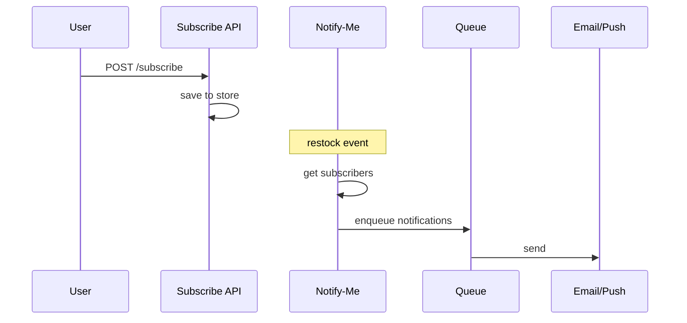

# High-Level Design: Notify-Me Button

## 1. Overview

A **subscription** feature: users subscribe to "notify me when available" for a product; when the product is **restocked**, all subscribers are **notified** (email/push) once. Supports inventory events and user preferences.

---

## System Design Process
- **Step 1: Clarify Requirements** — See §2 below (subscribe, trigger, channels).
- **Step 2: High-Level Design** — Subscribe service, event consumer, notifier; see §3 below.
- **Step 3: Detailed Design** — Subscriptions table; API: POST/DELETE subscribe. See LLD.
- **Step 4: Scale & Optimize** — Queue for notifications; idempotent send. See Trade-offs below.

#### High-Level Architecture

**Mermaid:**



#### Flow Diagram — Subscribe and on restock notify

**Mermaid:**



**API endpoints:** POST `/v1/subscribe`, DELETE `/v1/subscribe`. See LLD for full list.

---

## 2. Requirements

- **Subscribe:** User clicks "Notify Me" on a product (when OOS); store subscription (user_id, product_id, channel).
- **Unsubscribe:** User can remove subscription before or after notification.
- **Trigger:** On restock (inventory event), notify all subscribers for that product; then clear or mark subscriptions as notified (one-time).
- **Channels:** Email and/or push; optional preference per user.
- **Scale:** Many products; many subscribers per product; avoid duplicate notifications.

---

## 3. High-Level Architecture

```
┌─────────────┐                    ┌──────────────────┐
│  Product    │  Restock event     │  Inventory /     │
│  Page       │  (or admin)       │  Admin           │
└──────┬──────┘                    └────────┬─────────┘
       │                                    │
       │ Subscribe                          │ On restock
       ▼                                    ▼
┌─────────────────────────────────────────────────────────┐
│  Notify-Me Service                                       │
│  - Store subscriptions (product_id → user_id, channel)   │
│  - On restock: fetch subscribers → send notification     │
│  - Mark sent or delete (one-time)                        │
└────────────────────────┬──────────────────────────────┘
                          │
                          ▼
                 ┌────────────────┐
                 │  Notification  │
                 │  Service       │
                 │  (Email / Push) │
                 └────────────────┘
```

---

## 4. Core Components

| Component | Responsibility |
|-----------|----------------|
| **Notify-Me API** | Subscribe(user_id, product_id, channel); Unsubscribe(user_id, product_id); internal: OnRestock(product_id) |
| **Subscription Store** | Persist (user_id, product_id, channel); query by product_id; delete or mark sent after notify |
| **Notification Service** | Send email/push to user; idempotent per (user_id, product_id) if we send once |
| **Inventory/Event** | Emit "restock" event for product_id; consumed by Notify-Me to trigger notifications |

---

## 5. Data Flow

1. **Subscribe:** POST subscribe → validate product exists and is OOS (optional); insert (user_id, product_id, channel); return success.
2. **Restock:** Inventory system updates stock; calls Notify-Me OnRestock(product_id) or publishes event. Notify-Me loads all rows for product_id; for each: call NotificationService.send(user_id, product_id, channel); delete row or set sent_at (one-time).
3. **Unsubscribe:** DELETE subscription where user_id and product_id; return success.

---

## 6. Data Model

- **subscriptions:** (user_id, product_id, channel, created_at); UNIQUE(user_id, product_id). Optional: sent_at for idempotent "already notified" and audit.

---

## 7. Design Pattern (Observer)

- **Subject:** Product (or Notify-Me service) holding list of observers (subscribers).
- **Observers:** Per-user notification handlers (email, push). On "restock" event, subject notifies all observers; each sends one message.
- **Decoupling:** Inventory does not know subscribers; Notify-Me subscribes to restock events and fans out to users.

---

## 8. Trade-offs

| Decision | Choice | Rationale |
|----------|--------|-----------|
| One-time | Notify once then remove/mark | Avoid spam on every restock |
| Channel | Store per subscription | User choice (email vs push) |
| Trigger | Event-driven (restock event) | Decouples inventory from notify-me |
| Idempotency | One subscription per (user, product) | No duplicate emails on retry |

---

## Interview-Readiness Enhancements

### Capacity & SLO framing
- Define read/write QPS separately and estimate peak vs average traffic.
- Add latency budgets (p95/p99) per critical hop and target availability.
- State durability target and expected data growth/day.

### Critical path clarity
- Document write path (authoritative commit first, async side-effects second).
- Document read path (cache/read model first, fallback to source of truth).
- Identify likely hotspots (hot keys, hot partitions, fanout spikes).

### Failure handling
- Define retry strategy (bounded retries, backoff, jitter).
- Add circuit breakers and bulkheads for unstable dependencies.
- Cover queue failures (DLQ, replay) and datastore failover behavior.

### Security, operations, and cost
- Baseline security: AuthN/AuthZ, encryption in transit/at rest, secrets rotation.
- Observability: golden signals, SLO alerts, tracing, runbooks, canary/rollback.
- DR/cost: explicit RTO/RPO and top cost drivers with optimization levers.

### Trade-off table (mandatory)
- Include at least two realistic alternatives with decision rationale for this system.

