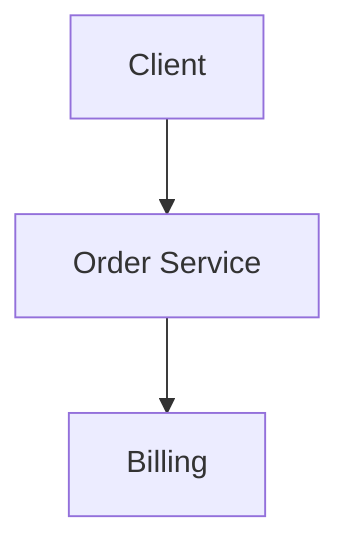
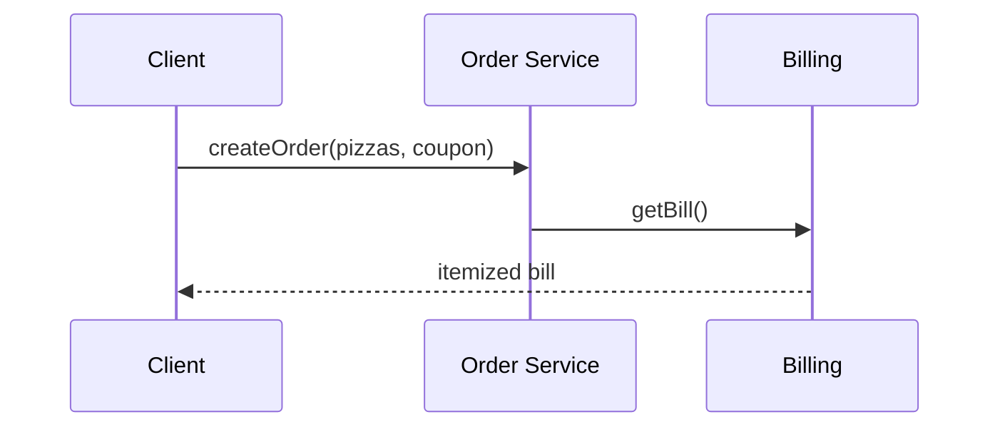

# High-Level Design: Pizza Billing System

## 1. Overview

An **order system** for pizzas: base (size) + **toppings** (each with price); **order** can have multiple pizzas; **coupon** and **tax**; total calculation. Focus on extensible pricing and product structure.

---

## System Design Process
- **Step 1: Clarify Requirements** — See §2 below (pizza, order, coupon, tax).
- **Step 2: High-Level Design** — Order, pricing (Decorator/Strategy); see §3 below.
- **Step 3: Detailed Design** — Itemized bill; API: createOrder(), getBill(). See LLD.
- **Step 4: Scale & Optimize** — Single-service; optional caching for menu.

#### High-Level Architecture

**Mermaid:**



#### Flow Diagram — Create order and get bill

**Mermaid:**



**API endpoints:** POST `/v1/orders`, GET `/v1/orders/:id/bill`. See LLD for full list.

---

## 2. Requirements

- **Pizza:** Base (S/M/L) with base price; add toppings (each has price); total = base + sum(topping).
- **Order:** One or more pizzas; optional coupon (percentage or fixed off); tax; final total.
- **Extensibility:** New toppings or sizes without changing core calculation; optional deals (combo).
- **Output:** Itemized bill (each pizza with description and cost); subtotal; discount; tax; total.

---

## 3. High-Level Architecture

```
┌─────────────┐                    ┌──────────────────┐
│  Client     │  Create order      │  Order Service   │
│  (POS/App)  │───────────────────►│  - Build pizzas  │
└─────────────┘                    │  - Apply coupon │
                                    │  - Tax, total   │
                                    └────────┬───────┘
                                             │
                    ┌────────────────────────┼────────────────────────┐
                    │                        │                        │
                    ▼                        ▼                        ▼
           ┌────────────────┐      ┌────────────────┐      ┌────────────────┐
           │  Pizza         │      │  Pricing       │      │  Coupon        │
           │  (base +       │      │  (base +       │      │  (rules,       │
           │   toppings)    │      │   toppings)   │      │   validate)   │
           └────────────────┘      └────────────────┘      └────────────────┘
```

---

## 4. Core Components

| Component | Responsibility |
|-----------|----------------|
| **Pizza / Product** | Represents one pizza: size, list of toppings; getCost() = basePrice(size) + sum(toppingPrice). Can be implemented as base + decorators (Decorator pattern) or as data (size + list of topping ids) with pricing lookup. |
| **Pricing** | Base price by size; topping price by id; optional strategy (weekday vs weekend). |
| **Order** | List of pizzas; subtotal = sum(pizza.getCost()); apply coupon → discount; tax = (subtotal - discount) * rate; total = subtotal - discount + tax. |
| **Coupon** | Validate code; type (percent or fixed); min order if any; return discount amount. |

---

## 5. Data Flow

1. **Build pizza:** Select size; add topping ids (e.g. cheese, olive). Create Pizza(size, [toppings]); cost = pricing.getBase(size) + sum(pricing.getToppingPrice(t)) for t in toppings.
2. **Create order:** Add one or more pizzas to order; order.subtotal = sum(pizza.cost). Apply coupon code → order.discount; order.tax = (subtotal - discount) * taxRate; order.total = subtotal - discount + tax.
3. **Output:** Return or print itemized lines (each pizza description + cost), subtotal, discount, tax, total.

---

## 6. Design Patterns (HLD View)

- **Decorator:** Pizza as base; each topping wraps and adds cost and description. Extensible: new topping = new decorator class.
- **Builder:** Fluent construction of pizza (size, addTopping, addTopping, build()) for readability and validation.
- **Strategy:** PricingStrategy for different rules (e.g. happy hour discount) without changing order logic.

---

## 7. Data Model (Conceptual)

- **menu_sizes:** size_id, name (S/M/L), base_price.
- **menu_toppings:** topping_id, name, price.
- **orders:** order_id, subtotal, discount, tax, total, created_at.
- **order_items:** order_id, size_id, cost (or computed); **order_item_toppings:** order_item_id, topping_id (for itemized bill).

---

## 8. Trade-offs

| Decision | Choice | Rationale |
|----------|--------|-----------|
| Cost calculation | In-memory from menu prices | Simple; no persistence of "pizza object" required for billing |
| Extensibility | Decorator or config-driven (size + toppings list) | New toppings = new row in menu_toppings or new decorator |
| Coupon | Applied at order level | Single discount per order; can extend to per-item later |
