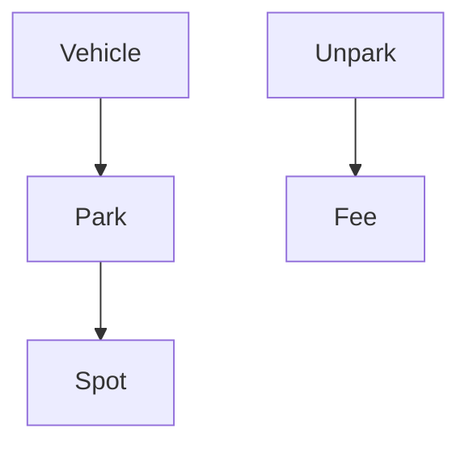
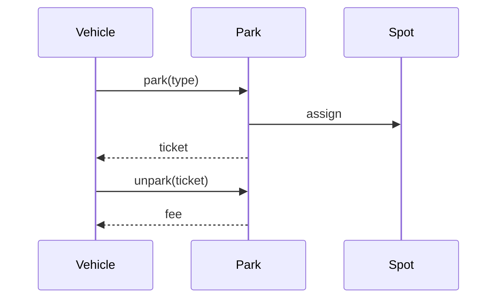

# High-Level Design: Parking Lot System

## 1. Overview

A **parking lot** with multiple **floors** and **spots** (car, bike, truck); **park** assigns a spot and returns a **ticket**; **unpark** uses ticket to release spot and compute **fee** (time-based). Optional display boards and pricing strategies.

---

## System Design Process
- **Step 1: Clarify Requirements** — See §2 below (park, unpark, fee).
- **Step 2: High-Level Design** — Lot, floors, spots, ticket; see §3 below.
- **Step 3: Detailed Design** — Spot assignment, fee calculation; API: park(), unpark(). See LLD.
- **Step 4: Scale & Optimize** — Single lot or multi-lot; optional sharding by lot_id.

#### High-Level Architecture

**Mermaid:**



#### Flow Diagram — Park and unpark

**Mermaid:**



**API endpoints:** POST `/v1/park`, POST `/v1/unpark`. See LLD for full list.

---

## 2. Requirements

- **Lot:** Multiple floors; each floor has N spots of different types (car, bike, truck).
- **Park:** Vehicle arrives (type); assign first available spot of matching type; return ticket (id, spot, start time).
- **Unpark:** Present ticket; release spot; calculate fee (e.g. first 2h flat, then per hour); return amount.
- **Optional:** Display board (free count per type per floor); different pricing (flat, hourly, daily); membership discount.

---

## 3. High-Level Architecture

```
┌─────────────┐                    ┌──────────────────┐
│  Vehicle    │  Park / Unpark     │  Parking Lot     │
│  (entry)    │───────────────────►│  (single or      │
└─────────────┘                    │   multi-floor)   │
                                    └────────┬─────────┘
                                             │
                    ┌────────────────────────┼────────────────────────┐
                    │                        │                        │
                    ▼                        ▼                        ▼
           ┌────────────────┐      ┌────────────────┐      ┌────────────────┐
           │  Floors        │      │  Spot           │      │  Pricing        │
           │  (each has     │      │  Management     │      │  Strategy      │
           │   spots)       │      │  (assign/free)  │      │  (fee calc)    │
           └────────────────┘      └────────────────┘      └────────────────┘
                    │                        │
                    └────────────────────────┘
                                    │
                           ┌────────▼────────┐
                           │  Ticket Store   │
                           │  (id → spot,    │
                           │   start time)  │
                           └────────────────┘
```

---

## 4. Core Components

| Component | Responsibility |
|-----------|----------------|
| **ParkingLot** | Entry point; holds floors; park(vehicleType) → find spot via FloorManager, create Ticket, return; unpark(ticketId) → release spot, compute fee via PricingStrategy, return amount. |
| **Floor** | List of spots by type; getAvailableSpot(vehicleType) → first available; markOccupied(spot), markAvailable(spot). |
| **Spot** | id, type (car/bike/truck), floorId, isAvailable. |
| **Ticket** | ticketId, spotId, vehicleId or type, startTime; stored in map or DB for unpark lookup. |
| **PricingStrategy** | calculate(entryTime, exitTime) → amount (e.g. hourly rate, or flat + hourly). |

---

## 5. Data Flow

1. **Park:** Vehicle type V; for each floor (or preferred order): spot = floor.getAvailableSpot(V). If spot found: set spot.available = false; create Ticket(ticketId, spot, now()); store ticket; return ticketId to user.
2. **Unpark:** Lookup ticket by ticketId; exitTime = now(); amount = pricingStrategy.calculate(ticket.startTime, exitTime); set spot.available = true; remove ticket; return amount.
3. **Display:** For each floor and type, count spots where available = true; show on board.

---

## 6. Design Patterns (HLD View)

- **Singleton:** Single ParkingLot instance (one physical lot).
- **Strategy:** PricingStrategy (HourlyPricing, FlatThenHourly) for different fee models; injectable.
- **Factory:** Optional SpotFactory for creating spots by type; VehicleFactory for vehicle types.

---

## 7. Data Model (Conceptual)

- **floors:** floor_id, name.
- **spots:** spot_id, floor_id, type (car/bike/truck), is_available.
- **tickets:** ticket_id, spot_id, vehicle_type, start_time; optional end_time, amount after unpark.
- **pricing_rules:** config (e.g. first_2h_flat, hourly_rate, daily_cap).

---

## 8. Trade-offs

| Decision | Choice | Rationale |
|----------|--------|-----------|
| Spot selection | First available (per floor or global) | Simple; optional "nearest to exit" later |
| Ticket storage | In-memory map or DB | DB for persistence across restarts; map for single process |
| Pricing | Strategy interface | Easy to add new schemes (weekend, member discount) |
