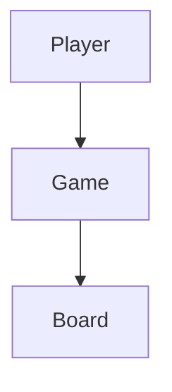
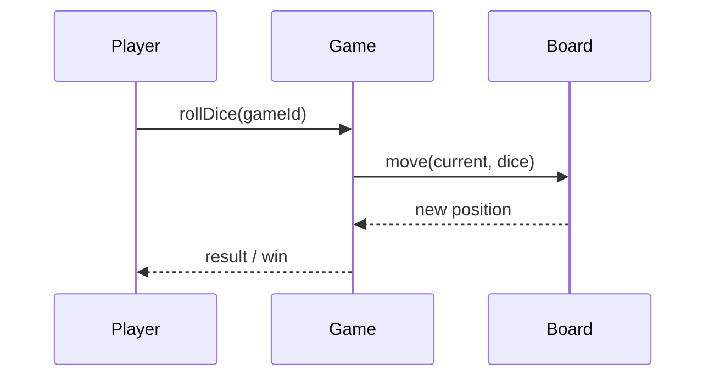

# High-Level Design: Snake and Ladder Game

## 1. Overview

A **board game** on a linear track of **100 cells**; **snakes** (head → tail, go down) and **ladders** (foot → top, go up); **players** take turns rolling a **dice**; first to reach **100** wins. Single-process or multi-player session.

---

## System Design Process
- **Step 1: Clarify Requirements** — See §2 below (board, dice, snakes/ladders).
- **Step 2: High-Level Design** — Game, board, players; see §3 below.
- **Step 3: Detailed Design** — Move logic; API: createGame(), rollDice(), getState(). See LLD.
- **Step 4: Scale & Optimize** — Single-game.

#### High-Level Architecture

**Mermaid:**



#### Flow Diagram — Roll dice and move

**Mermaid:**



**API endpoints:** createGame(), rollDice(gameId), getState(gameId). See LLD.

---

## 2. Requirements

- **Board:** 100 cells (1–100); predefined snakes (head, tail) and ladders (foot, top).
- **Players:** 2 to N; each has current position; turn-based.
- **Dice:** Roll 1–6 (or 2 dice); move = current + dice value; apply snake/ladder at new cell if any; win if new position = 100 (exact).
- **Rules:** If position + dice > 100, typically no move (or bounce); optional "roll again on 6".
- **Output:** Current player, dice value, new position, next player; game over when someone reaches 100.

---

## 3. High-Level Architecture

```
┌─────────────┐                    ┌──────────────────┐
│  Players    │  Roll dice         │  Game Controller  │
│  (turn)     │───────────────────►│  - Validate turn  │
└─────────────┘                    │  - Move, apply   │
                                    │    snake/ladder  │
                                    │  - Check win     │
                                    └────────┬─────────┘
                                             │
                    ┌────────────────────────┼────────────────────────┐
                    │                        │                        │
                    ▼                        ▼                        ▼
           ┌────────────────┐      ┌────────────────┐      ┌────────────────┐
           │  Board         │      │  Dice          │      │  Game State    │
           │  (cells,       │      │  (random       │      │  (players,     │
           │   snakes,      │      │   1–6)          │      │   positions,   │
           │   ladders)     │      │                 │      │   current)    │
           └────────────────┘      └────────────────┘      └────────────────┘
```

---

## 4. Core Components

| Component | Responsibility |
|-----------|----------------|
| **Board** | Hold cells 1–100; map of position → endPosition (for snake head or ladder foot); getNextPosition(position, diceValue) → apply move then snake/ladder. |
| **Dice** | roll() → random 1–6 (or 2–12 for two dice). |
| **Player** | id, name, currentPosition. |
| **Game** | board, list of players, currentPlayerIndex; rollDice() → advance current player, check win, switch turn. |
| **GameController** | createGame(players, snakes, ladders); rollDice(gameId) → result (new position, won?, next player). |

---

## 5. Data Flow

1. **Create game:** Initialize board with snake and ladder map; players at position 0 (or 1); currentPlayerIndex = 0.
2. **Roll:** diceValue = dice.roll(); newPos = currentPosition + diceValue; if newPos > 100, newPos = currentPosition (no move). If newPos == 100, player wins; game over. Else apply snake/ladder: newPos = board.getEndPosition(newPos) if exists else newPos. Update player.position = newPos; currentPlayerIndex = (currentPlayerIndex + 1) % N; return result.
3. **Snake/Ladder:** Board has map: cell → endCell (e.g. 62 → 5 for snake, 2 → 38 for ladder). After move, lookup newPos; if key exists, replace newPos with value.

---

## 6. Design Patterns (HLD View)

- **State:** Game state (Playing, Won); only allow roll when Playing; transition to Won when position = 100.
- **Strategy:** Optional different dice (single, double, loaded) or rules (roll again on 6) as strategy.
- **Simple data:** Board as config (snakes, ladders); no need for complex inheritance.

---

## 7. Data Model (Conceptual)

- **games:** game_id, status, current_player_index, created_at.
- **game_players:** game_id, player_id, position.
- **board_config:** snakes (head, tail), ladders (foot, top) — can be static per game type.

---

## 8. Trade-offs

| Decision | Choice | Rationale |
|----------|--------|-----------|
| Win condition | Exact 100 | Standard rule; no move if would exceed 100 |
| Bounce | Optional | Some variants: 100 - (newPos - 100) if newPos > 100 |
| Persistence | Optional | In-memory for one session; DB for resume/multiplayer |

---

## Interview-Readiness Enhancements

### Capacity & SLO framing
- Define read/write QPS separately and estimate peak vs average traffic.
- Add latency budgets (p95/p99) per critical hop and target availability.
- State durability target and expected data growth/day.

### Critical path clarity
- Document write path (authoritative commit first, async side-effects second).
- Document read path (cache/read model first, fallback to source of truth).
- Identify likely hotspots (hot keys, hot partitions, fanout spikes).

### Failure handling
- Define retry strategy (bounded retries, backoff, jitter).
- Add circuit breakers and bulkheads for unstable dependencies.
- Cover queue failures (DLQ, replay) and datastore failover behavior.

### Security, operations, and cost
- Baseline security: AuthN/AuthZ, encryption in transit/at rest, secrets rotation.
- Observability: golden signals, SLO alerts, tracing, runbooks, canary/rollback.
- DR/cost: explicit RTO/RPO and top cost drivers with optimization levers.

### Trade-off table (mandatory)
- Include at least two realistic alternatives with decision rationale for this system.

