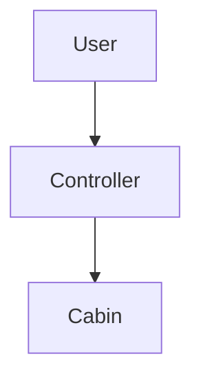
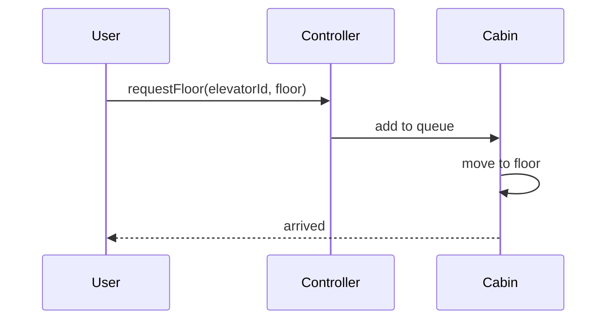

# High-Level Design: Elevator System

## 1. Overview

A **building** with multiple **floors** and **elevators**; users request elevator from a floor (up/down) or select destination from inside; **scheduler** assigns requests to elevators; **elevators** move and stop at requested floors. Focus on state, scheduling, and safety.

---

## System Design Process
- **Step 1: Clarify Requirements** — See §2 below (floors, cabin, requests).
- **Step 2: High-Level Design** — Elevator controller, cabin state; see §3 below.
- **Step 3: Detailed Design** — State machine; API: requestFloor(), getStatus(). See LLD.
- **Step 4: Scale & Optimize** — Multiple elevators; scheduling algorithm.

#### High-Level Architecture

**Mermaid:**



#### Flow Diagram — Request floor

**Mermaid:**



**API endpoints:** requestFloor(elevatorId, floor), getStatus(). See LLD.

---

## 2. Requirements

- **Building:** N floors, M elevators; each elevator has current floor, direction (UP/DOWN/IDLE), state (IDLE/MOVING/MAINTENANCE).
- **External request:** (floor, direction) — user on floor wants to go up or down.
- **Internal request:** (elevator_id, target_floor) — user inside selects floor.
- **Scheduling:** Assign request to an elevator (nearest, same direction, SCAN); elevator serves requests in order (e.g. same direction first).
- **Movement:** One floor per step; stop at floors in pending set; open/close door; update position and direction.
- **Safety:** No two elevators same floor collision; door open only when stopped; optional weight sensor.

---

## 3. High-Level Architecture

```
┌─────────────┐     Request       ┌──────────────────┐
│  Users      │  (floor, dir)     │  Elevator        │
│  (floors &  │  or (elevator,    │  Controller      │
│   inside)   │   target)         │  - Assign        │
└─────────────┘──────────────────►│  - Dispatch      │
                                    └────────┬─────────┘
                                             │
                    ┌────────────────────────┼────────────────────────┐
                    │                        │                        │
                    ▼                        ▼                        ▼
           ┌────────────────┐      ┌────────────────┐      ┌────────────────┐
           │  Elevators     │      │  Scheduler     │      │  State         │
           │  (each: floor, │      │  (pick best    │      │  (IDLE,        │
           │   direction,   │      │   elevator)    │      │   MOVING,      │
           │   pending)     │      │                │      │   MAINTENANCE) │
           └────────────────┘      └────────────────┘      └────────────────┘
```

---

## 4. Core Components

| Component | Responsibility |
|-----------|----------------|
| **Elevator** | currentFloor, direction, state; pendingStops (set or list); addRequest(floor); move() one floor; openDoor/closeDoor; update state (IDLE when no pending). |
| **Scheduler** | On external (floor, direction): choose elevator (nearest, same direction, or SCAN); add floor to that elevator's pending. On internal (elevatorId, floor): add floor to that elevator's pending. |
| **Building** | Holds elevators; exposes controller/scheduler; optional floor buttons (up/down) and elevator panels (floor buttons). |
| **State Machine** | Elevator state: IDLE → MOVING (when request added); MOVING → stop at floor (open, close, remove from pending); MOVING → IDLE when pending empty. |

---

## 5. Data Flow

1. **External request:** User at floor 5 presses UP. Scheduler selects elevator (e.g. elevator moving up and will pass 5, or nearest idle). Add 5 to that elevator's pendingStops. Elevator in next move() will include 5 in route.
2. **Internal request:** User in elevator 2 presses 9. Add 9 to elevator 2's pendingStops.
3. **Movement loop:** Every tick (e.g. 1s), each elevator: if pending not empty, set direction (toward next stop); currentFloor += 1 or -1; if currentFloor in pendingStops, stop, openDoor, remove currentFloor from pending, closeDoor; if pending empty, state = IDLE.

---

## 6. Scheduling Strategies (HLD)

- **Nearest car:** Min distance to request floor; prefer elevator moving toward request and that will pass the floor.
- **SCAN:** Elevator scans in one direction, serves all requests in that direction, then reverses (like disk scheduling).
- **Direction-based:** Prefer elevator that is IDLE or moving in same direction as request (up/down) and will pass the floor.

---

## 7. Design Patterns (HLD View)

- **State:** ElevatorState (IdleState, MovingState, MaintenanceState); behavior (can accept request, move) depends on state.
- **Strategy:** SchedulingStrategy (NearestCar, SCAN) injectable.
- **Singleton:** Building or Controller for single building.

---

## 8. Trade-offs

| Decision | Choice | Rationale |
|----------|--------|-----------|
| Assignment | Central scheduler | Simpler than distributed; single source of truth for "who serves which request" |
| Movement | Discrete steps (one floor per tick) | Easy to simulate and reason about; real system uses continuous with position feedback |
| Pending | Set of floors | Dedupe multiple requests for same floor; serve in order along direction |

---

## Interview-Readiness Enhancements

### Capacity & SLO framing
- Define read/write QPS separately and estimate peak vs average traffic.
- Add latency budgets (p95/p99) per critical hop and target availability.
- State durability target and expected data growth/day.

### Critical path clarity
- Document write path (authoritative commit first, async side-effects second).
- Document read path (cache/read model first, fallback to source of truth).
- Identify likely hotspots (hot keys, hot partitions, fanout spikes).

### Failure handling
- Define retry strategy (bounded retries, backoff, jitter).
- Add circuit breakers and bulkheads for unstable dependencies.
- Cover queue failures (DLQ, replay) and datastore failover behavior.

### Security, operations, and cost
- Baseline security: AuthN/AuthZ, encryption in transit/at rest, secrets rotation.
- Observability: golden signals, SLO alerts, tracing, runbooks, canary/rollback.
- DR/cost: explicit RTO/RPO and top cost drivers with optimization levers.

### Trade-off table (mandatory)
- Include at least two realistic alternatives with decision rationale for this system.

