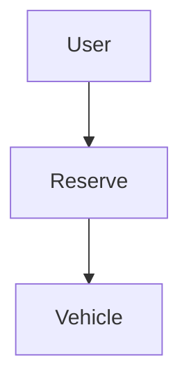
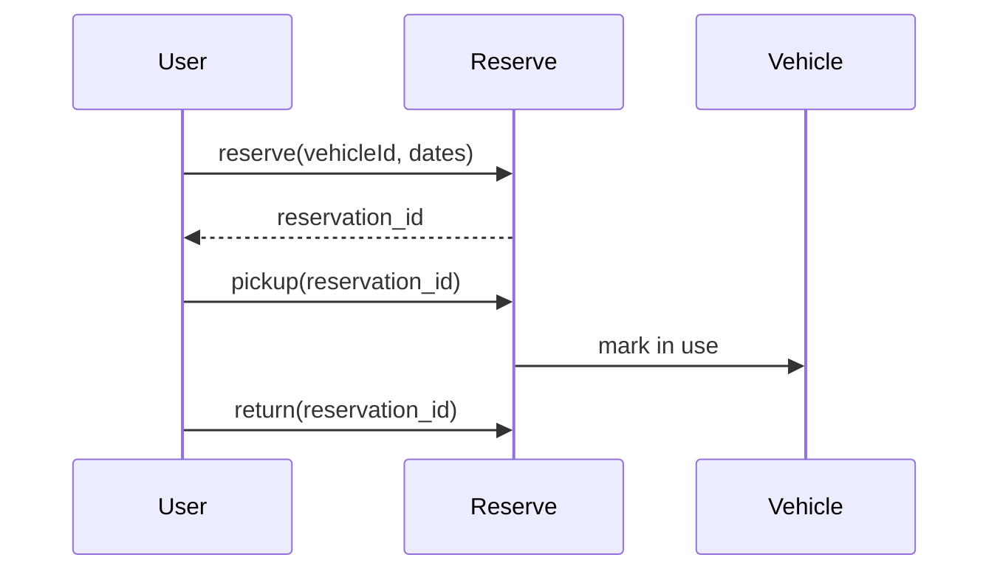

# High-Level Design: Car Rental System

## 1. Overview

**Vehicles** (by type and model) are **rented** by **users** for a **date range**; **reservation** (lock) then **confirm** (pay); **pickup** and **return** record actual times; **billing** (days × rate + extras, late fee). Manages availability and booking lifecycle.

---

## System Design Process
- **Step 1: Clarify Requirements** — See §2 below (reserve, pickup, return).
- **Step 2: High-Level Design** — Reservation, vehicle, state; see §3 below.
- **Step 3: Detailed Design** — State machine; API: reserve(), pickup(), return(). See LLD.
- **Step 4: Scale & Optimize** — Sharding by location or fleet.

#### High-Level Architecture

**Mermaid:**



#### Flow Diagram — Reserve, pickup, return

**Mermaid:**



**API endpoints:** POST `/v1/reservations`, POST `/v1/reservations/:id/pickup`, POST `/v1/return`. See LLD.

---

## 2. Requirements

- **Vehicles:** Id, type (economy, SUV, etc.), model, daily rate; status (AVAILABLE, RESERVED, RENTED, MAINTENANCE).
- **Search:** Available vehicles for date range (no overlapping booking).
- **Reserve:** Lock vehicle for [start, end]; create booking PENDING; TTL to pay (e.g. 30 min).
- **Confirm:** On payment; booking CONFIRMED.
- **Pickup / Return:** Record actual pickup and return times; vehicle RENTED then AVAILABLE; bill = actual days × rate + late fee if applicable.
- **Cancel:** Release vehicle; booking CANCELLED; refund per policy.

---

## 3. High-Level Architecture

```
┌─────────────┐                    ┌──────────────────┐
│  User       │  Search / Book    │  Rental Service   │
│  (App)      │───────────────────►│  - Availability  │
└─────────────┘                    │  - Reserve       │
                                    │  - Confirm       │
                                    │  - Pickup/Return │
                                    └────────┬─────────┘
                                             │
                    ┌────────────────────────┼────────────────────────┐
                    │                        │                        │
                    ▼                        ▼                        ▼
           ┌────────────────┐      ┌────────────────┐      ┌────────────────┐
           │  Inventory     │      │  Booking       │      │  Billing        │
           │  (vehicle ×    │      │  (reserve,     │      │  (rate, late    │
           │   date range)   │      │   confirm,     │      │   fee)         │
           │  availability   │      │   pickup/ret)  │      │                 │
           └────────────────┘      └────────────────┘      └────────────────┘
```

---

## 4. Core Components

| Component | Responsibility |
|-----------|----------------|
| **InventoryService** | getAvailableVehicles(start, end) — vehicles with no booking overlapping [start, end]; reserve(vehicleId, start, end) — create booking PENDING, mark vehicle RESERVED; release(bookingId) — set vehicle AVAILABLE, booking CANCELLED. |
| **BookingService** | reserve → confirm (on payment); pickup(bookingId) — vehicle RENTED; return(bookingId) — vehicle AVAILABLE, compute bill. |
| **BillingService** | calculate(booking) — (returnDate - pickupDate).days × dailyRate + lateFee if return > endDate; optional extras (insurance, fuel). |
| **Vehicle** | status; transitions: AVAILABLE → RESERVED → RENTED → AVAILABLE (or MAINTENANCE). |

---

## 5. Data Flow

1. **Search:** Query bookings; for each vehicle, check no booking overlaps [start, end]; return list with daily rate.
2. **Reserve:** Create Booking(PENDING, vehicleId, userId, start, end); mark vehicle RESERVED for that range (logical lock); start TTL timer.
3. **Confirm:** On payment success; set booking CONFIRMED; TTL cancelled.
4. **Pickup:** Set booking.pickupAt = now; vehicle.status = RENTED.
5. **Return:** Set booking.returnAt = now; vehicle.status = AVAILABLE; amount = BillingService.calculate(booking); return receipt.
6. **Cancel / TTL expiry:** Release vehicle; set booking CANCELLED.

---

## 6. Design Patterns (HLD View)

- **State:** Vehicle (AVAILABLE, RESERVED, RENTED, MAINTENANCE); Booking (PENDING, CONFIRMED, PICKED_UP, RETURNED, CANCELLED). Transitions on reserve, confirm, pickup, return, cancel.
- **Strategy:** PricingStrategy (weekday vs weekend, long-term discount); BillingStrategy for late fee calculation.
- **Factory:** VehicleFactory by type for creation and default pricing.

---

## 7. Data Model (Conceptual)

- **vehicles:** id, type, model, daily_rate, status.
- **bookings:** id, vehicle_id, user_id, start_date, end_date, status, pickup_at, return_at, created_at.
- **availability:** Either derived from bookings (no overlapping booking = available) or explicit slots (vehicle_id, date, status).

---

## 8. Trade-offs

| Decision | Choice | Rationale |
|----------|--------|-----------|
| Overlap check | Query bookings for vehicle in [start, end] | Simple; use index on (vehicle_id, start_date, end_date) |
| Lock | Logical (booking row) with TTL | No physical lock; release on cancel or timeout |
| Billing | On return | Actual days; late fee applied if returnAt > end_date |
