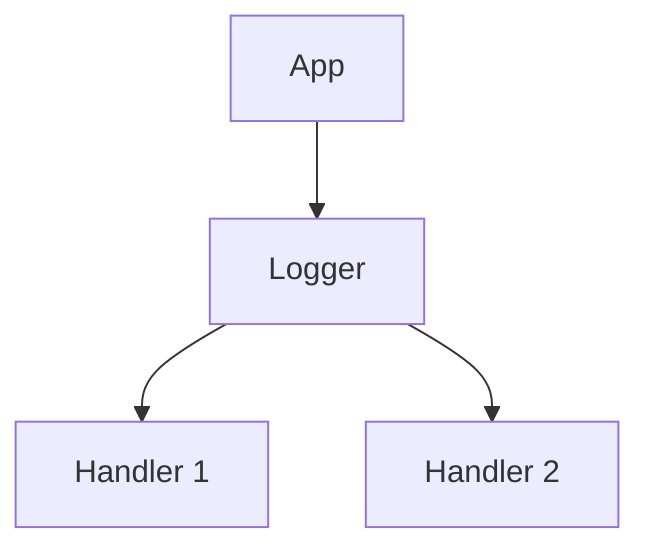
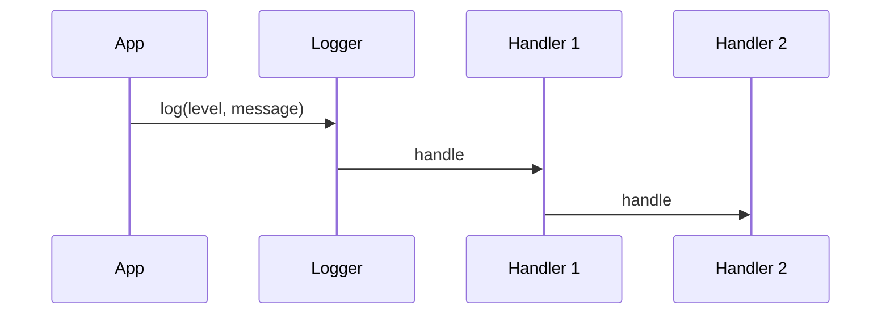

# High-Level Design: Logging System (Application-Level)

## 1. Overview

An **application logging** component that routes **log messages** (level, message, context) through a **chain of handlers** (console, file, remote); configurable **levels** and **formats**. Complements distributed logging (topic 11) with in-process design.

---

## System Design Process
- **Step 1: Clarify Requirements** — See §2 below (log levels, handlers).
- **Step 2: High-Level Design** — Logger, handlers (chain); see §3 below.
- **Step 3: Detailed Design** — Chain of Responsibility; API: log(level, message). See LLD.
- **Step 4: Scale & Optimize** — Async handlers; batching.

#### High-Level Architecture

**Mermaid:**



#### Flow Diagram — Log through chain

**Mermaid:**



**API endpoints:** log(level, message). See LLD.

---

## 2. Requirements

- **Levels:** DEBUG, INFO, WARN, ERROR; configurable minimum level (e.g. INFO in prod, DEBUG in dev).
- **Handlers:** Console (stdout), File (with optional rotation), Remote (send to log server); each handler can have its own level and format.
- **Chain:** Log request passed through handler chain; each handler may log and/or forward.
- **Format:** Configurable (timestamp, level, message, context/fields); structured (JSON) or plain text.
- **Optional:** Async write (non-blocking); batching for remote; correlation id / trace id in context.

---

## 3. High-Level Architecture

```
┌─────────────┐                    ┌──────────────────┐
│  Application│  log(level, msg)   │  Logger          │
│  Code       │───────────────────►│  - Level check   │
└─────────────┘                    │  - Invoke chain  │
                                    └────────┬─────────┘
                                             │
                    ┌────────────────────────┼────────────────────────┐
                    │                        │                        │
                    ▼                        ▼                        ▼
           ┌────────────────┐      ┌────────────────┐      ┌────────────────┐
           │  Console        │      │  File           │      │  Remote         │
           │  Handler        │      │  Handler        │      │  Handler        │
           │  (stdout)       │      │  (rotate,       │      │  (batch, send   │
           │                 │      │   buffer)       │      │   to server)    │
           └────────────────┘      └────────────────┘      └────────────────┘
                    │                        │                        │
                    └────────────────────────┴────────────────────────┘
                                    Chain of Responsibility
```

---

## 4. Core Components

| Component | Responsibility |
|-----------|----------------|
| **Logger** | Root or named logger; level threshold; list of handlers. log(level, message, context): if level >= logger.level, call each handler in chain. |
| **Handler (abstract)** | minLevel; next handler (chain); handle(level, message, context) — if level >= minLevel, doLog(); then call next.handle(). |
| **ConsoleHandler** | doLog: write formatted line to stdout/stderr. |
| **FileHandler** | doLog: write to file; optional rotation by size or date; buffer for performance. |
| **RemoteHandler** | doLog: enqueue or send to log server (sync or async); optional batch and flush. |
| **Formatter** | format(level, message, context) → string (or JSON). |

---

## 5. Data Flow

1. Application calls logger.info("user logged in", { userId: 123 }).
2. Logger checks level >= logger.level; for each handler in order: handler.handle(INFO, "user logged in", context).
3. Handler: if INFO >= handler.minLevel, doLog (e.g. write to file); then if next != null, next.handle(...). Chain propagates until end.
4. Result: same log may go to console, file, and remote depending on handler config.

---

## 6. Design Patterns (HLD View)

- **Chain of Responsibility:** Each handler can handle and pass to next; decouples sender from receivers; order matters (e.g. console first, then file, then remote).
- **Singleton:** Optional global root logger per process.
- **Strategy:** Formatter strategy (plain vs JSON) injectable per handler.

---

## 7. Configuration (Conceptual)

- **Logger:** name, level (DEBUG/INFO/WARN/ERROR), handlers[].
- **Handler config:** type (console/file/remote), minLevel, formatter, file path (for file), endpoint (for remote), batch size (for remote).

---

## 8. Trade-offs

| Decision | Choice | Rationale |
|----------|--------|-----------|
| Sync vs async | Async for file/remote | Avoid blocking request path; queue and flush |
| Chain order | Console → File → Remote | Console for dev; file for audit; remote for aggregation |
| Level per handler | Supported | e.g. DEBUG to file, INFO+ to remote to reduce volume |
