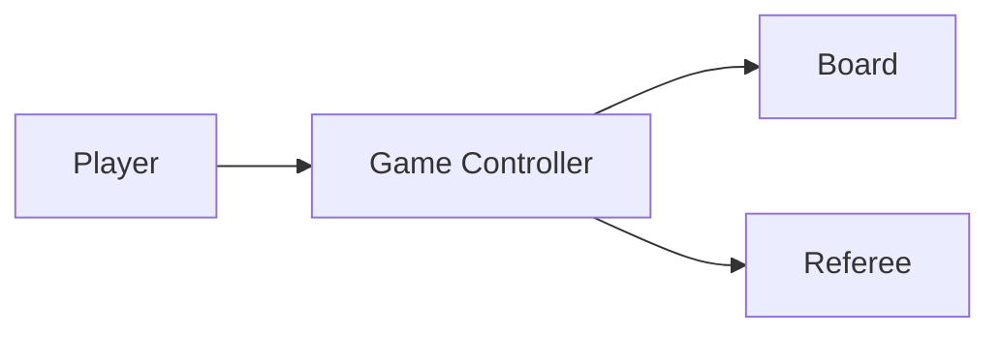

# High-Level Design: Tic-Tac-Toe Game

## 1. Overview

A **two-player** game on a **3×3 board**; players X and O take turns placing their symbol; **win** (row/column/diagonal) or **draw**. Optional N×N and k-in-a-row.

---

## System Design Process
- **Step 1: Clarify Requirements** — See §2 below (board, turns, win/draw).
- **Step 2: High-Level Design** — Game controller, board, referee; see §3 below.
- **Step 3: Detailed Design** — State and win check; API: createGame(), playMove(row, col). See LLD.
- **Step 4: Scale & Optimize** — Single-game; no distributed scale; optional replay/undo.

**Flow diagram:** `Player → playMove(row, col) → Game Controller → Board + Referee.`



**API / Interface:** createGame(), playMove(gameId, row, col), getStatus(gameId). See LLD for full list.

---

## 2. Requirements

- **Board:** 3×3 grid; empty initially; each cell holds X, O, or empty.
- **Turns:** Alternate X then O; one move per turn (place symbol in empty cell).
- **Win:** Same symbol in a full row, column, or either diagonal.
- **Draw:** Board full with no winner.
- **Optional:** N×N board; k-in-a-row to win; replay; undo.

---

## 3. High-Level Architecture

```
┌─────────────┐     Play move      ┌──────────────────┐
│  Player X   │  (row, col)        │  Game Controller │
│  Player O   │───────────────────►│  - Validate      │
└─────────────┘                    │  - Update board  │
                                    │  - Check win     │
                                    └────────┬─────────┘
                                             │
                    ┌────────────────────────┼────────────────────────┐
                    │                        │                        │
                    ▼                        ▼                        ▼
           ┌────────────────┐      ┌────────────────┐      ┌────────────────┐
           │  Board         │      │  Referee       │      │  Game State    │
           │  (grid, place, │      │  (winner       │      │  (PLAYING,      │
           │   state)       │      │   check)       │      │   WON, DRAW)    │
           └────────────────┘      └────────────────┘      └────────────────┘
```

---

## 4. Core Components

| Component | Responsibility |
|-----------|----------------|
| **Board** | 3×3 grid; place(row, col, symbol) — validate empty and bounds; getWinner() — check all rows, columns, diagonals for same symbol; isFull() — no empty cell. |
| **Game** | board, players [X, O], currentPlayerIndex, status (PLAYING/WON/DRAW). playMove(row, col): place symbol; check winner/draw; switch currentPlayer or end game. |
| **GameController** | createGame(); playMove(gameId, row, col) → result (continue / X wins / O wins / draw). |

---

## 5. Data Flow

1. createGame() → Game with empty board, currentPlayer = X.
2. playMove(row, col): Validate cell empty and in range; board.place(row, col, currentPlayer.symbol); if getWinner() != null → status = WON, return winner; if isFull() → status = DRAW, return; else currentPlayer = next; return status.
3. getWinner(): For each row, column, two diagonals — if all three cells same and not empty, return that symbol; else return null. After place, if isFull() and no winner → DRAW.

---

## 6. Design Patterns (HLD View)

- **State:** Game status (Playing, Won, Draw); playMove allowed only when Playing; transitions on win or draw.
- **Strategy:** Optional WinStrategy for N×N and k-in-a-row (inject different win check).

---

## 7. Trade-offs

| Decision | Choice | Rationale |
|----------|--------|-----------|
| Board representation | 3×3 array or 9-element list | Array [row][col] for simple index; flat for compact |
| Win check | After every move | O(1) or O(n) for 3×3; for N×N k-in-a-row, check only affected row/col/diag |

---

## Interview-Readiness Enhancements

### Capacity & SLO framing
- Define read/write QPS separately and estimate peak vs average traffic.
- Add latency budgets (p95/p99) per critical hop and target availability.
- State durability target and expected data growth/day.

### Critical path clarity
- Document write path (authoritative commit first, async side-effects second).
- Document read path (cache/read model first, fallback to source of truth).
- Identify likely hotspots (hot keys, hot partitions, fanout spikes).

### Failure handling
- Define retry strategy (bounded retries, backoff, jitter).
- Add circuit breakers and bulkheads for unstable dependencies.
- Cover queue failures (DLQ, replay) and datastore failover behavior.

### Security, operations, and cost
- Baseline security: AuthN/AuthZ, encryption in transit/at rest, secrets rotation.
- Observability: golden signals, SLO alerts, tracing, runbooks, canary/rollback.
- DR/cost: explicit RTO/RPO and top cost drivers with optimization levers.

### Trade-off table (mandatory)
- Include at least two realistic alternatives with decision rationale for this system.

