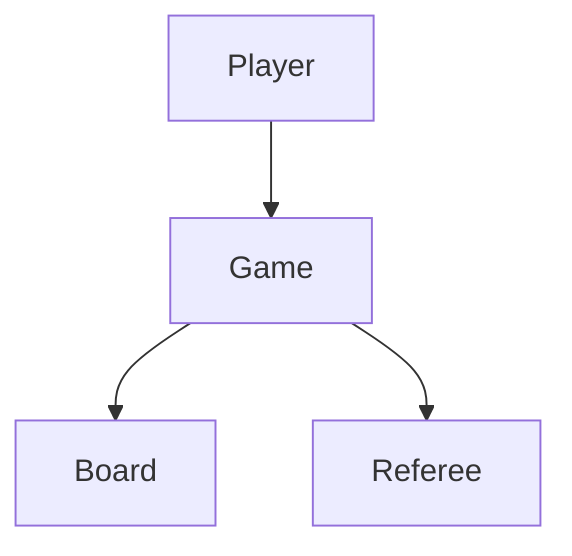
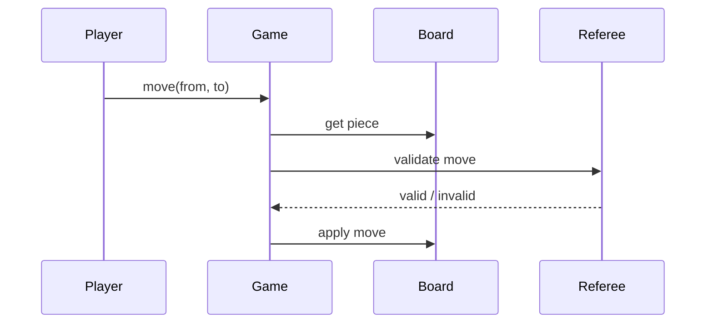

# High-Level Design: Chess Game

## 1. Overview

**Two-player** game on **8×8 board** with **pieces** (King, Queen, Rook, Bishop, Knight, Pawn); **turns** (white, black); **move validation** per piece type; **check** and **checkmate** detection. Focus on rules, state, and extensibility.

---

## System Design Process
- **Step 1: Clarify Requirements** — See §2 below (board, pieces, move, check/checkmate).
- **Step 2: High-Level Design** — Board, piece, referee; see §3 below.
- **Step 3: Detailed Design** — Move validation; API: move(from, to), getValidMoves(). See LLD.
- **Step 4: Scale & Optimize** — Single-game.

#### High-Level Architecture

**Mermaid:**



#### Flow Diagram — Move and validate

**Mermaid:**



**API endpoints:** createGame(), move(gameId, from, to), getValidMoves(). See LLD.

---

## 2. Requirements

- **Board:** 8×8; pieces at positions; white and black; turn-based (white then black).
- **Pieces:** Each type has move rules (e.g. Queen: any direction; Knight: L-shape); capture (destination has opponent piece); path clear (except Knight).
- **Move:** Validate piece at source, destination valid for piece type, path clear, no self-check (own king not under attack after move); optional en passant, castling.
- **Check:** King under attack; player must escape (move king or block/capture).
- **Checkmate:** King in check with no valid move; game over.
- **Optional:** Stalemate, draw (fifty-move, repetition), undo.

---

## 3. High-Level Architecture

```
┌─────────────┐     Move (from,to) ┌──────────────────┐
│  Players    │───────────────────►│  Game Controller │
│  (White/    │                    │  - Validate move │
│   Black)    │                    │  - Apply move    │
└─────────────┘                    │  - Check/       │
                                    │    Checkmate    │
                                    └────────┬────────┘
                                             │
                    ┌────────────────────────┼────────────────────────┐
                    │                        │                        │
                    ▼                        ▼                        ▼
           ┌────────────────┐      ┌────────────────┐      ┌────────────────┐
           │  Board         │      │  Piece         │      │  Referee       │
           │  (cells,       │      │  (move rules   │      │  (check,       │
           │   get/set)      │      │   per type)    │      │   checkmate)   │
           └────────────────┘      └────────────────┘      └────────────────┘
```

---

## 4. Core Components

| Component | Responsibility |
|-----------|----------------|
| **Board** | 8×8 grid; getPiece(cell), setPiece(cell, piece), removePiece(cell); isPathClear(from, to) for line moves; isAttacked(cell, byColor). |
| **Piece** | color, type; canMove(board, from, to) — type-specific rules; subclasses King, Queen, Rook, Bishop, Knight, Pawn. |
| **Game** | board, currentTurn (WHITE/BLACK), moveHistory; move(from, to): validate, apply, switch turn; getValidMoves(cell) for highlighting. |
| **Referee** | After move: isKingInCheck(board, color); isCheckmate(board, color) — king in check and no valid move for any piece. |

---

## 5. Data Flow

1. **Move:** Get piece at from; validate piece color == currentTurn; get valid moves for piece (or validate to in valid set); simulate move: apply on copy of board; if own king in check after, invalid; else apply on real board; append to history; switch turn; check if opponent in checkmate → game over.
2. **Valid moves:** For piece at cell, for each candidate cell: check piece rule (path, capture); simulate move; if own king not in check after, add to valid list.
3. **Check:** Find king of color; isAttacked(kingCell, opponentColor) — any opponent piece can move to kingCell (or attacks that cell).

---

## 6. Design Patterns (HLD View)

- **Strategy:** Move behavior per piece type (polymorphic Piece or injectable MoveStrategy per type).
- **State:** Game state (Playing, Check, Checkmate, Stalemate); optional Command for undo (store Move, reverse on undo).
- **Composite:** Optional for compound moves (e.g. castling = king move + rook move).

---

## 7. Trade-offs

| Decision | Choice | Rationale |
|----------|--------|-----------|
| Validation | Per-piece rules + no self-check | Correctness; simulate move to check king safety |
| Board copy | For validation and check | Avoid mutating board until move committed |
| Checkmate | Exhaust valid moves for all pieces | Expensive but accurate; cache valid moves per piece if needed |

---

## Interview-Readiness Enhancements

### Capacity & SLO framing
- Define read/write QPS separately and estimate peak vs average traffic.
- Add latency budgets (p95/p99) per critical hop and target availability.
- State durability target and expected data growth/day.

### Critical path clarity
- Document write path (authoritative commit first, async side-effects second).
- Document read path (cache/read model first, fallback to source of truth).
- Identify likely hotspots (hot keys, hot partitions, fanout spikes).

### Failure handling
- Define retry strategy (bounded retries, backoff, jitter).
- Add circuit breakers and bulkheads for unstable dependencies.
- Cover queue failures (DLQ, replay) and datastore failover behavior.

### Security, operations, and cost
- Baseline security: AuthN/AuthZ, encryption in transit/at rest, secrets rotation.
- Observability: golden signals, SLO alerts, tracing, runbooks, canary/rollback.
- DR/cost: explicit RTO/RPO and top cost drivers with optimization levers.

### Trade-off table (mandatory)
- Include at least two realistic alternatives with decision rationale for this system.

